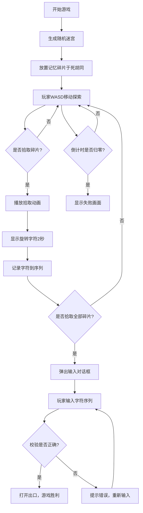

## 1. 产品概述

记忆迷藏是一款融合迷宫探索与记忆挑战的休闲益智游戏。玩家在动态变色的迷宫中寻找隐藏的记忆碎片，按顺序记住碎片展示的字符并复原，最终找到出口完成挑战。

- 目标用户：喜欢解谜和记忆力挑战的休闲游戏玩家
- 产品价值：通过视觉与记忆的双重挑战，提供紧张刺激的游戏体验

## 2. 核心功能

### 2.1 功能模块
1. **游戏主界面**：全屏Canvas游戏区域，包含迷宫、玩家、碎片、UI元素
2. **迷宫系统**：随机Prim算法生成10x10迷宫，墙壁动态颜色渐变
3. **玩家控制系统**：WASD键盘控制，精确碰撞检测，发光脉冲动画
4. **记忆碎片系统**：死胡同随机放置碎片，拾取动画，旋转字符展示
5. **字符验证系统**：玩家按顺序输入字符，校验正确后开启出口
6. **倒计时系统**：60秒倒计时，闪烁效果，超时失败
7. **脚印系统**：半透明粒子脚印，随时间衰减

### 2.2 页面详情
| 页面名称 | 模块名称 | 功能描述 |
|---------|---------|---------|
| 游戏主界面 | 迷宫渲染 | 10x10格子迷宫，墙壁动态颜色渐变 |
| 游戏主界面 | 玩家角色 | 发光白色圆球，脉冲光晕，WASD移动 |
| 游戏主界面 | 记忆碎片 | 半透明蓝色六边形，拾取动画 |
| 游戏主界面 | 字符展示 | 屏幕中央旋转字符，2秒后消失 |
| 游戏主界面 | 输入对话框 | 居中半透明黑底，圆角16像素，输入字符序列 |
| 游戏主界面 | 倒计时 | 左上角深红#D32F2F，20像素粗体，每秒闪烁 |
| 游戏主界面 | 脚印 | 半透明白色圆点，透明度衰减 |
| 失败界面 | 失败画面 | 模糊红色背景，中央白色"挑战失败"，收缩动画 |
| 胜利界面 | 胜利画面 | 展示通关信息（可选） |

## 3. 核心流程

## 4. 用户界面设计

### 4.1 设计风格
- **主背景色**：#0D1B2A（深蓝黑色）
- **墙壁默认色**：#2E3B4E（深灰蓝）
- **墙壁渐变目标色**：#4FC3F7（淡蓝色）
- **玩家颜色**：白色，带发光脉冲效果
- **碎片颜色**：半透明蓝色六边形
- **倒计时颜色**：#D32F2F（深红色）
- **脚印颜色**：半透明白色圆点
- **整体风格**：深色科技感，动态光效，简洁现代

### 4.2 页面设计概览
| 页面名称 | 模块名称 | UI元素 |
|---------|---------|---------|
| 游戏主界面 | 迷宫区域 | 10x10格子，每格40像素，墙壁从深灰到玩家周围3格内渐变淡蓝 |
| 游戏主界面 | 玩家角色 | 半径12像素白色圆球，脉冲光晕周期1.2秒 |
| 游戏主界面 | 记忆碎片 | 直径24像素半透明蓝色六边形 |
| 游戏主界面 | 倒计时 | 左上角20px粗体深红色，透明度0.8-1.0每秒闪烁 |
| 游戏主界面 | 脚印 | 半径4像素半透明白色圆点，2.5秒线性衰减 |
| 输入对话框 | 字符输入 | 居中半透明黑底，圆角16像素，宋体24px输入 |
| 失败画面 | 失败提示 | 模糊红色背景，中央白色"挑战失败"，收缩动画 |

### 4.3 响应式
- 游戏Canvas自适应全屏显示
- 保持迷宫正方形比例居中显示

## 5. 性能要求
- 帧率稳定60FPS
- 迷宫生成时间不超过30毫秒
- 动画流畅无卡顿
