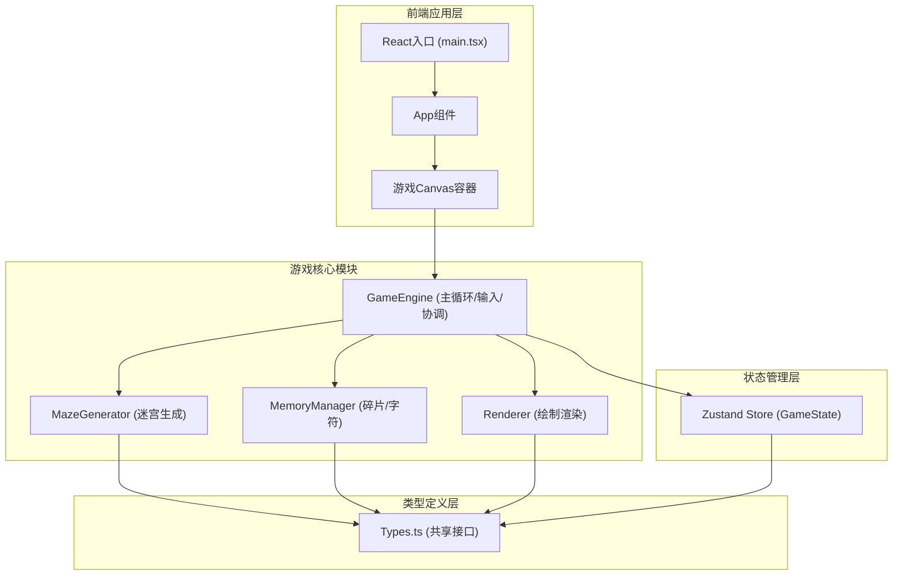

## 1. 架构设计



## 2. 技术说明
- **前端框架**：React@18 + TypeScript@5
- **构建工具**：Vite@5 + @vitejs/plugin-react
- **状态管理**：Zustand@4
- **渲染技术**：HTML5 Canvas 2D API
- **项目初始化**：vite-init (react-ts模板)

## 3. 模块职责定义

| 模块 | 文件 | 核心职责 |
|------|------|---------|
| Types | src/Types.ts | GridCell, Player, MemoryFragment, GameState等共享接口定义 |
| MazeGenerator | src/MazeGenerator.ts | Prim算法生成10x10迷宫，getCell/getNeighbors方法，<30ms生成 |
| MemoryManager | src/MemoryManager.ts | 碎片位置管理，拾取逻辑，字符序列生成与校验 |
| Renderer | src/Renderer.ts | 迷宫/玩家/碎片/脚印/UI绘制，所有颜色动画参数内部计算 |
| GameEngine | src/GameEngine.ts | requestAnimationFrame循环，Canvas初始化，键盘输入，协调各模块 |
| Zustand Store | src/store.ts | 游戏全局状态管理 |

## 4. 文件结构

```
d:\Pro\tasks\auto349/
├── package.json
├── index.html
├── tsconfig.json
├── vite.config.js
└── src/
    ├── main.tsx
    ├── App.tsx
    ├── Types.ts
    ├── GameEngine.ts
    ├── MazeGenerator.ts
    ├── MemoryManager.ts
    ├── Renderer.ts
    └── store.ts
```

## 5. 核心数据模型

### 5.1 类型定义 (Types.ts)

```typescript
// 迷宫格子
interface GridCell {
  x: number;
  y: number;
  walls: { top: boolean; right: boolean; bottom: boolean; left: boolean };
  visited: boolean;
  isDeadEnd: boolean;
}

// 玩家
interface Player {
  x: number; // 像素坐标
  y: number;
  radius: number;
  speed: number;
  pulsePhase: number; // 0-1 脉冲相位
}

// 记忆碎片
interface MemoryFragment {
  gridX: number;
  gridY: number;
  character: string;
  picked: boolean;
  pickAnimation: number; // 0-1 拾取动画进度
}

// 脚印
interface Footprint {
  x: number;
  y: number;
  opacity: number;
  createdAt: number;
}

// 当前显示字符
interface DisplayCharacter {
  char: string;
  rotation: number;
  startTime: number;
  duration: number;
}

// 游戏状态枚举
type GameStatus = 'playing' | 'input' | 'won' | 'lost';

// 全局游戏状态
interface GameState {
  status: GameStatus;
  timeLeft: number;
  grid: GridCell[][];
  player: Player;
  fragments: MemoryFragment[];
  pickedSequence: string[];
  footprints: Footprint[];
  currentDisplay: DisplayCharacter | null;
  showDialog: boolean;
  userInput: string;
}
```

## 6. 关键算法说明

### 6.1 迷宫生成 (Prim算法)
- 初始化10x10网格，所有格子四周围墙
- 随机选择起始格子，标记为已访问
- 将起始格子的墙加入候选墙列表
- 循环：随机选择候选墙，若墙两侧格子一个已访问一个未访问，则打通该墙，标记未访问格子，将其墙加入候选列表
- 完成后识别死胡同（仅一条通路的格子）

### 6.2 碰撞检测
- 玩家为圆形（半径12px），格子大小40x40px
- 检测玩家圆形与墙壁线段的精确碰撞
- 分轴处理：先X方向移动+碰撞，再Y方向移动+碰撞

### 6.3 颜色渐变
- 计算玩家所在格子与墙壁格子的曼哈顿距离
- 距离≤3时，从#2E3B4E向#4FC3F7线性插值
- 距离越近越接近目标色
