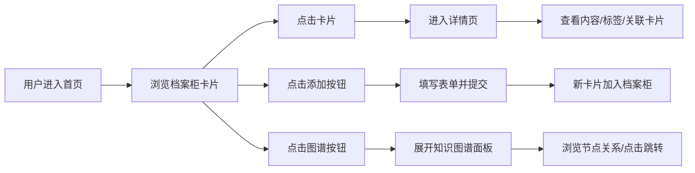

## 1. 产品概述

袖珍档案室是一个数字档案管理与知识网络构建平台，用户可以创建主题档案卡片，通过标签和关联构建知识图谱，实现个人知识的可视化管理与分享。

- 核心价值：将碎片化知识整理成结构化档案，通过可视化知识图谱发现知识关联，支持多人协作浏览与批注
- 目标用户：知识工作者、学生、研究人员、内容创作者

## 2. 核心功能

### 2.1 用户角色

| 角色 | 注册方式 | 核心权限 |
|------|----------|----------|
| 普通用户 | 无需注册（本地使用） | 创建、编辑、删除档案卡片，浏览知识图谱，添加标签与关联 |

### 2.2 功能模块

1. **档案柜首页**：木纹背景档案柜视图，卡片列表展示，添加卡片入口，知识图谱按钮
2. **卡片详情页**：封面图展示，正文内容，标签云，关联卡片列表
3. **卡片表单**：模态窗口表单，支持标题、正文、图片上传、标签输入
4. **知识图谱**：D3力导向图，节点关联可视化，交互跳转

### 2.3 页面详情

| 页面名称 | 模块名称 | 功能描述 |
|-----------|-------------|---------------------|
| 档案柜首页 | 卡片列表 | 左右两列堆叠展示档案盒卡片，悬停动画，点击跳转详情 |
| 档案柜首页 | 添加卡片按钮 | 弹出模态表单，创建新档案卡片 |
| 档案柜首页 | 知识图谱按钮 | 展开半透明面板，展示力导向知识图谱 |
| 卡片详情页 | 内容展示 | 封面图、标题、正文、标签云、关联卡片 |
| 卡片详情页 | 标签云 | 胶囊形状标签，点击筛选同类卡片 |
| 卡片详情页 | 关联卡片 | 水平滑动列表，左右箭头导航 |
| 卡片表单 | 表单输入 | 标题输入框、正文文本域、图片上传、标签输入 |
| 知识图谱 | 力导向图 | D3.js渲染，节点大小随关联数变化，悬停显示标题，点击跳转 |

## 3. 核心流程

## 4. 用户界面设计

### 4.1 设计风格

- **主色调**：木纹背景 `#D7CCC8`，标签条 `#FF8A65`（技术）、`#81C784`（生活）、`#64B5F6`（学习）、`#BA68C8`（创作）
- **辅助色**：卡片背景白色，边框 `#BCAAA4`，文字 `#3E2723`（标题）、`#5D4037`（正文）、`#795548`（标签）
- **按钮风格**：圆形按钮 `#8D6E63` 背景，胶囊标签 `#EFEBE9` 背景
- **字体**：标题使用思源宋体（display font），正文使用思源黑体（body font）
- **布局风格**：卡片式布局，木纹纹理背景，左右两列堆叠，阴影和悬浮动效营造层次感
- **图标风格**：简洁线性SVG图标，知识图谱使用网状图标

### 4.2 页面设计概述

| 页面名称 | 模块名称 | UI元素 |
|-----------|-------------|-------------|
| 档案柜首页 | 卡片列表 | 木纹纹理背景，左右两列200×120px卡片，左侧彩色标签条，悬停translateY(-8px)弹出阴影 |
| 档案柜首页 | 添加按钮 | 右下角浮动圆形按钮，`#8D6E63` 背景，+号图标 |
| 档案柜首页 | 图谱按钮 | 右下角小地图圆形按钮，网状SVG图标 |
| 卡片详情页 | 主内容区 | 70%宽度，封面图300px高度，标题24px粗体，正文16px行高1.6 |
| 卡片详情页 | 标签云 | 胶囊形状，`#EFEBE9` 背景，圆角16px，间距8px |
| 卡片详情页 | 关联卡片 | 水平滑动容器，120px缩略卡片，渐变箭头按钮 |
| 卡片表单 | 模态窗口 | 居中600px宽，圆角16px，淡入动画0.3s，白色背景 |
| 知识图谱 | 面板 | 左半边半透明面板 `rgba(239,235,233,0.95)`，D3力导向图，彩色节点，灰色连线 |

### 4.3 响应式设计

- Desktop-first 设计，桌面端优先
- 平板端：档案柜卡片改为单列布局，详情页主区域占90%宽度
- 移动端：图谱面板改为全屏，卡片尺寸自适应，触摸交互优化
- 滚动性能：图片懒加载，使用 `loading="lazy"` 属性

### 4.4 性能指标

- 知识图谱50节点渲染保持30fps以上
- 初次加载总时间不超过2秒
- 图片懒加载，滚动平滑
- 动画使用CSS transform和opacity，避免重排重绘
