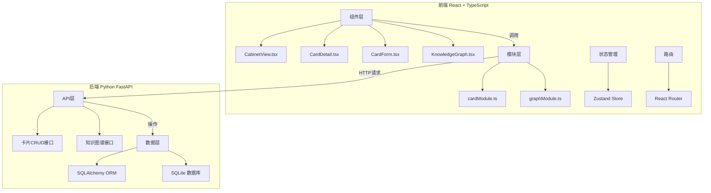
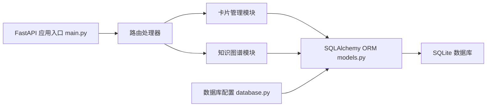
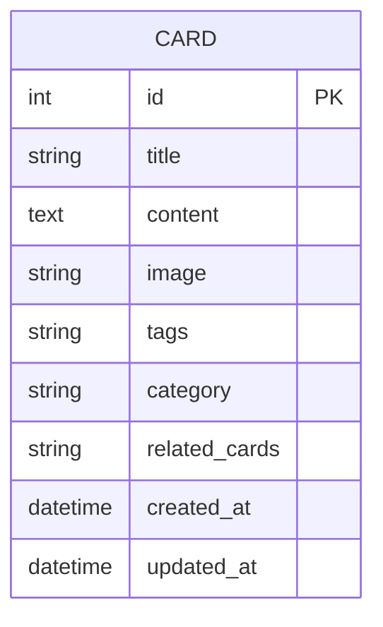

## 1. 架构设计



## 2. 技术栈描述

- **前端**：React@18 + TypeScript@5 + Vite@5
- **状态管理**：Zustand@4
- **路由**：React Router DOM@6
- **可视化**：D3.js@7（力导向图）
- **构建工具**：Vite@5 + @vitejs/plugin-react@4
- **后端**：Python 3.10+ + FastAPI@0.100 + Uvicorn@0.23
- **ORM**：SQLAlchemy@2.0
- **数据库**：SQLite 3

## 3. 路由定义

| 路由 | 用途 |
|-------|---------|
| `/` | 档案柜首页，展示卡片列表和操作按钮 |
| `/card/:id` | 卡片详情页，展示完整内容和关联卡片 |
| `/tag/:tag` | 标签筛选页，展示指定标签的卡片列表 |

## 4. API 定义

### TypeScript 类型定义

```typescript
interface Card {
  id: number;
  title: string;
  content: string;
  image: string;
  tags: string[];
  relatedCards: number[];
  category: string;
  createdAt: string;
  updatedAt: string;
}

interface GraphNode {
  id: number;
  title: string;
  category: string;
  connections: number;
  x?: number;
  y?: number;
}

interface GraphLink {
  source: number;
  target: number;
  value: number;
}

interface GraphData {
  nodes: GraphNode[];
  links: GraphLink[];
}
```

### RESTful API 端点

| 方法 | 路径 | 描述 | 请求 | 响应 |
|------|------|------|------|------|
| GET | `/api/cards` | 获取所有卡片 | - | `Card[]` |
| GET | `/api/cards/:id` | 获取单张卡片 | - | `Card` |
| POST | `/api/cards` | 创建新卡片 | `{title, content, image, tags, category}` | `Card` |
| PUT | `/api/cards/:id` | 更新卡片 | `{title, content, image, tags, category}` | `Card` |
| DELETE | `/api/cards/:id` | 删除卡片 | - | `{success: boolean}` |
| GET | `/api/cards/tag/:tag` | 按标签筛选卡片 | - | `Card[]` |
| GET | `/api/graph` | 获取知识图谱数据 | - | `GraphData` |

## 5. 服务器架构



## 6. 数据模型

### 6.1 ER 图



### 6.2 数据定义语言

```sql
CREATE TABLE IF NOT EXISTS cards (
    id INTEGER PRIMARY KEY AUTOINCREMENT,
    title VARCHAR(255) NOT NULL,
    content TEXT NOT NULL,
    image TEXT,
    tags TEXT,
    category VARCHAR(50) DEFAULT 'general',
    related_cards TEXT DEFAULT '[]',
    created_at DATETIME DEFAULT CURRENT_TIMESTAMP,
    updated_at DATETIME DEFAULT CURRENT_TIMESTAMP
);

CREATE INDEX IF NOT EXISTS idx_cards_category ON cards(category);
CREATE INDEX IF NOT EXISTS idx_cards_tags ON cards(tags);

-- 初始测试数据
INSERT INTO cards (title, content, image, tags, category, related_cards) VALUES
('React 基础', 'React 是一个用于构建用户界面的 JavaScript 库...', 'https://picsum.photos/400/300?random=1', '["React", "前端", "JavaScript"]', 'tech', '[2, 3]'),
('TypeScript 入门', 'TypeScript 是 JavaScript 的超集，添加了类型系统...', 'https://picsum.photos/400/300?random=2', '["TypeScript", "前端"]', 'tech', '[1]'),
('Vite 构建工具', 'Vite 是下一代前端构建工具，提供极速的开发体验...', 'https://picsum.photos/400/300?random=3', '["Vite", "构建工具", "前端"]', 'tech', '[1, 2]'),
('读书笔记原则', '《原则》一书分享了生活和工作的基本原则...', 'https://picsum.photos/400/300?random=4', '["读书", "原则", "思考"]', 'life', '[5]'),
('时间管理方法', '番茄工作法、GTD等时间管理方法的实践总结...', 'https://picsum.photos/400/300?random=5', '["时间管理", "效率", "生活"]', 'life', '[4]'),
('学习方法论', '费曼学习法、间隔重复等高效学习技巧...', 'https://picsum.photos/400/300?random=6', '["学习", "方法", "教育"]', 'study', '[7]'),
('英语学习技巧', '背单词、练口语、听力提升的实用方法...', 'https://picsum.photos/400/300?random=7', '["英语", "语言学习"]', 'study', '[6]');
```

## 7. 项目文件结构

```
auto352/
├── package.json
├── vite.config.js
├── tsconfig.json
├── index.html
├── src/
│   ├── main.tsx
│   ├── App.tsx
│   ├── store/
│   │   └── useStore.ts
│   ├── components/
│   │   ├── CabinetView.tsx
│   │   ├── CardDetail.tsx
│   │   ├── CardForm.tsx
│   │   └── KnowledgeGraph.tsx
│   ├── modules/
│   │   ├── cardModule.ts
│   │   └── graphModule.ts
│   └── types/
│       └── index.ts
├── backend/
│   ├── main.py
│   ├── models.py
│   ├── database.py
│   └── requirements.txt
└── .trae/
    └── documents/
        ├── prd.md
        └── tech-arch.md
```

## 8. 性能优化策略

1. **知识图谱性能**：
   - D3.js force simulation 使用 `requestAnimationFrame` 优化渲染
   - 节点数量超过50时启用简化模式，减少连线透明度
   - 使用 Canvas 替代 SVG 进行大规模渲染

2. **图片加载**：
   - 使用 `loading="lazy"` 实现图片懒加载
   - 图片使用 WebP 格式，设置合理的 `sizes` 和 `srcset`
   - 缩略图使用低质量占位符（LQIP）

3. **代码分割**：
   - 路由级代码分割，KnowledgeGraph 组件按需加载
   - D3.js 动态导入，避免首屏加载过大

4. **状态管理**：
   - Zustand 轻量级状态管理，避免不必要的重渲染
   - 使用 `useShallow` 优化选择器性能
