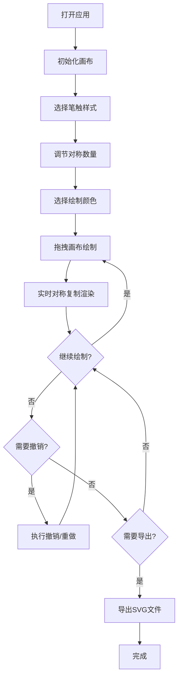

## 1. 产品概述

几何花纹工坊是一款基于Web的交互式创意绘图应用，通过手势操作快速生成复杂的对称几何图案。它解决了传统平面设计工具缺乏直观手势创作体验、用户难以快速生成复杂对称图案的痛点，为设计师、艺术爱好者和普通用户提供简单而富有创意的图案生成工具。

- **目标用户**：平面设计师、数字艺术家、手工创作者、教育工作者和普通创意爱好者
- **核心价值**：通过直观的手势交互和实时对称复制，让用户在几秒内生成精美复杂的几何花纹

## 2. 核心功能

### 2.1 用户角色

| 角色 | 注册方式 | 核心权限 |
|------|----------|----------|
| 所有用户 | 无需注册，直接使用 | 完整的绘图、编辑、导出功能 |

### 2.2 功能模块

1. **无限画布模块**：支持缩放、平移的浅灰色无限画布，实时显示对称绘制效果
2. **笔触样式模块**：四种预设笔触（圆点、花瓣、星芒、波浪），点击切换，实时预览
3. **对称控制模块**：3-12重径向对称滑块调节，默认六重对称，实时更新
4. **交互控制模块**：鼠标/触屏绘制，双指捏合/滚轮缩放，空白拖拽平移
5. **历史记录模块**：撤销/重做功能（最多50步），支持快捷键，带淡入淡出动画
6. **颜色管理模块**：12色调色盘，实时预览，色相渐变绘制
7. **导出模块**：SVG矢量导出，时间戳命名，导出反馈动画

### 2.3 页面详情

| 页面名称 | 模块名称 | 功能描述 |
|-----------|-------------|---------------------|
| 主页面 | 顶部工具栏 | 笔触选择、对称数滑块、撤销/重做、导出按钮，固定高度56px深灰背景 |
| 主页面 | 画布区域 | 浅灰色#F5F5F5背景，支持绘制、缩放、平移，右上角色块预览和缩放百分比 |
| 主页面 | 底部调色盘 | 浮动圆角调色盘，12色预设，两行排列，点击切换下一笔颜色 |

## 3. 核心流程

用户打开应用后，默认处于绘制模式，使用六重对称和基础圆点笔触。用户在画布上拖拽鼠标即可绘制，路径自动进行对称复制。用户可随时切换笔触样式、调整对称数量、更换颜色。支持撤销/重做修正错误，最终导出高质量SVG文件。

## 4. 用户界面设计

### 4.1 设计风格

- **设计语言**：Material Design 暗色调风格
- **主色调**：深灰工具栏 #263238，图标白色 #ECEFF1
- **画布背景**：浅灰 #F5F5F5，边缘滚动条浅蓝 #4FC3F7
- **强调色**：选中指示绿点，导出闪光反馈
- **按钮风格**：圆角图标按钮，带0.2s过渡动画
- **字体**：Google Fonts - Noto Sans SC（中文）搭配 Roboto（数字和英文）
- **布局**：桌面端顶部水平工具栏 + 底部浮动调色盘，移动端垂直窄工具栏 + 单行横向滚动调色盘
- **图标**：Lucide React 图标库

### 4.2 页面设计概览

| 页面名称 | 模块名称 | UI元素 |
|-----------|-------------|-------------|
| 主页面 | 顶部工具栏 | 固定56px高度，左右16px留白，笔触图标带选中绿点，滑块数字显示，按钮悬停效果 |
| 主页面 | 画布区域 | 浅灰背景，当前色预览方块（左上角），缩放百分比（右上角），浅蓝色滚动指示条 |
| 主页面 | 底部调色盘 | 16px圆角，4px y偏移12px模糊投影，12色块24x24px，两行排列，点击即时反馈 |

### 4.3 响应式设计

采用桌面优先（Desktop-first）设计策略：

- **桌面端（≥768px）**：顶部水平工具栏（高56px），底部浮动两行调色盘
- **移动端（<768px）**：左侧垂直窄工具栏（宽48px），底部单行横向滚动调色盘
- **触屏优化**：双指捏合缩放，触控绘制精度优化，更大的触控热区

### 4.4 动画与过渡

- **画布变换**：缩放/平移 0.3s ease-out 过渡
- **历史操作**：撤销淡出0.4s，重做淡入0.4s
- **笔触切换**：图标右上角绿点平滑出现
- **按钮交互**：所有交互默认0.2s ease过渡
- **导出反馈**：0.2s绿色闪光效果

## 5. 性能要求

- 12重对称下，连续快速绘制100个点以上帧率 ≥ 30FPS
- 单次笔触渲染耗时 ≤ 50ms
- 历史记录最大50步，内存占用可控
- SVG导出大文件时保持响应性
