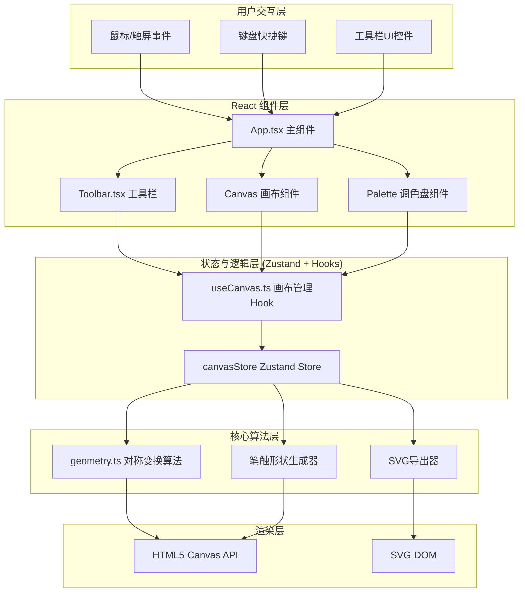

## 1. 架构设计



## 2. 技术栈说明

- **前端框架**：React 18 + TypeScript
- **构建工具**：Vite 5.x（带 @vitejs/plugin-react 插件）
- **状态管理**：Zustand 4.x
- **UI图标**：Lucide React
- **字体**：Google Fonts - Noto Sans SC + Roboto
- **渲染技术**：HTML5 Canvas 2D API（绘制）+ SVG（导出）

## 3. 文件组织结构

```
auto353/
├── package.json
├── index.html
├── vite.config.js
├── tsconfig.json
└── src/
    ├── main.tsx              # React 挂载入口
    ├── App.tsx               # 主组件，组合画布和工具栏
    ├── hooks/
    │   └── useCanvas.ts      # 画布管理Hook + Zustand Store
    ├── components/
    │   └── Toolbar.tsx       # 工具栏组件
    └── utils/
        └── geometry.ts       # 对称变换算法与SVG导出
```

### 模块职责说明

| 文件 | 职责 |
|------|------|
| `package.json` | 项目依赖管理（react, react-dom, zustand, vite, @vitejs/plugin-react） |
| `index.html` | 入口HTML，设置标题、引入字体和全局样式 |
| `vite.config.js` | Vite配置，启用React插件和路径别名@ |
| `tsconfig.json` | TypeScript严格模式，ES2020目标 |
| `src/main.tsx` | ReactDOM.createRoot挂载入口 |
| `src/App.tsx` | 主布局：工具栏+画布+调色盘，事件协调 |
| `src/hooks/useCanvas.ts` | Zustand状态管理：路径历史、视口变换、笔触设置、颜色；鼠标/触摸事件处理 |
| `src/components/Toolbar.tsx` | 笔触选择、对称滑块、撤销重做、导出按钮 |
| `src/utils/geometry.ts` | 旋转矩阵计算、对称路径生成、SVG字符串导出 |

## 4. 核心数据模型

### 4.1 类型定义

```typescript
// 笔触类型
type BrushType = 'dot' | 'petal' | 'star' | 'wave';

// 2D点
interface Point {
  x: number;
  y: number;
}

// 单条路径（含所有对称副本）
interface Path {
  id: string;
  points: Point[];           // 原始路径点
  symmetricPaths: Point[][]; // N条对称路径点集
  brush: BrushType;
  color: string;             // 基础颜色
  startHue: number;          // 起始色相 0
  endHue: number;            // 结束色相 360
  opacity: number;           // 0.8
  timestamp: number;
  fadeState: 'active' | 'fadingOut' | 'fadingIn';
}

// 视口变换
interface Viewport {
  scale: number;     // 0.5 - 4.0
  offsetX: number;   // 平移X
  offsetY: number;   // 平移Y
}

// 画布状态（Zustand Store）
interface CanvasState {
  paths: Path[];
  redoStack: Path[];
  viewport: Viewport;
  brush: BrushType;
  symmetry: number;     // 3-12，默认6
  currentColor: string;
  isDrawing: boolean;
  currentPathPoints: Point[];
  // actions
  startDrawing: (p: Point) => void;
  continueDrawing: (p: Point) => void;
  endDrawing: () => void;
  setBrush: (b: BrushType) => void;
  setSymmetry: (n: number) => void;
  setColor: (c: string) => void;
  setViewport: (v: Partial<Viewport>) => void;
  undo: () => void;
  redo: () => void;
  exportSVG: () => string;
}
```

## 5. 关键算法设计

### 5.1 对称变换算法

对于N重径向对称，每次旋转角度为 `θ = 2π / N`。使用2D旋转矩阵：

```
x' = x * cos(θ) - y * sin(θ)
y' = x * sin(θ) + y * cos(θ)
```

每条原始路径生成 N-1 条副本（共N条），中心为画布视口中心。

### 5.2 色相渐变算法

沿路径长度线性插值色相值，从起点0°渐变至终点360°。每个线段段根据其累计路径长度占总长度的比例计算对应的 HSL 色相值。

### 5.3 笔触渲染算法

- **基础圆点**：`arc(x, y, 1.5, 0, 2π)`，实心填充
- **花瓣形**：3个重叠椭圆，主径14px，分别旋转0°/120°/240°
- **星芒形**：8个尖角，内外径12px/6px交替，通过lineTo绘制
- **波浪形**：两点间正弦插值，振幅6px，波长20px

## 6. 性能优化策略

1. **增量渲染**：每次绘制只追加当前路径段，不清空整个画布重绘
2. **路径点抽样**：高速绘制时按距离阈值抽样，避免过多点导致对称计算爆炸
3. **对称预计算**：缓存旋转矩阵，每帧只计算一次
4. **Canvas分层**：历史路径绘制到离屏canvas，当前路径实时绘制到前景canvas
5. **requestAnimationFrame**：所有绘制操作纳入RAF调度，避免掉帧
6. **历史栈限制**：最多50步，超出自动丢弃最早记录

## 7. 快捷键定义

| 快捷键 | 功能 |
|--------|------|
| Ctrl+Z | 撤销（最近路径淡出） |
| Ctrl+Shift+Z | 重做（路径淡入） |
| Ctrl + 滚轮 | 缩放画布 0.5x-4.0x |

## 8. 响应式断点

- **≥768px**：桌面端布局，顶部水平工具栏（h=56px），底部两行调色盘
- **<768px**：移动端布局，左侧垂直窄工具栏（w=48px），底部单行横向滚动调色盘
