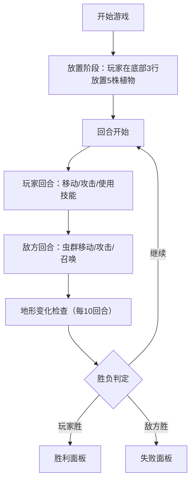

## 1. 产品概述

植物拼战场是一款8x8棋盘回合制策略小游戏，玩家布置植物棋子抵御入侵虫群，结合动态地形变化与丰富技能系统。

- 目标用户：休闲策略游戏爱好者
- 核心玩法：布阵策略、回合制战斗、地形利用

## 2. 核心特性

### 2.1 用户角色

| 角色 | 注册方式 | 核心权限 |
|------|----------|----------|
| 玩家 | 无需注册 | 进行游戏、查看统计 |

### 2.2 功能模块

1. **游戏主界面**：棋盘渲染、植物选择栏、控制面板
2. **战斗系统**：回合制对战、技能触发、伤害计算
3. **单位系统**：植物单位、虫群单位、属性与技能
4. **地形系统**：动态地形生成、地形效果
5. **游戏状态**：回合计数、胜负判定、动画展示

### 2.3 页面详情

| 页面名称 | 模块名称 | 功能描述 |
|----------|----------|----------|
| 游戏主界面 | 植物选择栏 | 展示5种植物，支持拖拽放置 |
| 游戏主界面 | 8x8棋盘 | 渲染格子、单位、地形，支持点击/拖拽交互 |
| 游戏主界面 | 左侧信息面板 | 显示选中植物详细属性 |
| 游戏主界面 | 右侧信息面板 | 显示回合数、双方单位数量 |
| 游戏主界面 | 战斗动画层 | 技能特效、地形变化提示、胜负面板 |

## 3. 核心流程

## 4. 用户界面设计

### 4.1 设计风格

- **主色调**：深色主题 #121212（背景），#1B5E20（棋盘深绿），#388E3C（网格线浅绿）
- **强调色**：#FFD700（金色胜利）、#F44336（红色失败）、#4CAF50（绿色胜利面板）
- **按钮/交互**：悬停放大1.1倍、平滑过渡动画
- **字体**：现代无衬线字体，标题粗体，正文12px白色
- **布局**：棋盘居中（顶部80px），左右各200px信息面板
- **动画**：CSS动画+requestAnimationFrame，单位移动300ms，特效延迟<100ms

### 4.2 页面设计概览

| 页面名称 | 模块名称 | UI元素 |
|----------|----------|--------|
| 游戏主界面 | 植物选择栏 | 80px高、#1E1E1E背景、5个圆形植物图标（48px直径）、悬停放大、Tooltip名称提示 |
| 游戏主界面 | 8x8棋盘 | 每格60x60px，深绿背景，浅绿1px虚线网格线，植物/虫群渲染，生命值进度条 |
| 游戏主界面 | 左侧信息面板 | 200px宽，#1E1E1E背景，圆角8px，1px #333边框，植物属性文字白色12px |
| 游戏主界面 | 右侧信息面板 | 200px宽，回合数40px粗体白色，双方单位数（红绿图标） |
| 游戏主界面 | 胜负面板 | 半透明覆盖层，胜利：#4CAF50背景+#FFD700文字；失败：#F44336背景+抖动白色文字 |

### 4.3 响应式

桌面优先设计，固定布局，针对桌面端优化。

## 5. 单位定义

### 5.1 植物单位

| 名称 | 属性 | 生命值 | 攻击力 | 技能描述 |
|------|------|--------|--------|----------|
| 向日葵 | 光 | 100 | 0 | 每回合恢复相邻植物20%生命 |
| 豌豆射手 | 土 | 100 | 30 | 直线攻击射程3格 |
| 寒冰射手 | 水 | 100 | 15 | 直线攻击射程2格，减速50% 1回合 |
| 坚果墙 | 土 | 200 | 0 | 高血量防御单位 |
| 樱桃炸弹 | 火 | 100 | 80 | 牺牲自身对2x2范围造成伤害 |

### 5.2 虫群单位

| 名称 | 生命值 | 攻击力 | 特殊 |
|------|--------|--------|------|
| 工蜂 | 50 | 10 | 基础单位 |
| 兵蜂 | 80 | 25 | 高伤害 |
| 女王蜂 | 200 | 15 | 每3回合召唤2只工蜂 |
