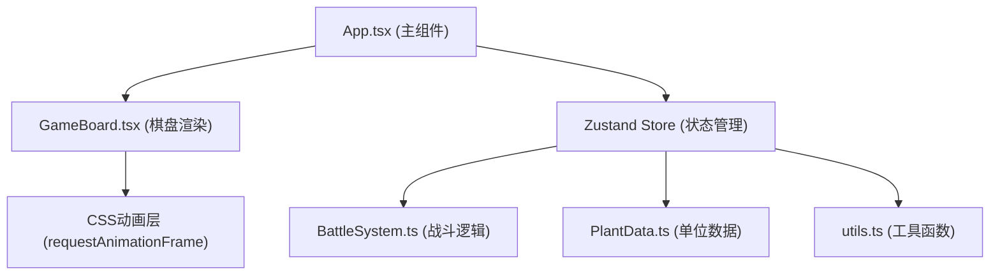

## 1. 架构设计



## 2. 技术说明

- **前端框架**：React 18 + TypeScript
- **构建工具**：Vite（端口3000）
- **状态管理**：Zustand
- **唯一ID**：uuid
- **样式方案**：纯CSS（CSS Modules/内联样式），不使用Tailwind
- **动画方案**：CSS动画 + requestAnimationFrame驱动

## 3. 目录结构

```
.
├── package.json
├── index.html
├── vite.config.ts
├── tsconfig.json
└── src/
    ├── App.tsx          # 主组件，组合棋盘、控制面板
    ├── GameBoard.tsx    # 8x8棋盘渲染与交互
    ├── PlantData.ts     # 植物与虫群单位数据定义
    ├── BattleSystem.ts  # 回合制战斗模拟逻辑
    └── utils.ts         # 随机地形、坐标计算工具函数
```

## 4. 数据模型

### 4.1 核心类型定义

```typescript
// 位置坐标
interface Position {
  row: number;  // 0-7
  col: number;  // 0-7
}

// 植物属性
type PlantElement = 'fire' | 'water' | 'earth' | 'wind' | 'light';

// 植物类型
type PlantType = 'sunflower' | 'peashooter' | 'iceshooter' | 'wallnut' | 'cherrybomb';

// 虫群类型
type BugType = 'worker' | 'soldier' | 'queen';

// 地形类型
type TerrainType = 'normal' | 'water' | 'rock';

// 植物单位
interface PlantUnit {
  id: string;
  type: PlantType;
  position: Position;
  hp: number;
  maxHp: number;
  attack: number;
  range: number;
  skillCooldown: number;
  currentCooldown: number;
  hasMoved: boolean;
  hasActed: boolean;
}

// 虫群单位
interface BugUnit {
  id: string;
  type: BugType;
  position: Position;
  hp: number;
  maxHp: number;
  attack: number;
  slowed: boolean;
  summonCounter: number;
}

// 格子
interface Cell {
  position: Position;
  terrain: TerrainType;
  terrainTimer: number;
}

// 游戏阶段
type GamePhase = 'placement' | 'playerTurn' | 'enemyTurn' | 'victory' | 'defeat';

// 游戏状态
interface GameState {
  phase: GamePhase;
  turn: number;
  plants: PlantUnit[];
  bugs: BugUnit[];
  board: Cell[][];
  selectedPlantId: string | null;
  selectedPlantType: PlantType | null;
  plantsPlaced: number;
  bugsKilled: number;
  notifications: Notification[];
}
```

## 5. 核心模块职责

### 5.1 PlantData.ts
- 定义5种植物的基础属性（名称、生命值、攻击力、射程、技能、颜色、半径）
- 定义3种虫群的基础属性
- 导出工厂函数创建新单位实例

### 5.2 BattleSystem.ts
- 处理回合切换逻辑
- 玩家行动：移动、攻击、使用技能
- 敌方AI：移动、攻击、女王蜂召唤
- 伤害计算（含减速效果、地形影响）
- 胜负判定

### 5.3 utils.ts
- 坐标计算：相邻格子、直线射程、曼哈顿距离
- 随机地形生成：每10回合随机3-5格变水域/石堆
- 其他通用工具函数

### 5.4 GameBoard.tsx
- 8x8网格渲染（60px/格）
- 植物/虫群单位渲染（CSS圆形+六边形）
- 生命值进度条
- 点击选中、拖拽放置交互
- 地形渲染（水域波浪、石堆立体效果）
- 动画层：提示文字飘动、胜负面板

### 5.5 App.tsx
- 整体布局：左右信息面板 + 中央棋盘 + 顶部植物选择栏
- Zustand store初始化
- 连接各子组件与状态
