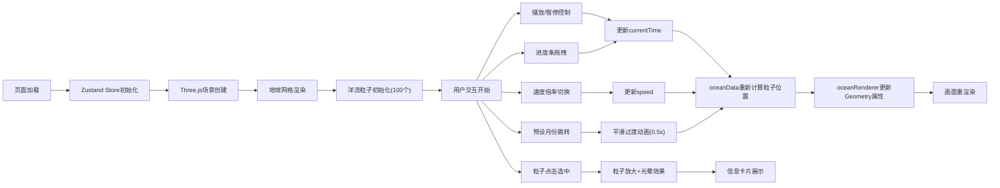

## 1. 产品概述

洋流时空三维可视化器是一款为气象数据中心研究人员设计的专业三维可视化工具，用于直观观测不同时间尺度下全球洋流的动态变化与热量传递过程。

- 主要用途：通过交互式三维地球界面，展示100个洋流粒子在24个月时间范围内的运动轨迹、温度变化与流速分布
- 目标用户：气象研究人员、海洋学家、气候分析师
- 产品价值：将复杂的洋流数据转化为直观的三维动态可视化，辅助科研分析与决策

## 2. 核心功能

### 2.1 功能模块

1. **三维场景渲染模块**：半透明地球经纬网格、洋流粒子系统、星空深色背景
2. **洋流数据管理模块**：100个洋流粒子数据生成、24个月位置路径插值、温度与流速属性计算
3. **时间轴控制模块**：播放/暂停控制、进度条拖拽、速度倍率调节、预设时间快速跳转
4. **粒子交互模块**：粒子点击选中、信息卡片展示、光晕高亮效果
5. **状态管理模块**：Zustand共享状态、时间戳同步、选中粒子数据流转

### 2.2 页面详情

| 页面名称 | 模块名称 | 功能描述 |
|-----------|-------------|---------------------|
| 主页面 | 三维地球场景 | 半径10单位半透明经纬网格地球，深色星空背景，支持鼠标拖拽旋转/滚轮缩放 |
| 主页面 | 洋流粒子系统 | 100个粒子均匀分布，颜色根据温度蓝红渐变，大小随洋流强度动态变化2-8px |
| 主页面 | 信息面板 | 左上角毛玻璃面板，显示当前月份、播放状态、总粒子数 |
| 主页面 | 时间轴控制条 | 底部居中，进度条、播放按钮、速度选择、预设跳转按钮 |
| 主页面 | 粒子信息卡片 | 点击粒子弹出，显示经纬度、温度(°C)、流速(节) |

## 3. 核心流程

用户进入页面 → 三维场景初始化（地球网格+100个初始粒子）→ 用户通过时间轴控制播放 → 粒子按时间戳插值移动 → 用户可点击粒子查看详情 → 可使用预设按钮快速跳转至指定月份

## 4. 用户界面设计

### 4.1 设计风格
- **主色调**：深色星空背景(#0A0E27)，地球网格线(#4A4A4A，0.3透明度)
- **渐变色彩**：温度梯度从蓝色(#1A237E)到红色(#FF5722)，进度条已播放部分从青色(#00E5FF)到品红(#FF4080)
- **高亮色**：播放按钮青色(#00E5FF)，选中速度按钮品红(#FF4080)
- **按钮风格**：播放按钮圆形40px带悬停缩放1.1倍/0.2s过渡，速度按钮胶囊状30px高，所有控件有点击缩放0.95反馈
- **字体**：白色(#E0E0E0)，正文16px，移动端14px
- **面板风格**：半透明毛玻璃效果(背景rgba(255,255,255,0.08)，边框1px solid rgba(255,255,255,0.12)，圆角12px)

### 4.2 页面设计概述

| 页面名称 | 模块名称 | UI元素 |
|-----------|-------------|-------------|
| 主页面 | 三维场景 | 深色星空背景(#0A0E27)、半透明地球网格(半径10)、彩色洋流粒子 |
| 主页面 | 信息面板 | 左上角毛玻璃卡片、三行数据(月份/状态/粒子数)、12px圆角 |
| 主页面 | 时间轴控制条 | 底部80%宽度居中、60px高度(移动端50px)、圆角8px、半透明黑色背景 |
| 主页面 | 进度条 | 6px高度、已播放渐变色(#00E5FF→#FF4080)、未播放深灰(#333) |
| 主页面 | 控制按钮 | 圆形播放/暂停按钮(青色#00E5FF)、胶囊状速度按钮组(0.5x/1x/2x/4x)、预设月份按钮(1/6/12月) |
| 主页面 | 粒子信息卡片 | 点击粒子弹出、显示经纬度/温度/流速、选中粒子放大12px+白色光晕(0.6透明度) |

### 4.3 响应式设计
- **桌面端(≥768px)**：信息面板左上角悬浮，控制条高60px，字体16px
- **移动端(<768px)**：信息面板变为顶部横幅，控制条高度缩减至50px，字体从16px缩小到14px
- **触摸优化**：增大按钮点击区域，支持触摸拖拽旋转视角

### 4.4 3D场景指导
- **环境氛围**：深邃星空背景，营造宇宙空间观测感，无额外HDRI
- **光照设置**：环境光(0x404040) + 方向光模拟太阳光，确保粒子色彩饱和度高
- **相机设置**：PerspectiveCamera初始距离30单位，支持OrbitControls拖拽旋转/滚轮缩放
- **构图焦点**：地球居中占画面主要区域，控制面板不遮挡核心视图
- **交互动画**：播放时粒子按60FPS插值移动，预设跳转0.5秒线性过渡动画
- **后期效果**：选中粒子添加光晕(Sprite)，色彩增强确保暗背景下粒子清晰可见
- **性能预算**：粒子上限200个时帧率不低于30FPS，使用BufferGeometry批量渲染
