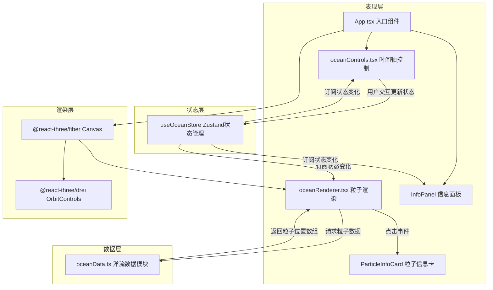

## 1. 架构设计



## 2. 技术描述

- **前端框架**：React@18 + TypeScript（严格模式）
- **构建工具**：Vite@5
- **3D渲染**：three@latest + @react-three/fiber@latest + @react-three/drei@latest
- **状态管理**：zustand@latest
- **工具库**：uuid@latest
- **样式方案**：原生CSS + CSS变量（不使用Tailwind，按需求精确控制样式细节）
- **后端服务**：无（纯前端应用，洋流数据在客户端生成）

## 3. 文件结构与调用关系

```
project-root/
├── package.json           # 依赖定义与脚本
├── vite.config.js         # Vite构建配置
├── tsconfig.json          # TypeScript严格模式配置
├── index.html             # 入口HTML页面
└── src/
    ├── main.tsx           # React入口，挂载App
    ├── App.tsx            # 根组件，组合所有模块
    ├── oceanData.ts       # 洋流数据模块，定义类型与数据生成函数
    ├── oceanRenderer.tsx  # Three.js粒子渲染组件
    ├── oceanControls.tsx  # 时间轴控制组件
    ├── oceanStore.ts      # Zustand状态管理store
    └── styles.css         # 全局样式
```

**文件调用关系与数据流向：**
1. `oceanData.ts` → 被 `oceanRenderer.tsx` 调用，接收时间戳返回当前帧粒子数组
2. `oceanStore.ts` → 被 `oceanControls.tsx`（写入）、`oceanRenderer.tsx`（读取）、`App.tsx`（读取）调用
3. `oceanRenderer.tsx` → 被 `App.tsx` 引入到 Canvas 中渲染
4. `oceanControls.tsx` → 被 `App.tsx` 引入到DOM层渲染
5. `styles.css` → 被 `main.tsx` 全局引入

## 4. 数据模型

### 4.1 核心类型定义

```typescript
// 单个洋流粒子数据结构
interface OceanParticle {
  id: string;                    // UUID唯一标识
  path: ParticleFrame[];         // 24个月的预设路径点(每月份一帧)
  temperature: number[];         // 24个月的温度序列
  speed: number[];               // 24个月的流速序列(节)
}

// 单帧粒子状态（用于插值后的当前状态）
interface ParticleFrame {
  lat: number;                   // 纬度 -90 ~ 90
  lon: number;                   // 经度 -180 ~ 180
  position: THREE.Vector3;       // 三维空间坐标(球面坐标转换)
}

// 当前帧渲染数据
interface RenderParticle {
  id: string;
  position: THREE.Vector3;       // 插值后的三维位置
  color: THREE.Color;            // 根据温度计算的颜色
  size: number;                  // 根据流速计算的大小(2-8px)
  temperature: number;           // 当前温度°C
  speed: number;                 // 当前流速(节)
  lat: number;                   // 当前纬度
  lon: number;                   // 当前经度
}

// Zustand Store 状态
interface OceanState {
  currentTime: number;           // 当前时间 0-24 (月)
  speed: number;                 // 播放速度倍率: 0.5/1/2/4
  isPlaying: boolean;            // 播放状态
  targetTime: number | null;     // 平滑过渡目标时间
  transitionStart: number | null;// 过渡起始时间
  selectedParticleId: string | null; // 选中粒子ID
  // Actions
  setCurrentTime: (t: number) => void;
  setPlaying: (p: boolean) => void;
  setSpeed: (s: number) => void;
  jumpToMonth: (month: number) => void;
  selectParticle: (id: string | null) => void;
  tick: (deltaSeconds: number) => void; // 每帧更新时间
}
```

### 4.2 球面坐标转换

经纬度转三维坐标公式（地球半径R=10）：
```
x = R * cos(lat) * cos(lon)
y = R * sin(lat)
z = R * cos(lat) * sin(lon)
```

## 5. 关键算法说明

### 5.1 洋流路径生成算法
- 每个粒子生成初始随机经纬度（均匀球面分布：使用斐波那契球面点算法避免极点聚集）
- 生成24个月的路径点：纬度按正弦曲线季节摆动（±5°~±15°），经度按洋流方向线性漂移+小幅度正弦扰动
- 温度随纬度+季节变化：基础温度 = 30 - |lat| * 0.6 + 季节正弦项 ± 随机扰动
- 流速：初始随机2-8节，路径上每个点有±20%波动

### 5.2 时间插值算法
- 输入：currentTime(0~24浮点数)
- 计算前后帧索引：frameIndex = Math.floor(currentTime)，t = currentTime - frameIndex
- 对位置、温度、流速分别进行线性插值(LERP)
- 边界处理：frameIndex ≥ 23时取最后两帧插值

### 5.3 平滑过渡动画（预设跳转）
- 记录 transitionStart（当前时间）和 targetTime
- 在tick()中按0.5秒时长线性插值从起始时间到目标时间
- 插值公式：t = min(1, elapsed / 0.5)，currentTime = lerp(startTime, targetTime, easeInOutQuad(t))

### 5.4 温度转颜色算法
- 温度范围：-2°C ~ 30°C 归一化到 0-1
- 颜色渐变：#1A237E (蓝) → 中间白色过渡 → #FF5722 (红)
- 使用三色分段LERP实现平滑渐变

## 6. 性能优化策略

1. **BufferGeometry批量渲染**：所有粒子使用单个Points + BufferGeometry，避免100个独立Mesh
2. **属性增量更新**：每帧仅更新position/color/size attribute数组，不重建Geometry
3. **typed array复用**：Float32Array预分配，每帧直接写内存不重新分配
4. **节流渲染**：useFrame按实际刷新率更新，低端设备自动降级到30FPS
5. **状态订阅优化**：Zustand使用selector精确订阅，避免不必要的重渲染
6. **球面坐标预计算**：路径点的三维坐标预先生成缓存，渲染时只做帧间插值
