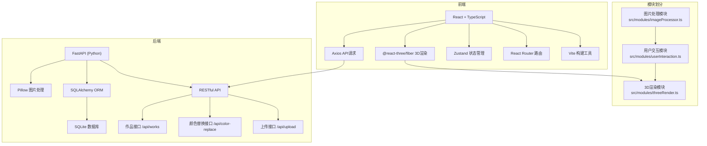
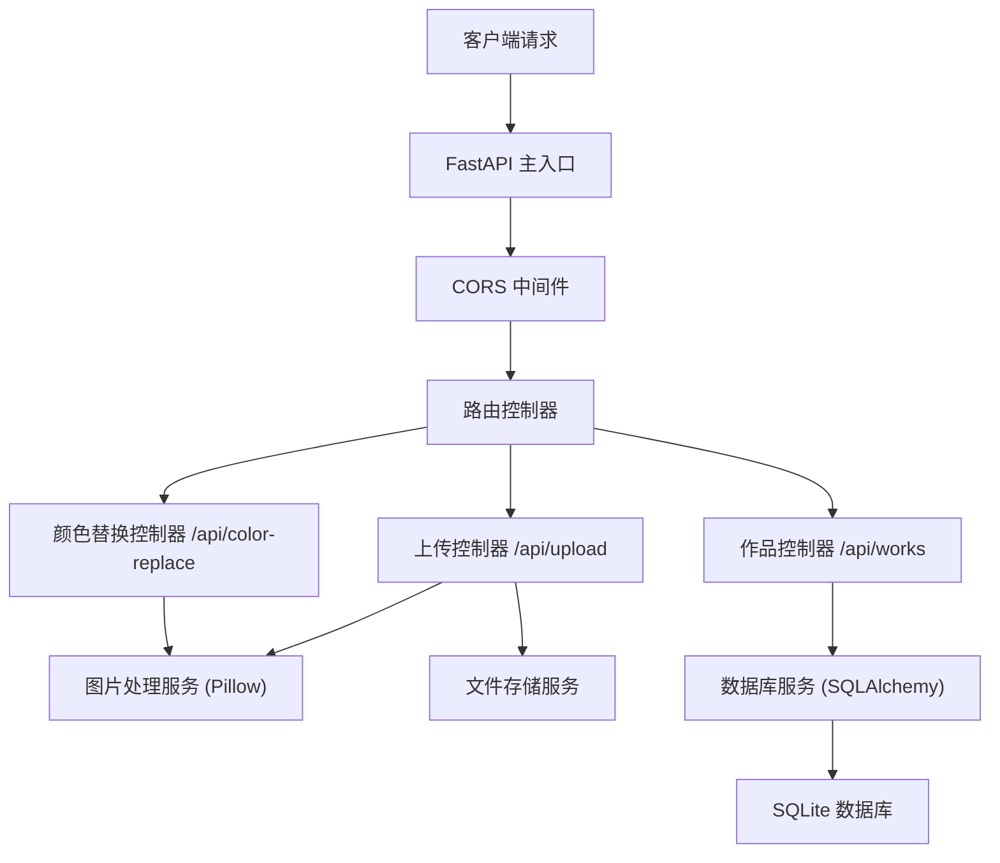

## 1. 架构设计



## 2. 技术描述

- **前端**：React@18 + TypeScript + Vite + TailwindCSS@3
- **3D技术栈**：three + @react-three/fiber + @react-three/drei
- **状态管理**：zustand
- **路由**：react-router-dom
- **HTTP请求**：axios
- **后端**：Python FastAPI + Uvicorn
- **ORM**：SQLAlchemy
- **数据库**：SQLite
- **图片处理**：Pillow (Python)

## 3. 路由定义

| 路由 | 用途 |
|------|------|
| / | 首页，社区作品展示 |
| /upload | 衣物上传页面 |
| /tryon | 虚拟试衣间页面 |
| /works | 作品浏览页面 |
| /works/:id | 作品详情页 |

## 4. API 定义

### TypeScript 类型定义

```typescript
interface ClothingItem {
  id: string;
  imageUrl: string;
  originalColor: string;
  currentColor: string;
  size?: {
    shoulder: number;
    chest: number;
    length: number;
    sleeve: number;
  };
}

interface DesignParams {
  sleeveLength: number; // 0-100
  clothingLength: number; // 0-100
  waistFit: number; // 0-100
}

interface WorkItem {
  id: string;
  userId: string;
  clothingImage: string;
  designParams: DesignParams;
  style: string; // retro / minimalist / bohemian
  likes: number;
  comments: Comment[];
  createdAt: string;
}

interface Comment {
  id: string;
  userId: string;
  content: string;
  createdAt: string;
}
```

### 请求/响应 Schema

```
POST /api/upload
Request: multipart/form-data { image: File, size?: object }
Response: { id: string, imageUrl: string }

POST /api/color-replace
Request: { imageId: string, targetColor: string }
Response: { imageUrl: string, success: boolean }

GET /api/works?style=:style
Response: { works: WorkItem[], total: number }

POST /api/works/:id/like
Response: { likes: number }

POST /api/works/:id/comments
Request: { content: string }
Response: { comment: Comment }
```

## 5. 服务器架构图



## 6. 数据模型

### 6.1 数据模型定义

```mermaid
erDiagram
    USER ||--o{ WORK : creates
    WORK ||--o{ COMMENT : has
    WORK ||--o{ LIKE : receives
    USER ||--o{ COMMENT : writes
    USER ||--o{ LIKE : gives
    
    USER {
        string id PK
        string username
        string avatar_url
        datetime created_at
    }
    
    WORK {
        string id PK
        string user_id FK
        string clothing_image_url
        string design_params JSON
        string style
        int likes_count
        datetime created_at
    }
    
    COMMENT {
        string id PK
        string work_id FK
        string user_id FK
        string content
        datetime created_at
    }
    
    LIKE {
        string id PK
        string work_id FK
        string user_id FK
        datetime created_at
    }
```

### 6.2 数据定义语言

```sql
-- 用户表
CREATE TABLE users (
    id VARCHAR(36) PRIMARY KEY,
    username VARCHAR(50) NOT NULL UNIQUE,
    avatar_url VARCHAR(255),
    created_at DATETIME DEFAULT CURRENT_TIMESTAMP
);

-- 作品表
CREATE TABLE works (
    id VARCHAR(36) PRIMARY KEY,
    user_id VARCHAR(36) NOT NULL,
    clothing_image_url VARCHAR(255) NOT NULL,
    design_params TEXT NOT NULL,
    style VARCHAR(20) NOT NULL,
    likes_count INTEGER DEFAULT 0,
    created_at DATETIME DEFAULT CURRENT_TIMESTAMP,
    FOREIGN KEY (user_id) REFERENCES users(id)
);

-- 评论表
CREATE TABLE comments (
    id VARCHAR(36) PRIMARY KEY,
    work_id VARCHAR(36) NOT NULL,
    user_id VARCHAR(36) NOT NULL,
    content TEXT NOT NULL,
    created_at DATETIME DEFAULT CURRENT_TIMESTAMP,
    FOREIGN KEY (work_id) REFERENCES works(id),
    FOREIGN KEY (user_id) REFERENCES users(id)
);

-- 点赞表
CREATE TABLE likes (
    id VARCHAR(36) PRIMARY KEY,
    work_id VARCHAR(36) NOT NULL,
    user_id VARCHAR(36) NOT NULL,
    created_at DATETIME DEFAULT CURRENT_TIMESTAMP,
    UNIQUE(work_id, user_id),
    FOREIGN KEY (work_id) REFERENCES works(id),
    FOREIGN KEY (user_id) REFERENCES users(id)
);

-- 索引
CREATE INDEX idx_works_style ON works(style);
CREATE INDEX idx_works_created_at ON works(created_at);
CREATE INDEX idx_comments_work_id ON comments(work_id);
```
