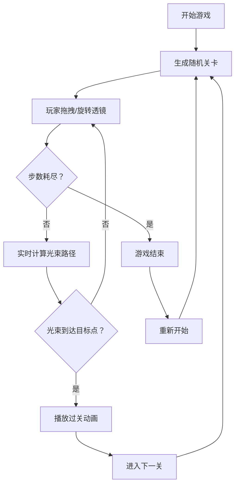

## 1. 产品概述

光之迷途是一款以光学折射和反射为主题的2D解谜游戏，玩家需要操控光束通过透镜和棱镜到达目标点，每个关卡的光路和障碍物随机生成。游戏目标是通过策略性地放置有限数量的可移动透镜，引导光束穿过复杂的光学迷宫最终到达目标点。

- 目标用户：喜欢解谜和物理模拟类游戏的独立游戏玩家
- 产品价值：提供基于真实光学原理的沉浸式解谜体验，结合精美的视觉效果

## 2. 核心功能

### 2.1 功能模块
1. **游戏主界面**：侧边栏透镜选择、Canvas游戏画布、顶部进度条、状态提示
2. **关卡生成系统**：8x8网格随机生成反射镜、三棱镜、能量衰减区域、目标点
3. **光束物理模拟**：反射、折射（波长色散）、能量衰减、粒子尾迹
4. **玩家交互系统**：透镜拖拽放置、滚轮旋转、步数计数
5. **视觉反馈系统**：目标点闪烁、进度条动画、过关烟花粒子特效

### 2.2 页面详情
| 页面名称 | 模块名称 | 功能描述 |
|-----------|-------------|---------------------|
| 游戏主界面 | 侧边栏 | 展示可拖拽透镜（最多5个），深紫罗兰色磨砂玻璃效果 |
| 游戏主界面 | Canvas画布 | 绘制背景、障碍物、透镜、光束、粒子特效，全屏渲染 |
| 游戏主界面 | 进度条 | 顶部动态进度条，显示当前关卡完成百分比 |
| 游戏主界面 | 状态显示 | 显示剩余步数、当前关卡、分数信息 |

## 3. 核心流程

玩家进入游戏后，系统随机生成当前关卡。玩家从侧边栏拖拽透镜放置到画布上，或选中已放置透镜通过滚轮旋转角度。每放置或旋转一次透镜计为1步，系统实时重新计算光束路径。当光束成功到达目标点时，播放过关烟花动画并进入下一关；步数耗尽仍未过关则可选择重新开始。

## 4. 用户界面设计

### 4.1 设计风格
- **主色调**：深色科幻风格，深蓝渐变背景（#0a0a1a 到 #1a1a2e）
- **强调色**：透镜蓝色（#4FC3F7 到 #1E88E5），光束橙紫渐变（#FF4500 到 #8A2BE2），成功绿色（#00FF00），失败红色（#FF0000）
- **控件风格**：圆角8px，悬停时背景变亮（透明度增加0.2）
- **字体**：现代等宽或无衬线字体，适配科幻主题
- **特殊效果**：磨砂玻璃（backdrop-filter: blur(10px)）、内发光、径向渐变光晕

### 4.2 页面设计概述
| 页面名称 | 模块名称 | UI元素 |
|-----------|-------------|-------------|
| 游戏主界面 | 侧边栏 | 宽150px，深紫罗兰色（#2d2d44），磨砂玻璃效果，透镜图标带玻璃质感径向渐变和内发光 |
| 游戏主界面 | Canvas画布 | 全屏，背景#0a0a1a，边缘径向渐变光晕，60fps渲染 |
| 游戏主界面 | 进度条 | 顶部高8px，填充色从红渐变到绿，动态更新 |
| 游戏主界面 | 透镜图标 | 蓝色圆形，半径15px，径向渐变，内发光效果 |

### 4.3 响应式设计
- 桌面端（宽度≥768px）：侧边栏固定在左侧，宽150px，画布占据剩余区域
- 移动端（宽度<768px）：侧边栏折叠为顶部工具栏，高60px，透镜图标紧凑排列

### 4.4 视觉特效
- 光束粒子尾迹：每帧10个粒子，直径2-4px，透明度衰减
- 目标点：金色发光六边形，成功时绿色闪烁（2Hz），失败时红色闪烁（1Hz）
- 过关动画：200个烟花粒子，随机颜色，爆发半径100px，持续2秒
