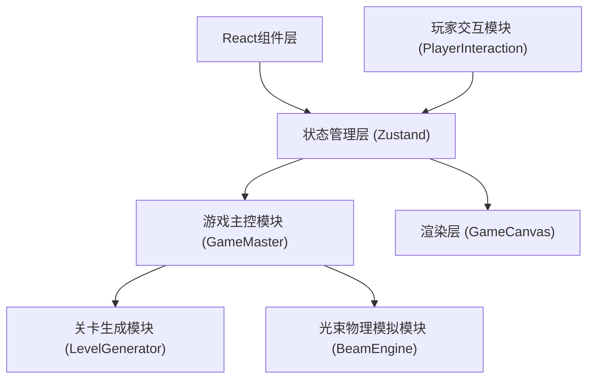

## 1. 架构设计



### 数据流向
1. PlayerInteraction → GameMaster：玩家放置/旋转透镜的操作事件
2. GameMaster → LevelGenerator：请求生成新关卡数据
3. LevelGenerator → GameMaster：返回障碍物、透镜、目标点数据
4. GameMaster → BeamEngine：传入关卡数据和玩家透镜数据
5. BeamEngine → GameMaster：返回计算后的光路数组
6. GameMaster → GameCanvas：通过Zustand状态传递渲染数据
7. GameCanvas：从Zustand读取状态并渲染到Canvas

## 2. 技术描述

- **前端框架**：React 18 + TypeScript
- **构建工具**：Vite 5
- **状态管理**：Zustand 4
- **渲染技术**：Canvas 2D API
- **辅助库**：uuid（生成唯一ID）
- **初始化方式**：Vite react-ts 模板

## 3. 文件结构与调用关系

```
src/
├── game/
│   ├── types.ts              # 共享类型定义（被所有game模块引用）
│   ├── LevelGenerator.ts     # 关卡生成模块（被GameMaster调用）
│   ├── BeamEngine.ts         # 光束物理模拟模块（被GameMaster调用）
│   ├── GameMaster.ts         # 游戏主控模块（Zustand Store）
│   └── PlayerInteraction.ts  # 玩家交互模块（Hook，调用GameMaster）
├── components/
│   ├── GameCanvas.tsx        # Canvas渲染组件（读取GameMaster状态）
│   └── Sidebar.tsx           # 侧边栏组件（使用PlayerInteraction）
├── App.tsx                   # 主应用组件
├── main.tsx                  # 入口文件
└── index.css                 # 全局样式
```

### 模块调用关系
- `LevelGenerator.ts` → 依赖 `types.ts`，导出 `generateLevel(difficulty)`
- `BeamEngine.ts` → 依赖 `types.ts`，导出 `simulateBeam(levelData, lenses)`
- `GameMaster.ts` → 依赖 `types.ts` + `LevelGenerator.ts` + `BeamEngine.ts`，导出 Zustand store
- `PlayerInteraction.ts` → 依赖 `GameMaster.ts`，导出 `usePlayerInteraction()`
- `GameCanvas.tsx` → 依赖 `GameMaster.ts`，纯渲染组件

## 4. 核心数据模型

### 4.1 共享接口定义

```typescript
// 坐标点
interface Point {
  x: number;
  y: number;
}

// 光路线段
interface BeamSegment {
  start: Point;
  end: Point;
  color: string;
  width: number;
  energy: number; // 0-1
}

// 反射镜
interface Mirror {
  id: string;
  position: Point;
  angle: number; // 度
  length: number; // 40px
}

// 三棱镜
interface Prism {
  id: string;
  position: Point;
  rotation: number;
  sideLength: number; // 50px
}

// 能量衰减区域
interface Attenuator {
  id: string;
  position: Point;
  radius: number; // 30px (直径60)
}

// 目标点
interface Target {
  position: Point;
  radius: number; // 20px (直径40)
  hit: boolean;
}

// 可移动透镜
interface Lens {
  id: string;
  position: Point;
  angle: number; // 0-360度
  radius: number; // 15px
  placed: boolean;
}

// 粒子
interface Particle {
  id: string;
  position: Point;
  velocity: Point;
  color: string;
  size: number;
  opacity: number;
  life: number; // 剩余帧数
}

// 关卡数据
interface LevelData {
  gridSize: number; // 8
  mirrors: Mirror[];
  prisms: Prism[];
  attenuators: Attenuator[];
  target: Target;
  beamStart: Point;
  beamAngle: number;
}

// 游戏状态
interface GameState {
  level: number;
  score: number;
  stepsRemaining: number;
  levelData: LevelData | null;
  placedLenses: Lens[];
  availableLenses: Lens[];
  beamPath: BeamSegment[];
  particles: Particle[];
  selectedLensId: string | null;
  levelComplete: boolean;
  fireworks: Particle[];
}
```

## 5. 性能优化策略

1. **光束模拟优化**：光线追踪使用迭代法，最大反射/折射次数限制为20次，避免无限循环
2. **粒子池管理**：复用粒子对象，每束光尾迹粒子不超过30个，整体粒子上限500个
3. **Canvas渲染优化**：使用 requestAnimationFrame，脏矩形重绘，离屏Canvas缓存静态元素
4. **状态更新节流**：透镜旋转使用节流（5度步长），光束计算延迟控制在30ms内
5. **响应式处理**：使用ResizeObserver监听画布尺寸变化，debounce重绘
