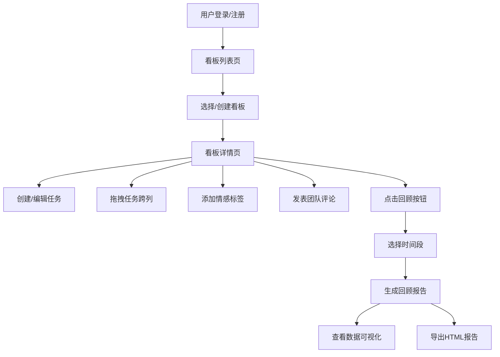

## 1. 产品概述

AgileFlow 是一款团队敏捷任务管理与回顾应用，解决传统看板工具缺乏情感反馈、无法自动生成回顾报告的痛点。面向敏捷开发团队，提供任务可视化管理、团队情感追踪、智能回顾分析一体化解决方案。

- **核心价值**：将情感数据融入项目管理，帮助团队识别压力点、庆祝成就，通过数据驱动的回顾会议提升团队效率和凝聚力。
- **目标用户**：敏捷开发团队、产品经理、Scrum Master、项目负责人。

---

## 2. 核心功能

### 2.1 用户角色

| 角色 | 注册方式 | 核心权限 |
|------|----------|----------|
| 普通用户 | 用户名密码注册（localStorage模拟） | 创建看板、管理任务、添加评论、查看回顾报告 |
| 看板成员 | 受邀加入 | 查看看板、移动任务、添加评论和情感标签 |

### 2.2 功能模块

1. **看板列表页**：用户看板展示、创建新看板、受邀看板列表、用户登录/注册
2. **看板详情页**：四列任务看板、拖拽排序、情感图表统计、任务卡片管理、评论系统
3. **回顾报告页**：完成率环形图、情感分布饼图、评论词云、时间段筛选、HTML导出

### 2.3 页面详情

| 页面名称 | 模块名称 | 功能描述 |
|----------|----------|----------|
| 看板列表页 | 导航栏 | 应用Logo、用户头像昵称、退出登录 |
| 看板列表页 | 看板网格 | 展示用户创建和受邀的看板卡片，点击进入详情 |
| 看板列表页 | 创建看板 | 弹窗表单，输入看板名称和描述 |
| 看板列表页 | 登录注册 | 表单切换，支持新用户注册和已有用户登录 |
| 看板详情页 | 情感统计图表 | 条形图展示各情感标签数量，动画平滑过渡 |
| 看板详情页 | 四列看板 | 待办/进行中/审核/已完成，支持拖拽跨列移动 |
| 看板详情页 | 任务卡片 | 标题/描述/负责人/截止日期/情感标签/评论区 |
| 看板详情页 | 评论系统 | 头像首字母图标、Markdown编辑预览、时间戳 |
| 回顾报告页 | 时间段选择 | 最近一周/两周/一个月快捷选项 |
| 回顾报告页 | 数据可视化 | 完成率环形图、情感分布饼图、高频词云 |
| 回顾报告页 | 导出功能 | 一键导出完整HTML格式报告 |

---

## 3. 核心流程

用户登录后进入看板列表，选择或创建看板进入详情页。在看板中可以创建任务、拖拽移动状态、添加情感标签和评论。点击回顾按钮选择时间段，系统自动生成包含完成率、情感分布和词云的回顾报告，可导出为HTML文件。

---

## 4. 用户界面设计

### 4.1 设计风格

- **主色调**：#2C3E50（深蓝灰）作为背景和文字主色，#E74C3C（珊瑚红）作为强调色
- **状态色**：待办#FFB74D、进行中#42A5F5、审核#AB47BC、已完成#66BB6A
- **毛玻璃效果**：背景模糊16px，叠加rgba(255,255,255,0.85)半透明白色遮罩
- **卡片样式**：圆角12px，左侧3px状态色条，默认阴影0 4px 12px rgba(0,0,0,0.08)，悬停阴影加深至0 8px 24px rgba(0,0,0,0.15)并上移2px
- **按钮交互**：悬停放大1.05倍，transition 0.2s ease
- **字体**：Google Fonts Inter，字重400/500/700
- **输入框**：聚焦时边框变为珊瑚红色

### 4.2 页面设计概述

| 页面名称 | 模块名称 | UI元素 |
|----------|----------|--------|
| 看板列表页 | 导航栏 | 固定高度60px，左侧应用名称+返回首页，右侧用户头像+昵称 |
| 看板列表页 | 看板卡片 | 毛玻璃效果，悬停上移动画，显示看板名称、任务数量、创建时间 |
| 看板详情页 | 情感图表 | 条形图，每种表情对应颜色条，数据更新时平滑过渡动画 |
| 看板详情页 | 任务卡片 | 宽260px，高度自适应，左侧3px状态色条，底部情感标签选择器 |
| 看板详情页 | 评论区 | 可展开收起，首字母圆形头像（直径36px），Markdown预览 |
| 回顾报告页 | 图表区域 | 三栏布局，环形图+饼图+词云，动画入场效果 |
| 回顾报告页 | 导出按钮 | 珊瑚红色，悬停放大，点击生成HTML下载 |

### 4.3 响应式设计

- **Desktop（>768px）**：四列并排布局，卡片固定宽度260px
- **Tablet/Mobile（≤768px）**：单列竖排布局，列宽度100%，卡片宽度自适应
- **触摸优化**：拖拽区域增加触摸反馈，按钮最小尺寸44x44px

---

## 5. 性能指标

| 操作 | 响应时间要求 |
|------|-------------|
| 拖拽操作响应延迟 | < 20ms |
| 情感图表更新延迟 | < 50ms |
| 回顾报告生成时间 | ≤ 500ms（本地计算） |
| 页面首次加载 | < 2s |
