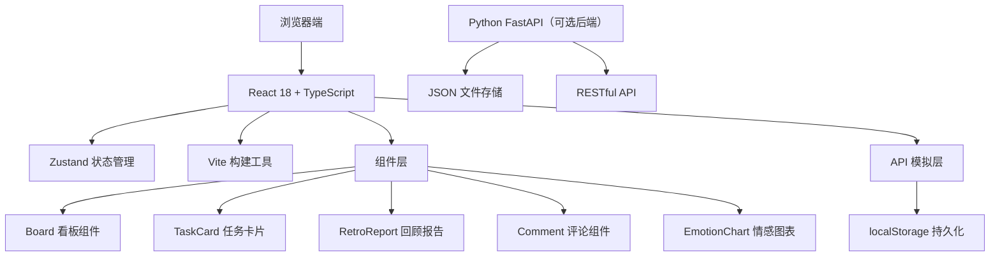
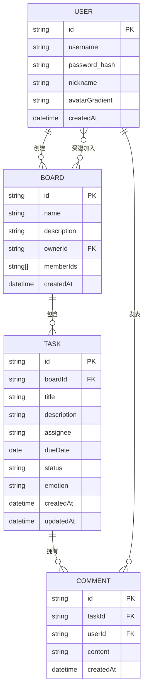

## 1. 架构设计



## 2. 技术描述

- **前端框架**：React@18 + TypeScript@5
- **构建工具**：Vite@5
- **状态管理**：Zustand@4
- **拖拽库**：react-beautiful-dnd（或 @hello-pangea/dnd 替代）
- **图表库**：Recharts@2
- **Markdown渲染**：react-markdown@9
- **HTTP客户端**：Axios@1
- **唯一ID**：uuid@9
- **样式方案**：原生CSS + CSS变量，毛玻璃效果使用backdrop-filter
- **后端**：Python FastAPI（模拟运行，JSON文件存储）

## 3. 路由定义

| 路由 | 页面 | 说明 |
|------|------|------|
| / | 看板列表页 | 展示用户所有看板，登录入口 |
| /board/:id | 看板详情页 | 四列看板、任务管理、情感统计 |
| /board/:id/retro | 回顾报告页 | 数据可视化、报告导出 |
| /login | 登录页 | 用户登录表单 |
| /register | 注册页 | 新用户注册表单 |

## 4. API 定义

```typescript
// 类型定义
interface User {
  id: string;
  username: string;
  nickname: string;
  avatarGradient: string;
  createdAt: string;
}

interface Task {
  id: string;
  boardId: string;
  title: string;
  description: string;
  assignee: string;
  dueDate: string;
  status: 'todo' | 'in-progress' | 'review' | 'done';
  emotion: 'happy' | 'sad' | 'angry' | 'proud' | 'tired' | null;
  createdAt: string;
  updatedAt: string;
}

interface Comment {
  id: string;
  taskId: string;
  userId: string;
  content: string;
  createdAt: string;
}

interface Board {
  id: string;
  name: string;
  description: string;
  ownerId: string;
  memberIds: string[];
  createdAt: string;
}

interface RetroReport {
  period: 'week' | 'twoWeeks' | 'month';
  startDate: string;
  endDate: string;
  completionRate: number;
  totalTasks: number;
  completedTasks: number;
  emotionStats: Record<string, number>;
  wordCloud: { word: string; count: number }[];
}

// API 接口
interface Api {
  // 用户相关
  login: (username: string, password: string) => Promise<User>;
  register: (username: string, password: string, nickname: string) => Promise<User>;
  getUser: (id: string) => Promise<User>;
  
  // 看板相关
  getBoards: (userId: string) => Promise<Board[]>;
  getBoard: (id: string) => Promise<Board>;
  createBoard: (board: Omit<Board, 'id' | 'createdAt'>) => Promise<Board>;
  updateBoard: (id: string, board: Partial<Board>) => Promise<Board>;
  deleteBoard: (id: string) => Promise<void>;
  
  // 任务相关
  getTasks: (boardId: string) => Promise<Task[]>;
  createTask: (task: Omit<Task, 'id' | 'createdAt' | 'updatedAt'>) => Promise<Task>;
  updateTask: (id: string, task: Partial<Task>) => Promise<Task>;
  deleteTask: (id: string) => Promise<void>;
  moveTask: (taskId: string, newStatus: Task['status'], newIndex: number) => Promise<void>;
  
  // 评论相关
  getComments: (taskId: string) => Promise<Comment[]>;
  createComment: (comment: Omit<Comment, 'id' | 'createdAt'>) => Promise<Comment>;
  deleteComment: (id: string) => Promise<void>;
  
  // 回顾报告
  generateReport: (boardId: string, period: RetroReport['period']) => Promise<RetroReport>;
}
```

## 5. 数据模型



## 6. 文件结构

```
project/
├── package.json
├── index.html
├── vite.config.js
├── tsconfig.json
├── src/
│   ├── main.tsx
│   ├── App.tsx
│   ├── store/
│   │   └── index.ts          # Zustand store
│   ├── components/
│   │   ├── Board.tsx         # 看板主组件
│   │   ├── TaskCard.tsx      # 任务卡片
│   │   ├── RetroReport.tsx   # 回顾报告
│   │   ├── CommentList.tsx   # 评论列表
│   │   ├── CommentForm.tsx   # 评论表单
│   │   ├── EmotionChart.tsx  # 情感图表
│   │   ├── EmotionPicker.tsx # 情感选择器
│   │   ├── BoardList.tsx     # 看板列表
│   │   ├── BoardCard.tsx     # 看板卡片
│   │   ├── Navbar.tsx        # 导航栏
│   │   ├── LoginForm.tsx     # 登录表单
│   │   └── RegisterForm.tsx  # 注册表单
│   ├── pages/
│   │   ├── HomePage.tsx      # 首页/看板列表
│   │   ├── BoardPage.tsx     # 看板详情页
│   │   ├── RetroPage.tsx     # 回顾报告页
│   │   ├── LoginPage.tsx     # 登录页
│   │   └── RegisterPage.tsx  # 注册页
│   ├── api/
│   │   └── index.ts          # 模拟API调用
│   ├── types/
│   │   └── index.ts          # 类型定义
│   ├── utils/
│   │   ├── colors.ts         # 颜色生成工具
│   │   ├── markdown.ts       # Markdown工具
│   │   ├── wordCloud.ts      # 词频统计
│   │   └── date.ts           # 日期处理
│   └── styles/
│       ├── global.css        # 全局样式
│       └── reset.css         # Reset样式
└── backend/ (可选)
    ├── main.py               # FastAPI入口
    ├── models.py             # 数据模型
    ├── routes/
    │   ├── users.py
    │   ├── boards.py
    │   ├── tasks.py
    │   ├── comments.py
    │   └── reports.py
    └── data/
        └── db.json           # JSON数据存储
```

## 7. 核心技术方案

### 7.1 状态管理（Zustand）

```typescript
interface AppState {
  user: User | null;
  boards: Board[];
  currentBoard: Board | null;
  tasks: Task[];
  comments: Record<string, Comment[]>;
  loading: boolean;
  
  // 操作方法
  setUser: (user: User | null) => void;
  fetchBoards: () => Promise<void>;
  setCurrentBoard: (board: Board | null) => void;
  fetchTasks: (boardId: string) => Promise<void>;
  addTask: (task: Task) => void;
  updateTaskState: (taskId: string, status: Task['status'], index: number) => void;
  updateTaskEmotion: (taskId: string, emotion: Task['emotion']) => void;
  fetchComments: (taskId: string) => Promise<void>;
  addComment: (taskId: string, comment: Comment) => void;
}
```

### 7.2 拖拽实现

使用 `@hello-pangea/dnd`（react-beautiful-dnd 的维护分支）实现拖拽功能，确保 < 20ms 响应延迟。

### 7.3 性能优化

- 任务卡片使用 `React.memo` 避免不必要重渲染
- 情感图表使用 Recharts 的动画配置实现平滑过渡（< 50ms）
- 回顾报告生成本地计算，使用 Web Worker 处理词频统计（≤ 500ms）
- 评论列表虚拟化（如需要）

### 7.4 情感颜色映射

```typescript
const EMOTION_MAP = {
  happy: { emoji: '😊', color: '#FFD93D', label: '快乐' },
  sad: { emoji: '😢', color: '#6C9BCF', label: '悲伤' },
  angry: { emoji: '😠', color: '#E74C3C', label: '愤怒' },
  proud: { emoji: '💪', color: '#2ECC71', label: '自豪' },
  tired: { emoji: '😧', color: '#9B59B6', label: '疲惫' },
};
```

### 7.5 词频统计算法

1. 收集时间段内所有评论内容
2. 分词（简单空格分隔 + 中文分词基础处理）
3. 过滤停用词（常见虚词）
4. 统计词频并排序
5. 生成词云数据
