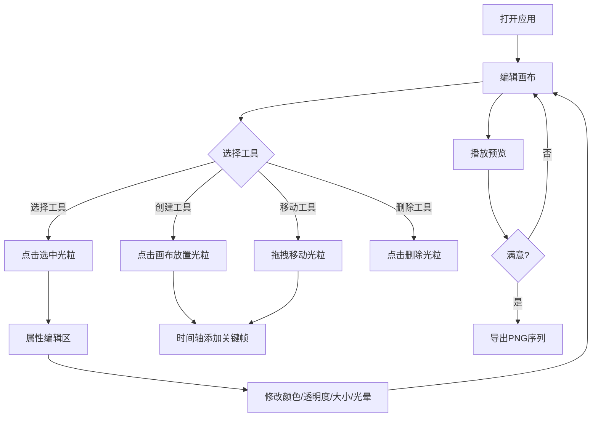

## 1. 产品概述

光粒画布（LightParticle Studio）是一款面向创意工作者和动画爱好者的动态光效短片创作工具。用户通过在深色数字画布上排列组合光粒、设定关键帧动画，即可快速生成流畅的动态光效短片，无需专业动画制作经验。
- 解决传统动画制作门槛高、缺乏即时反馈和创意表达受限的核心问题
- 目标用户为独立创作者、视觉设计师、动效爱好者，提供零门槛的动态光效创作体验

## 2. 核心功能

### 2.1 功能模块

1. **编辑画布页**：全屏深色画布 + 浮动工具面板 + 底部时间轴，三位一体的核心创作界面

### 2.2 页面详情

| 页面名称 | 模块名称 | 功能描述 |
|----------|----------|----------|
| 编辑画布页 | 深色画布 | 800x600px深色画布(#0A0A1A)，支持缩放(0.5x-3x)和中键拖拽平移，光粒实时渲染 |
| 编辑画布页 | 工具面板 | 左侧悬浮面板(240px宽，毛玻璃效果)，包含创建/选择/移动/删除工具及属性编辑区 |
| 编辑画布页 | 时间轴 | 底部水平时间轴(60px高)，5秒/24帧，关键帧管理，播放/暂停，进度条 |
| 编辑画布页 | 预览模式 | 全屏纯黑背景，光粒动画循环播放，返回编辑和导出PNG序列按钮 |
| 编辑画布页 | 属性编辑 | 选中光粒后显示颜色选择器(7色预设)、透明度滑块、大小滑块、光晕开关 |

## 3. 核心流程

用户打开应用后进入编辑画布，使用创建工具在画布上放置光粒，通过选择/移动/删除工具调整光粒布局。选中光粒后在工具面板编辑其颜色、透明度、大小和光晕效果，所有修改实时反映在画布上。在时间轴上添加关键帧记录当前光粒状态，切换到不同时间点调整光粒位置和属性以创建动画。点击预览按钮全屏播放动画，满意后导出为PNG序列zip文件。

## 4. 用户界面设计

### 4.1 设计风格

- **主色调**：深蓝灰(#0A0A1A, #1A1A2E, #2E2E44)
- **强调色**：青蓝(#00E5FF, #6C63FF)
- **按钮风格**：圆角按钮，悬停0.3s ease-in-out渐变过渡，点击0.95倍缩放反馈
- **字体**：UI字体使用系统无衬线字体，工具面板标题使用等宽字体增加科技感
- **布局风格**：画布居中全屏，工具面板左悬浮，时间轴底悬浮
- **图标风格**：线性图标，stroke 2px，颜色#00E5FF

### 4.2 页面设计概览

| 页面名称 | 模块名称 | UI元素 |
|----------|----------|--------|
| 编辑画布页 | 深色画布 | 背景#0A0A1A，800x600px默认尺寸，光粒渲染层，缩放平移交互 |
| 编辑画布页 | 工具面板 | 240px宽，背景#1A1A2E/0.85透明度，圆角12px，1px #2E2E44边框，backdrop-filter:blur(10px)，工具按钮组，属性编辑区 |
| 编辑画布页 | 时间轴 | 60px高，背景#12122A，圆角8px，1px #2A2A44边框，帧标记，播放/暂停按钮，进度条 |
| 编辑画布页 | 预览按钮 | 40x40px，背景#6C63FF，圆角50%，播放图标，悬停1.1倍放大 |
| 编辑画布页 | 预览模式 | 纯黑#000000背景，全屏，底部返回和导出按钮 |
| 编辑画布页 | 光粒效果 | 默认6-12px圆形，颜色#FF6B6B，透明度0.8，选中外发光#00E5FF，光晕径向渐变 |

### 4.3 响应式设计

- 桌面优先设计，画布区域自适应窗口大小
- 工具面板和时间轴在小屏幕下可折叠
- 触控优化：光粒选择区域适当扩大，滑块操作区域增大

### 4.4 动效设计

- 光粒创建时：从0缩放到目标大小，200ms ease-out
- 光粒选中时：外发光#00E5FF脉冲动画，1s循环
- 光粒移动时：显示十字辅助坐标线，虚线样式#00E5FF
- 时间轴播放：光粒按ease-in-out曲线插值平滑移动
- 面板元素：悬停0.3s ease-in-out过渡，点击0.95倍缩放
- 预览按钮：悬停1.1倍放大，0.3s过渡
