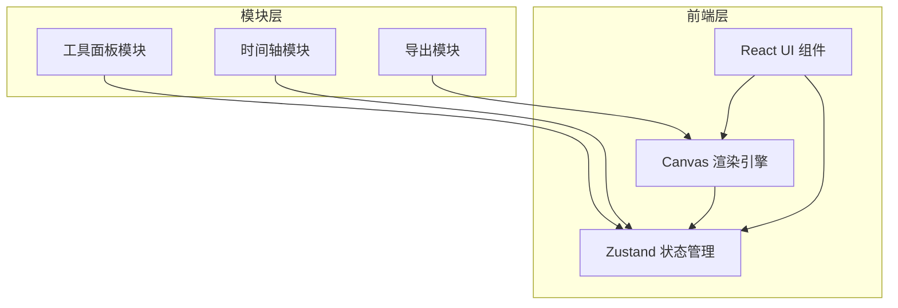

## 1. 架构设计



## 2. 技术说明

- **前端框架**：React@18 + TypeScript（严格模式）
- **构建工具**：Vite + @vitejs/plugin-react
- **状态管理**：Zustand（管理光粒列表、关键帧数据、播放状态）
- **渲染引擎**：原生Canvas 2D API（光粒渲染、动画插值、缩放平移）
- **导出工具**：JSZip（PNG序列打包为zip下载）
- **无后端**：纯前端应用，所有数据存储在内存/Zustand store中

## 3. 文件结构

| 文件路径 | 职责 |
|----------|------|
| package.json | 依赖管理：react, react-dom, zustand, typescript, vite, @vitejs/plugin-react, jszip |
| index.html | 入口页面，挂载div#root |
| vite.config.ts | Vite配置，含React插件 |
| tsconfig.json | TypeScript严格模式配置，JSX保留 |
| src/main.tsx | React渲染入口 |
| src/store/useEditorStore.ts | Zustand状态仓库：光粒数组、关键帧序列、播放状态、选中ID、工具状态；提供CRUD方法和播放控制 |
| src/canvas/ParticleCanvas.ts | Canvas渲染模块：光粒绘制、光晕渲染、关键帧插值(ease-in-out)、缩放平移、导出静态图像 |
| src/timeline/Timeline.tsx | 时间轴React组件：轨道渲染、帧标记、进度条、播放/暂停交互 |
| src/tools/ToolPanel.tsx | 工具面板React组件：工具按钮组、属性编辑区(颜色/透明度/大小/光晕) |
| src/utils/export.ts | 导出工具：Canvas帧渲染→PNG→JSZip打包→触发下载 |

## 4. 核心数据结构

### 4.1 光粒（Particle）

```typescript
interface Particle {
  id: string;
  x: number;
  y: number;
  radius: number;       // 4-20px
  color: string;        // hex颜色
  opacity: number;      // 0.1-1.0
  glowEnabled: boolean; // 光晕开关
}
```

### 4.2 关键帧（Keyframe）

```typescript
interface Keyframe {
  id: string;
  frameIndex: number;         // 帧序号(0-119, 5秒x24帧)
  particles: Particle[];      // 该帧所有光粒的快照
}
```

### 4.3 编辑器状态（EditorStore）

```typescript
interface EditorState {
  particles: Particle[];
  keyframes: Keyframe[];
  selectedParticleId: string | null;
  activeTool: 'create' | 'select' | 'move' | 'delete';
  isPlaying: boolean;
  currentFrame: number;       // 当前帧索引
  totalFrames: number;        // 总帧数(默认120)
  zoom: number;               // 缩放级别(0.5-3)
  panOffset: { x: number; y: number };
  isPreviewMode: boolean;
}
```

## 5. 动画插值算法

关键帧之间采用ease-in-out插值：

```typescript
function easeInOut(t: number): number {
  return t < 0.5 ? 2 * t * t : 1 - Math.pow(-2 * t + 2, 2) / 2;
}
```

对于两个相邻关键帧之间的帧，计算当前帧在关键帧间的进度比例`t`，对光粒的`x`、`y`、`radius`、`opacity`进行线性插值，插值因子使用ease-in-out曲线平滑。

## 6. 性能目标

- 编辑模式：光粒≤50个时无卡顿，60fps
- 预览模式：动画播放帧率稳定60fps
- 使用requestAnimationFrame驱动渲染循环
- Canvas绘制优化：只重绘变化区域，光晕使用离屏Canvas缓存
