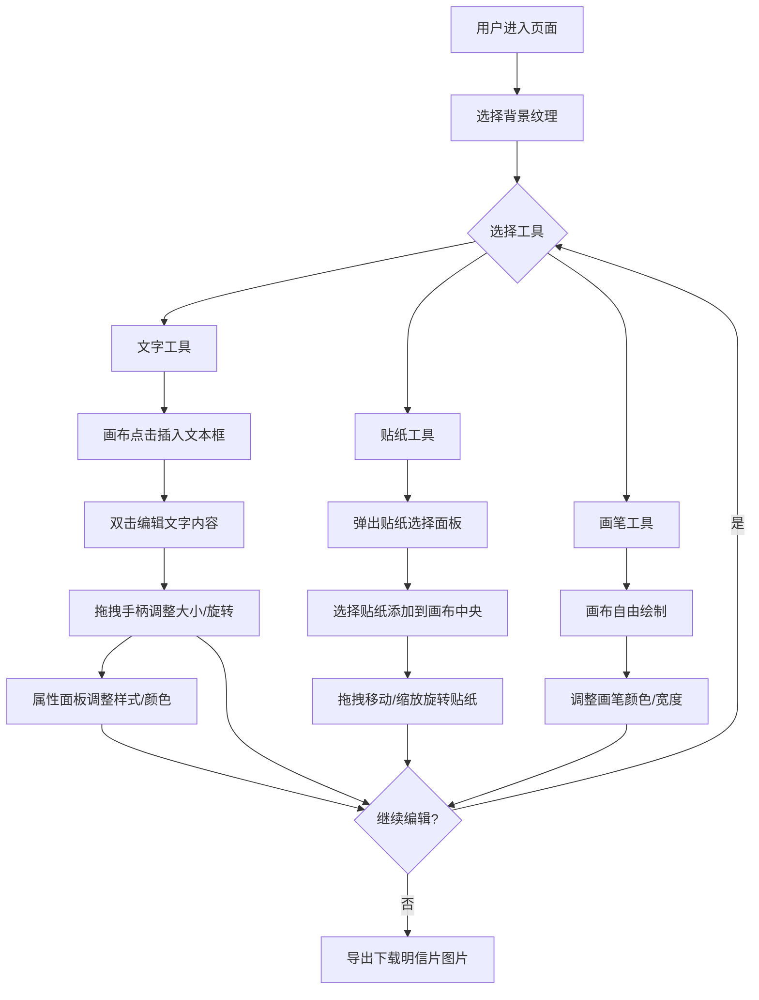

## 1. 产品概述
回声明信片是一款Web端数码明信片设计工具，用户可在800x600像素画布上自由设计明信片，支持背景纹理切换、文字编辑添加、贴纸装饰、自由涂鸦绘制，完成后可导出图片下载。

- 核心价值：让用户以复古温暖的视觉风格，快速创作个性化数码明信片，传递情感与记忆。

## 2. 核心功能

### 2.2 功能模块

1. **编辑器主页**：画布渲染、侧边工具栏、属性编辑区、元素交互

### 2.3 页面详情

| 页面名称 | 模块名称 | 功能描述 |
|---------|---------|---------|
| 编辑器主页 | 中央画布区 | 800x600像素，#FAFAFA背景，box-shadow阴影，渲染纹理、元素、贴纸、画笔路径 |
| 编辑器主页 | 左侧工具栏 | 宽220px，#F0EBE6背景，顶部圆角12px，包含纹理区、元素添加区、属性编辑区 |
| 编辑器主页 | 纹理选择区 | 5个60x60px缩略图，圆角8px，点击切换画布背景纹理 |
| 编辑器主页 | 元素添加区 | 文字、贴纸、画笔三个圆形按钮（直径44px，SVG图标，悬停#D7CCC8） |
| 编辑器主页 | 属性编辑区 | 选中元素后出现，位置/尺寸输入框、颜色选择器 |
| 编辑器主页 | 文本编辑 | 双击编辑文字，8个拖拽手柄（白色圆点，直径8px，灰色边框），支持缩放旋转 |
| 编辑器主页 | 文字样式 | 粗体、斜体、下划线切换，12色3x4圆盘选择器（色块20px） |
| 编辑器主页 | 贴纸面板 | 居中浮层（320px，#FFF，圆角16px，半透明遮罩），12种SVG贴纸（80x80px） |
| 编辑器主页 | 画笔工具 | 自由绘制贝塞尔曲线，颜色/宽度调节，Ctrl+Z撤销最近笔触 |
| 编辑器主页 | 导出功能 | 生成完整明信片图片，支持下载保存 |

## 3. 核心流程

用户打开页面 → 选择背景纹理 → 添加文字/贴纸/涂鸦 → 调整元素属性（位置、大小、旋转、颜色）→ 重复添加元素 → 导出下载明信片

## 4. 用户界面设计

### 4.1 设计风格

- **主色调**：米黄#FDF5E6、深褐#5D4037、琥珀#FFB300
- **画布背景**：#FAFAFA（带淡淡阴影box-shadow: 0 8px 24px rgba(0,0,0,0.1)）
- **工具栏背景**：#F0EBE6（浅灰米色），悬停#D7CCC8
- **按钮风格**：圆角8px-12px，圆形工具按钮直径44px
- **字体**：文字默认Georgia，界面字体采用衬线+无衬线组合
- **图标风格**：简洁单色SVG图标

### 4.2 页面设计概览

| 页面名称 | 模块名称 | UI元素 |
|---------|---------|---------|
| 编辑器主页 | 整体布局 | 暖复古风格，画布居中，工具栏左侧悬浮，圆角设计 |
| 编辑器主页 | 画布区 | 800x600px，居中，阴影，白色背景 |
| 编辑器主页 | 工具栏 | 220px宽，浅米色，顶部圆角12px，三段式分区 |
| 编辑器主页 | 纹理缩略图 | 60x60px，圆角8px，选中态高亮边框 |
| 编辑器主页 | 工具按钮 | 圆形44px，SVG图标，悬停深色背景 |
| 编辑器主页 | 属性面板 | 输入框圆角，颜色圆盘3x4网格 |
| 编辑器主页 | 贴纸浮层 | 居中模态，圆角16px，半透明遮罩 |
| 编辑器主页 | 拖拽手柄 | 8个白色圆点，8px直径，1px灰色边框 |

### 4.3 响应式

- **桌面优先（≥900px）：工具栏左侧固定宽度220px

，画布800x600px居中
- **移动端（<900px）：工具栏折叠为底部横条60px高，画布等比例缩小适配，触摸优化

### 4.4 动画与性能

- 过渡动画0.2s ease-in-out
- 画布渲染响应≤100ms（鼠标松开后）
- 拖拽/绘制延迟≤32ms
