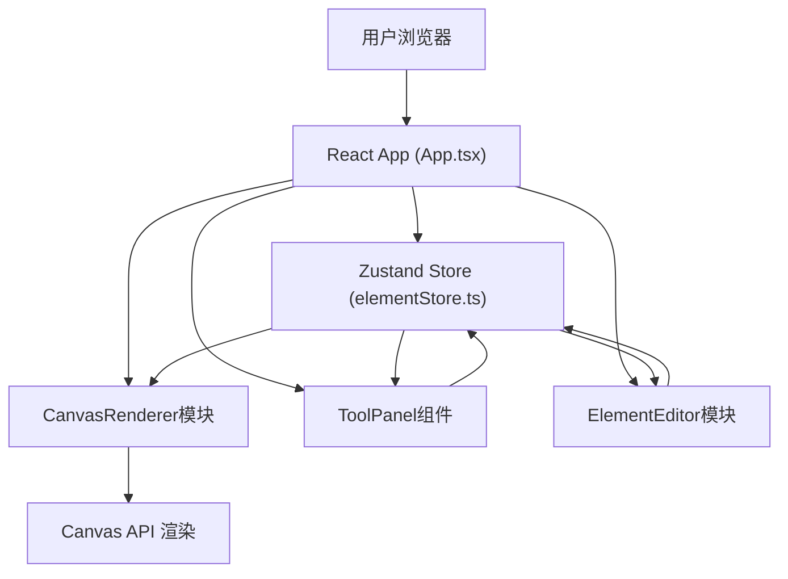

## 1. 架构设计



## 2. 技术说明

- **前端框架**：React@18 + TypeScript
- **构建工具**：Vite@5 + @vitejs/plugin-react
- **状态管理**：Zustand@4
- **唯一ID**：uuid@9
- **画布渲染**：HTML5 Canvas API
- **样式方案**：原生CSS（CSS Modules风格内联样式）

## 3. 文件结构

```
auto360/
├── package.json
├── index.html
├── tsconfig.json
├── vite.config.js
└── src/
│   ├── main.tsx
│   ├── App.tsx
│   ├── store/
│   │   └── elementStore.ts
│   └── modules/
│       ├── CanvasRenderer.ts
│       ├── ToolPanel.tsx
│       └── ElementEditor.ts
```

## 4. 数据模型

### 4.1 Zustand Store (elementStore.ts)

```typescript
interface BaseElement {
  id: string;
  type: 'text' | 'sticker' | 'brush';
  x: number;
  y: number;
  width: number;
  height: number;
  rotation: number;
}

interface TextElement extends BaseElement {
  type: 'text';
  content: string;
  fontSize: number;
  fontFamily: string;
  color: string;
  bold: boolean;
  italic: boolean;
  underline: boolean;
}

interface StickerElement extends BaseElement {
  type: 'sticker';
  stickerType: string;
}

interface BrushElement extends BaseElement {
  type: 'brush';
  points: { x: number; y: number }[];
  strokeWidth: number;
  strokeColor: string;
}

type PostcardElement = TextElement | StickerElement | BrushElement;

interface ElementState {
  elements: PostcardElement[];
  selectedId: string | null;
  backgroundTexture: string;
  history: PostcardElement[][];
  historyIndex: number;
  currentTool: 'select' | 'text' | 'sticker' | 'brush';
  brushColor: string;
  brushWidth: number;
}
```

## 5. 模块职责

### 5.1 CanvasRenderer.ts
- 画布初始化与尺寸管理
- 背景纹理渲染（5种纹理绘制函数
- 元素渲染循环
- 鼠标事件处理（点击、拖拽、缩放、旋转）
- 导出图片生成（toDataURL）

### 5.2 ToolPanel.tsx
- 纹理选择区渲染与切换
- 工具按钮（文字/贴纸/画笔）
- 属性编辑区（位置、尺寸、颜色选择器
- 贴纸弹出面板
- 文字样式控制面板

### 5.3 ElementEditor.ts
- 选中元素管理
- 位置/尺寸/旋转变换计算
- 8个拖拽手柄命中检测
- 缩放旋转矩阵变换
- 撤销/重做历史栈
