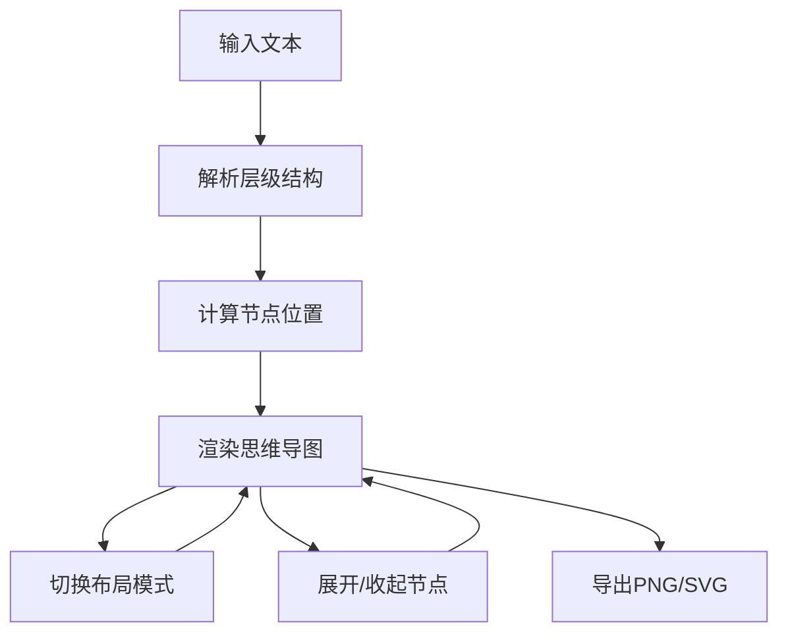

## 1. 产品概述

思维导图工具是一款将文字笔记自动转化为可视化思维导图的在线工具，帮助用户快速整理零散想法，提升信息整理效率。

- 核心价值：解决手动绘制思维导图耗时、难以快速整理零散想法的痛点
- 目标用户：学生、知识工作者、产品经理等需要进行信息结构化整理的人群
- 使用场景：读书笔记整理、会议纪要梳理、项目规划、头脑风暴等

## 2. 核心功能

### 2.1 用户角色

| 角色 | 注册方式 | 核心权限 |
|------|----------|----------|
| 普通用户 | 无需注册，直接使用 | 文本编辑、导图生成、布局切换、图片导出 |

### 2.2 功能模块

1. **文本编辑模块**：多行文本输入，缩进层级解析，实时预览
2. **导图渲染模块**：树形结构可视化，贝塞尔曲线连接，节点交互动画
3. **布局切换模块**：三种布局模式（思维导图、组织结构图、鱼骨图）平滑切换
4. **导出模块**：支持PNG（2x分辨率）和SVG矢量格式导出
5. **交互控制模块**：节点展开/收起、拖拽分隔线

### 2.3 页面详情

| 页面名称 | 模块名称 | 功能描述 |
|----------|----------|----------|
| 主页 | 顶部工具栏 | 布局模式下拉选择、导出按钮组 |
| 主页 | 左侧文本编辑区 | 多行文本输入、缩进解析提示 |
| 主页 | 分隔线 | 可拖拽调整左右栏宽度 |
| 主页 | 右侧思维导图画布 | SVG渲染、节点交互、贝塞尔曲线连接 |
| 主页 | 导出遮罩层 | 半透明背景、加载动画 |

## 3. 核心流程

用户在左侧编辑区输入带缩进的多行文本，系统自动解析层级关系并在右侧画布生成思维导图。用户可切换布局模式、展开收起节点、调整左右栏比例，最终导出为图片或矢量文件。

## 4. 用户界面设计

### 4.1 设计风格

- 主色调：蓝色 #1976D2（导出按钮）、浅米色 #FFF8E1（编辑区背景）、浅灰色 #ECEFF1（画布背景）
- 节点色带：一级#E53935红、二级#FB8C00橙、三级#43A047绿、四级#1E88E5蓝
- 按钮风格：圆角6px，hover时加深颜色
- 字体：系统默认字体，节点文字14px，颜色#333
- 布局风格：左右两栏布局，顶部工具栏，中间可拖拽分隔线
- 动画风格：CSS过渡动画0.4秒ease-in-out，加载旋转动画

### 4.2 页面设计概览

| 页面名称 | 模块名称 | UI元素 |
|----------|----------|--------|
| 主页 | 顶部工具栏 | 白色背景、底部边框、左侧标题、中间布局选择器、右侧导出按钮 |
| 主页 | 文本编辑区 | 浅米色背景、textarea占满、等宽字体、内边距 |
| 主页 | 分隔线 | 深灰色4px宽、col-resize光标、hover高亮 |
| 主页 | 思维导图画布 | 浅灰色背景、SVG容器、节点圆角矩形、贝塞尔曲线连接 |
| 主页 | 导出遮罩 | 半透明白色背景、居中旋转加载圆环 |

### 4.3 响应式

- 桌面端优先设计
- 左侧编辑区最小宽度500px
- 画布区域自适应剩余空间
- 分隔线拖拽时保持最小宽度限制

### 4.4 性能指标

- 1000节点以下解析渲染耗时 ≤ 500ms
- 节点拖拽帧率 ≥ 30FPS
- 布局切换动画流畅无卡顿
