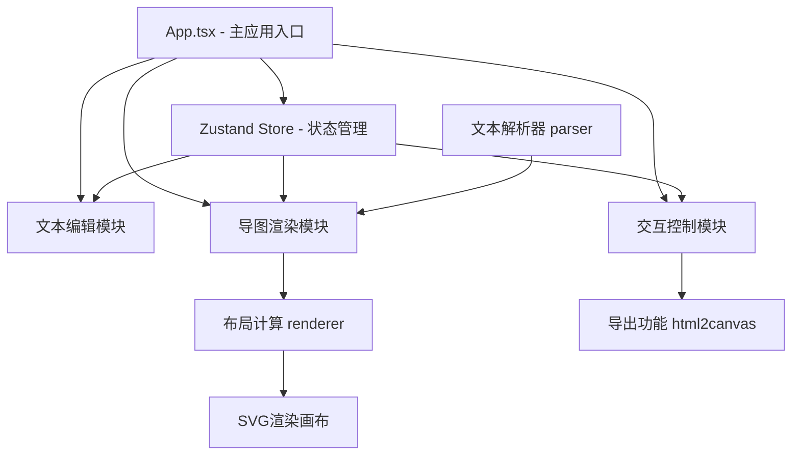

## 1. 架构设计



## 2. 技术描述

- **前端框架**：React 18 + TypeScript
- **构建工具**：Vite
- **状态管理**：Zustand
- **唯一标识**：uuid
- **图片导出**：html2canvas
- **样式方案**：CSS Modules / 内联样式
- **渲染技术**：SVG + 贝塞尔曲线

## 3. 目录结构

```
src/
├── App.tsx                     # 主应用组件
├── main.tsx                    # 入口文件
├── index.css                   # 全局样式
├── store/
│   └── useMindMapStore.ts      # Zustand状态管理
├── modules/
│   ├── parser/
│   │   └── index.ts            # 文本解析模块
│   ├── renderer/
│   │   └── index.ts            # 画布渲染/布局计算模块
│   └── interaction/
│       └── index.ts            # 交互控制模块
├── components/
│   ├── Toolbar.tsx             # 顶部工具栏
│   ├── TextEditor.tsx          # 文本编辑区
│   ├── MindMapCanvas.tsx       # 思维导图画布
│   ├── MindMapNode.tsx         # 导图节点组件
│   ├── BezierCurve.tsx         # 贝塞尔曲线组件
│   ├── Resizer.tsx             # 可拖拽分隔线
│   └── ExportOverlay.tsx       # 导出遮罩层
└── types/
    └── index.ts                # 类型定义
```

## 4. 核心模块设计

### 4.1 文本解析模块 (parser)

- 输入：原始多行文本字符串
- 输出：层级节点树
- 核心逻辑：
  - 按行分割文本
  - 计算每行缩进层级（空格或Tab）
  - 构建树形结构
  - 空行过滤处理

### 4.2 布局渲染模块 (renderer)

- 输入：节点树数据、布局模式
- 输出：节点位置坐标数组、曲线路径数据
- 三种布局算法：
  - 思维导图：径向布局，根节点居中，子节点放射状排列
  - 组织结构图：自上而下层级布局
  - 鱼骨图：主干从左到右，分支上下分布

### 4.3 交互控制模块 (interaction)

- 节点点击：展开/收起子树
- 布局切换：调用渲染器重新计算位置
- 导出功能：调用html2canvas生成PNG，原生SVG序列化生成SVG

### 4.4 状态管理 (Zustand Store)

```typescript
interface MindMapState {
  rawText: string;
  nodeTree: MindMapNode | null;
  layoutMode: 'mindmap' | 'orgchart' | 'fishbone';
  selectedNodeId: string | null;
  collapsedNodes: Set<string>;
  isExporting: boolean;
  // actions
  setRawText: (text: string) => void;
  setLayoutMode: (mode: string) => void;
  toggleNode: (nodeId: string) => void;
  exportPNG: () => void;
  exportSVG: () => void;
}
```

## 5. 数据模型

### 5.1 节点数据结构

```typescript
interface MindMapNode {
  id: string;
  text: string;
  level: number;
  children: MindMapNode[];
  parentId: string | null;
  isCollapsed?: boolean;
}
```

### 5.2 节点位置数据

```typescript
interface NodePosition {
  id: string;
  x: number;
  y: number;
  width: number;
  height: number;
}
```

### 5.3 连接曲线数据

```typescript
interface BezierCurve {
  id: string;
  sourceId: string;
  targetId: string;
  path: string;
}
```

## 6. 性能优化策略

- 使用requestAnimationFrame保证渲染帧率
- 节点位置计算采用迭代算法避免递归爆栈
- SVG渲染使用memo减少不必要重绘
- 文本解析使用增量更新（debounce）
- 大图导出使用离屏Canvas
