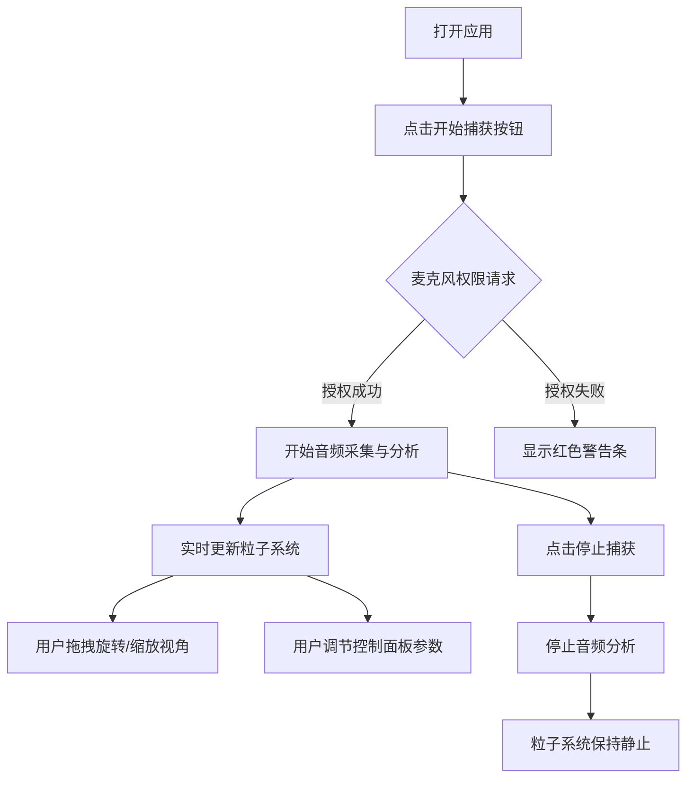

## 1. 产品概述

声波粒子雕塑家是一款基于WebGL的三维交互式音频可视化应用，将麦克风输入的声音实时转化为动态粒子雕塑。用户通过声音创造独特的视觉艺术作品，支持视角控制和参数调节。

- 核心价值：将听觉体验转化为沉浸式视觉体验，让用户直观感受声音的形态与律动
- 目标用户：音乐爱好者、视觉艺术家、教育工作者、普通用户

## 2. 核心功能

### 2.1 功能模块

1. **音频采集模块**：麦克风输入、实时频谱分析、音量包络计算
2. **粒子系统模块**：三维粒子渲染、音频驱动动画、颜色映射
3. **交互控制模块**：视角旋转缩放、参数调节面板、帮助说明
4. **状态管理模块**：全局状态共享、音频数据传递、参数同步

### 2.2 页面详情

| 页面名称 | 模块名称 | 功能描述 |
|---------|---------|----------|
| 主场景 | 3D粒子系统 | 实时音频可视化粒子雕塑，支持鼠标拖拽旋转、滚轮缩放 |
| 主场景 | 开始/停止按钮 | 左下角控制按钮，启动/停止麦克风捕获，显示实时音量条 |
| 控制面板 | 参数调节面板 | 右下角浮动面板，调节粒子密度、颜色方案、运动阻尼 |
| 控制面板 | 帮助弹窗 | 点击?按钮显示操作说明 |
| 警告提示 | 权限警告 | 麦克风权限拒绝时顶部红色警告条 |

## 3. 核心流程

用户打开应用 → 点击"开始捕获" → 请求麦克风权限 → 授权成功后开始音频分析 → 粒子系统响应音频变化 → 用户通过鼠标交互调整视角 → 通过控制面板调节参数 → 点击"停止捕获"结束

## 4. 用户界面设计

### 4.1 设计风格

- **设计主题**：赛博朋克科技风，暗色主题，发光粒子效果
- **主色调**：深蓝背景(#0A0A2A)，青绿色(#4ECDC4)，珊瑚红(#FF6B6B)
- **辅助色**：红橙渐变(#FF4500-#FF8C00)、蓝紫渐变(#1E90FF-#8A2BE2)、青绿渐变(#00FA9A-#00CED1)
- **字体**：现代无衬线字体，清晰易读
- **视觉效果**：毛玻璃面板、发光粒子、平滑过渡动画

### 4.2 页面设计概述

| 页面模块 | 元素名称 | UI细节 |
|---------|---------|--------|
| 3D场景 | Canvas全屏 | 径向渐变背景从深蓝到黑色，粒子发光效果 |
| 左下角 | 捕获按钮 | 宽120px高36px，圆角18px，青绿色背景，白色文字 |
| 左下角 | 音量条 | 按钮下方，宽200px高8px，深灰背景，绿色填充 |
| 右下角 | 控制面板 | 宽240px，半透明深色背景，毛玻璃效果，圆角12px |
| 控制面板 | 粒子密度滑块 | 范围200-2000，步长100，初始500 |
| 控制面板 | 颜色方案下拉 | 快速变换、平滑过渡、单色渐变 |
| 控制面板 | 阻尼系数滑块 | 范围0.80-0.99，步长0.01，初始0.95 |
| 控制面板 | 帮助按钮 | 左上角?图标，圆形24px |
| 顶部 | 警告条 | 高40px，红色背景，白色文字 |

### 4.3 响应式设计

- 桌面端：控制面板固定右下角，宽240px
- 移动端(768px以下)：控制面板改为水平布局，固定底部，宽度100%，高度自适应
- 触摸优化：支持双指缩放、单指旋转

### 4.4 3D场景设计

- **环境**：径向渐变背景从深蓝(#0A0A2A)到黑色(#000000)，营造深空氛围
- **光照**：环境光强度0.4，点光源位于(5,10,5)强度0.8
- **粒子**：球体粒子半径0.02，分段数8，中心不透明边缘半透明的发光效果
- **相机**：初始距离适中，支持OrbitControls轨道控制
- **动画**：布朗运动+音频驱动力，音量超过0.7时爆发脉冲效果
- **性能**：2000粒子时保持45fps以上
