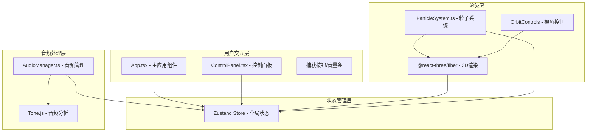

## 1. 架构设计



## 2. 技术栈说明

- **前端框架**：React@18 + TypeScript@5
- **构建工具**：Vite@5 + @vitejs/plugin-react
- **3D渲染**：Three.js + @react-three/fiber + @react-three/drei
- **状态管理**：Zustand
- **音频处理**：Tone.js（UserMedia + FFT分析器）
- **工具库**：uuid

## 3. 文件结构

```
├── package.json
├── vite.config.js
├── tsconfig.json
├── index.html
└── src/
    ├── audio/
    │   └── AudioManager.ts      # 音频采集与频谱分析模块
    ├── particle/
    │   └── ParticleSystem.ts    # 粒子系统渲染与更新模块
    ├── ui/
    │   └── ControlPanel.tsx    # 用户交互控制模块
    ├── store/
    │   └── useAudioStore.ts    # Zustand状态管理
    ├── App.tsx                # 主应用组件
    └── main.tsx                # 入口文件
```

## 4. 核心模块设计

### 4.1 AudioManager 模块

| 项 | 说明 |
|----|------|
| 职责 | 麦克风初始化、FFT频谱分析、音频特征提取 |
| 输入 | 麦克风音频流 |
| 输出 | AudioFeatures 对象（lowFreq, midFreq, highFreq, overallVolume） |
| FFT大小 | 1024 |
| 频段划分 | 低频20-250Hz、中频250-4000Hz、高频4000-20000Hz |
| 更新频率 | 每帧（~16ms） |

### 4.2 ParticleSystem 模块

| 项 | 说明 |
|----|------|
| 职责 | 粒子创建、动画更新、渲染 |
| 输入 | AudioFeatures + 配置参数 |
| 粒子数量 | 500-2000（动态增减） |
| 初始分布 | 半径5的球体内随机分布 |
| 颜色映射 | 低频红橙、中频蓝紫、高频青绿 |
| 运动模式 | 布朗运动 + 音频驱动力 + 阻尼衰减 |
| 特殊效果 | 音量>0.7时3倍速度爆发脉冲 |

### 4.3 ControlPanel 模块

| 项 | 说明 |
|----|------|
| 职责 | 用户参数调节、帮助说明 |
| 控件 | 粒子密度滑块、颜色方案下拉、阻尼系数滑块 |
| 布局 | 桌面端右下角固定，移动端底部水平 |
| 样式 | 毛玻璃效果、渐变滑块、悬停动画 |

### 4.4 Zustand Store

```typescript
interface AudioFeatures {
  lowFreq: number;      // 低频能量 0-1
  midFreq: number;       // 中频能量 0-1
  highFreq: number;       // 高频能量 0-1
  overallVolume: number;  // 总体音量 0-1
}

interface ParticleConfig {
  density: number;           // 粒子密度 200-2000
  colorScheme: string;    // 颜色映射方案
  damping: number;        // 阻尼系数 0.8-0.99
}

interface AppState {
  isCapturing: boolean;
  audioFeatures: AudioFeatures;
  particleConfig: ParticleConfig;
  permissionError: boolean;
  setCapturing: (v: boolean) => void;
  setAudioFeatures: (f: AudioFeatures) => void;
  setParticleConfig: (c: ParticleConfig) => void;
  setPermissionError: (v: boolean) => void;
}
```

## 5. 性能优化策略

1. **粒子池化**：使用 BufferGeometry 批量渲染，避免逐个粒子独立更新
2. **帧率控制**：requestAnimationFrame 同步更新，避免不必要的重绘
3. **内存管理**：粒子动态增减时合理分配回收，避免内存泄漏
4. **音频优化**：FFT 大小适中(1024)，平衡精度与性能
5. **着色器优化**：使用自定义 shader 实现发光效果，减少绘制调用

## 6. 数据流向

1. 用户点击开始 → Tone.js 启动麦克风 → AudioManager 实时分析音频
2. AudioManager 每帧计算 AudioFeatures → 更新 Zustand Store
3. ParticleSystem 订阅 Store → 更新粒子位置/颜色 → Three.js 渲染
4. 用户调节控制面板 → 更新 Store → 粒子系统响应变化
