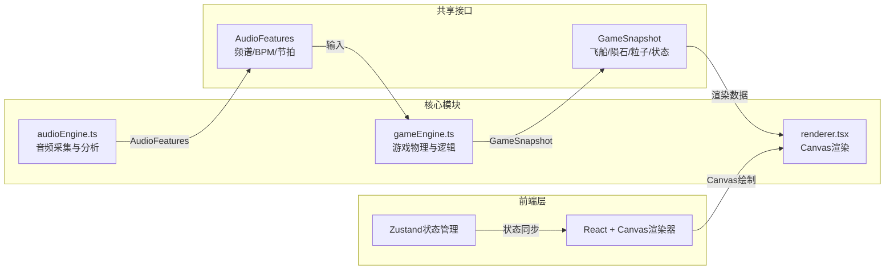

## 1. 架构设计



## 2. 技术说明

- 前端：React@18 + TypeScript + Vite
- 状态管理：Zustand
- 初始化工具：vite-init (react-ts模板)
- 后端：无
- 数据库：无

### 2.1 依赖清单

| 依赖 | 版本 | 用途 |
|------|------|------|
| react | ^18 | UI框架 |
| react-dom | ^18 | DOM渲染 |
| zustand | ^4 | 状态管理 |
| vite | ^5 | 构建工具 |
| @vitejs/plugin-react | ^4 | Vite React插件 |
| typescript | ^5 | 类型系统 |
| @types/react | ^18 | React类型定义 |
| @types/react-dom | ^18 | ReactDOM类型定义 |

### 2.2 启动脚本

- `dev`: `vite`
- `build`: `tsc && vite build`

## 3. 路由定义

本项目为单页面游戏应用，无路由。

| 路由 | 用途 |
|------|------|
| / | 游戏主页面（游戏画面+结算弹窗） |

## 4. API定义

无后端API。

### 4.1 共享接口定义

```typescript
interface AudioFeatures {
  lowFreqEnergy: number;
  highFreqEnergy: number;
  bpm: number;
  beatDetected: boolean;
  beatType: 'low' | 'high' | null;
  timestamp: number;
}

interface ShipState {
  x: number;
  y: number;
  targetY: number;
  targetX: number;
  health: number;
  maxHealth: number;
  isJumping: boolean;
  isDodging: boolean;
  manualCooldown: number;
}

interface Meteorite {
  id: number;
  x: number;
  y: number;
  type: 'normal' | 'burning' | 'splitting';
  speed: number;
  width: number;
  height: number;
  rotation: number;
  splitCount: number;
}

interface Particle {
  x: number;
  y: number;
  vx: number;
  vy: number;
  life: number;
  maxLife: number;
  size: number;
  color: string;
  type: 'flame' | 'trail' | 'explosion';
}

interface Star {
  x: number;
  y: number;
  radius: number;
  opacity: number;
  twinkleSpeed: number;
  twinklePhase: number;
}

interface GameSnapshot {
  ship: ShipState;
  meteorites: Meteorite[];
  particles: Particle[];
  stars: Star[];
  score: number;
  bpm: number;
  maxBpm: number;
  survivalTime: number;
  isGameOver: boolean;
  backgroundColor: string;
  spawnInterval: number;
  baseSpeed: number;
}
```

## 5. 数据模型

无持久化数据模型，所有数据运行时在内存中管理。

## 6. 文件结构

```
├── package.json
├── vite.config.js
├── tsconfig.json
├── index.html
└── src/
    ├── audioEngine.ts    # 麦克风初始化、频谱分析、节拍检测
    ├── gameEngine.ts     # 陨石生成、碰撞检测、飞船状态、游戏逻辑
    ├── renderer.tsx      # Canvas渲染：星空、飞船、陨石、粒子、UI
    ├── store.ts          # Zustand状态管理
    ├── App.tsx           # 主应用组件，游戏循环
    └── main.tsx          # 入口文件
```

### 6.1 模块职责

- **audioEngine.ts**：封装Web Audio API，负责麦克风初始化（getUserMedia）、创建AnalyserNode、实时频谱分析（getByteFrequencyData）、BPM估算（基于能量峰值间隔）、节拍类型判断（低频200Hz vs 高频2000Hz分界），输出AudioFeatures对象。提供startListening/stopListening方法。
- **gameEngine.ts**：纯逻辑模块，接收AudioFeatures和手动触发事件，管理ShipState/Meteorite/Particle状态。陨石生成按难度递增规则，碰撞检测使用AABB，分裂陨石碰撞后生成两个小陨石。输出GameSnapshot。
- **renderer.tsx**：React组件封装Canvas绘制，接收GameSnapshot，绘制星空背景（闪烁动画）、飞船（三角形+尾焰粒子）、陨石（三种类型+动画）、碰撞爆炸特效、HUD（得分/BPM/生命条）、结算界面。
- **store.ts**：Zustand store，管理游戏状态（进行中/结束）、AudioFeatures缓存、GameSnapshot缓存、手动触发事件队列。
- **App.tsx**：游戏主循环，使用requestAnimationFrame驱动，协调三个模块的数据流。
