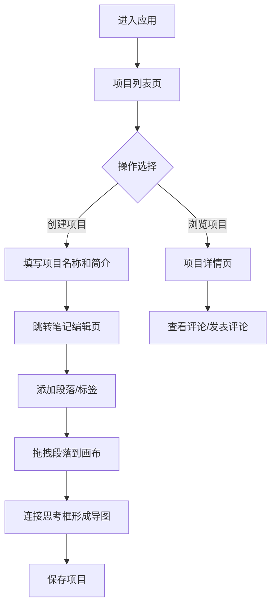

## 1. 产品概述

接力阅读笔记是一款面向深度阅读爱好者的知识管理与思维导图工具，帮助用户将阅读中的精彩摘录、个人感想通过可视化方式串联成知识网络。

- 核心价值：让阅读笔记从线性记录升级为结构化知识图谱，促进深度思考与创意联想
- 目标用户：学生、研究者、终身学习者等有深度阅读习惯的人群

## 2. 核心功能

### 2.1 用户角色

| 角色 | 注册方式 | 核心权限 |
|------|----------|----------|
| 普通用户 | 自动生成匿名身份 | 创建项目、编辑笔记、浏览公开项目、点赞评论 |

### 2.2 功能模块

1. **项目列表页**：展示所有阅读项目，支持创建新项目
2. **笔记编辑页**：段落管理、标签系统、思维导图画布、拖拽连线
3. **项目详情页**：项目信息展示、评论区互动

### 2.3 页面详情

| 页面名称 | 模块名称 | 功能描述 |
|----------|----------|----------|
| 项目列表页 | 项目卡片网格 | 展示项目名称、简介、笔记数量，点击进入详情 |
| 项目列表页 | 创建项目按钮 | 悬浮变色，点击弹出模态框输入项目名称和简介 |
| 项目列表页 | 创建项目模态框 | 居中显示，表单验证（名称≤20字），确认后跳转编辑页 |
| 笔记编辑页 | 左侧段落列表 | 宽280px，浅紫背景，顶部标签过滤区，支持拖拽段落到画布 |
| 笔记编辑页 | 右侧思维导图画布 | 白色背景，支持拖拽创建思考框、拖动位置、贝塞尔曲线连线 |
| 笔记编辑页 | 标签管理 | 最多5个标签，圆角样式，点击过滤，x按钮删除 |
| 笔记编辑页 | 思考框组件 | 宽200px，自适应高度，左侧3px色条（按标签色相分配），圆角12px |
| 笔记编辑页 | 贝塞尔连线 | 颜色与起始框一致，线宽2px，悬浮高亮加粗到4px |
| 项目详情页 | 评论区 | 白色背景圆角卡片，评论输入+发送按钮，列表按时间倒序 |
| 项目详情页 | 评论项 | 用户头像（圆形随机色）、昵称（预设列表随机）、评论内容 |
| 全局导航 | 左侧导航栏 | 宽60px深紫色，首页/项目/个人中心图标，悬浮放大+浅色背景过渡 |
| 全局导航 | 底部Tab栏（移动端） | 768px以下切换为底部导航 |

## 3. 核心流程

用户打开应用 → 浏览项目列表或创建新项目 → 进入项目编辑笔记（添加段落、标签）→ 拖拽段落到画布形成思考框 → 连接思考框构建思维导图 → 保存项目 → 其他用户浏览公开项目 → 点赞评论

## 4. 用户界面设计

### 4.1 设计风格

- **主色调**：紫色系主题
  - 主背景：#F8F6FF
  - 导航栏深紫：#4A3B6B
  - 强调按钮紫：#6A5ACD（悬浮变#7B68EE）
  - 浅紫背景：#F5F3FF
  - 文字深紫：#4A3B6B
- **阴影**：所有卡片使用浅紫色阴影 `box-shadow: 0 2px 8px rgba(106,90,205,0.08)`
- **按钮样式**：圆形按钮为主，圆角过渡平滑
- **字体**：系统无衬线字体，保持简洁现代感
- **布局风格**：左右分栏布局（导航栏+主内容区），卡片式组件
- **图标风格**：简洁线性图标（Lucide React）

### 4.2 页面设计概述

| 页面名称 | 模块名称 | UI元素 |
|----------|----------|--------|
| 项目列表页 | 项目卡片网格 | 白色卡片、浅紫阴影、圆角16px、悬停上浮效果 |
| 项目列表页 | 创建按钮 | 圆形40px、#6A5ACD背景、+号居中、悬浮变亮 |
| 项目列表页 | 模态框 | 宽400px高200px、白色背景、圆角16px、居中、表单输入 |
| 笔记编辑页 | 段落列表 | 宽280px、#F5F3FF背景、标签过滤区、可拖拽列表项 |
| 笔记编辑页 | 思维导图画布 | 白色背景、全屏、SVG连线层、可拖拽思考框 |
| 笔记编辑页 | 思考框 | 宽200px、圆角12px、左侧3px色条、可拖拽、内容区 |
| 项目详情页 | 评论区 | 宽80%居中、白色背景圆角16px、输入框+圆形发送按钮 |
| 全局导航 | 侧边栏 | 宽60px、#4A3B6B深紫、3个图标按钮、悬浮放大+浅色背景 |
| 全局导航 | 底部Tab栏 | 768px以下显示、深紫背景、3个图标居中分布 |

### 4.3 响应式设计

- **桌面优先**：默认桌面端布局（左侧导航栏+主内容区）
- **移动端适配**：768px断点以下，左侧导航栏变为底部Tab栏
- **触摸优化**：可拖拽元素支持触摸事件，按钮最小点击区域40x40px
- **页面切换动画**：淡入效果 `opacity 0→1，0.3s`

## 5. 性能指标

| 指标 | 目标值 |
|------|--------|
| 段落拖拽到画布创建思考框响应时间 | ≤ 50ms |
| 画布上拖动思考框帧率 | ≥ 30fps |
| API请求总耗时（后端+数据库） | ≤ 200ms |
