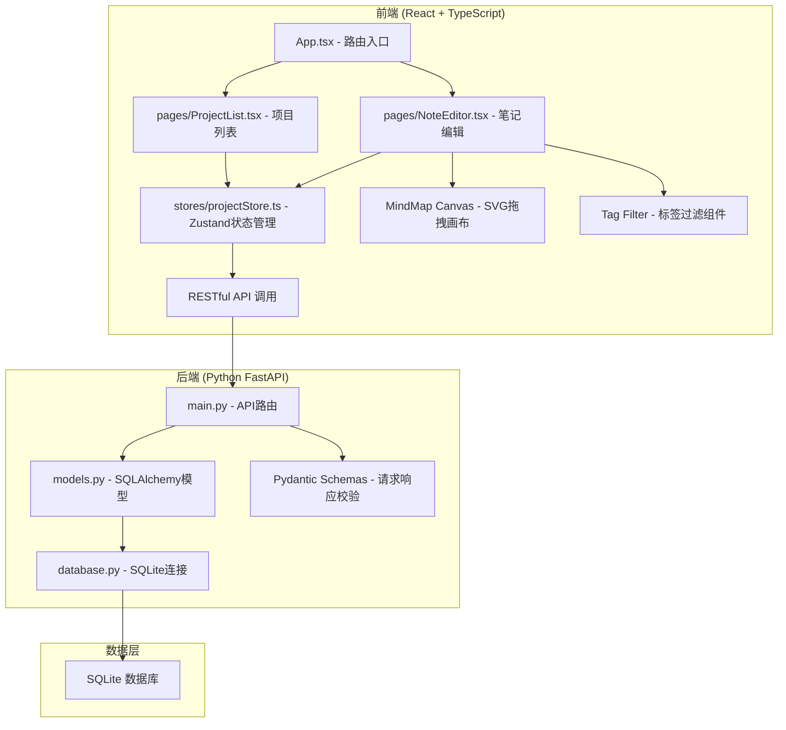
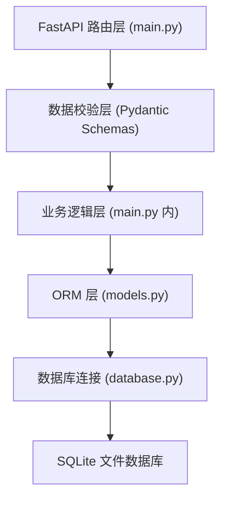
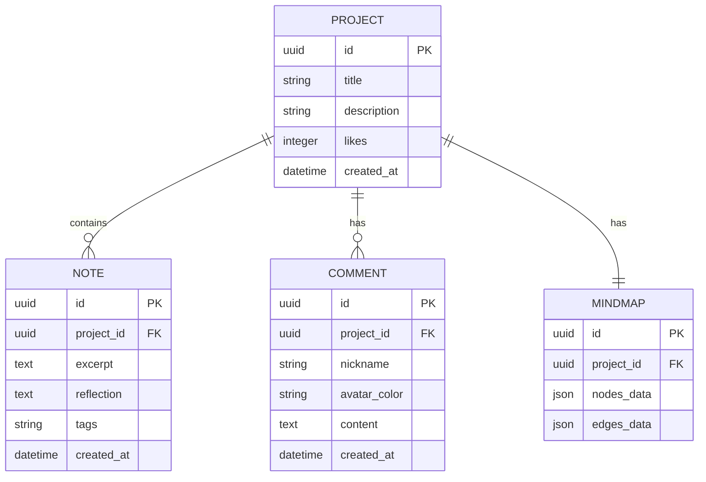

## 1. 架构设计



## 2. 技术描述

- **前端**：React 18 + TypeScript + Vite
- **状态管理**：Zustand
- **路由**：react-router-dom
- **图标**：lucide-react
- **后端**：Python FastAPI + Uvicorn
- **ORM**：SQLAlchemy
- **数据库**：SQLite
- **数据库异步驱动**：databases（可选，同步模式也可）
- **唯一ID**：uuid（前端）/ Python uuid（后端）

## 3. 路由定义

| 路由路径 | 页面组件 | 用途 |
|----------|----------|------|
| / | ProjectList | 项目列表页，展示所有项目，支持创建 |
| /project/:id | NoteEditor | 笔记编辑页，管理段落、标签、思维导图 |

## 4. API 定义

### TypeScript 类型定义

```typescript
interface Project {
  id: string;
  title: string;
  description: string;
  created_at: string;
}

interface Note {
  id: string;
  project_id: string;
  excerpt: string;
  reflection: string;
  tags: string[];
  created_at: string;
}

interface MindMapNode {
  id: string;
  noteId: string;
  x: number;
  y: number;
}

interface MindMapEdge {
  id: string;
  from: string;
  to: string;
}

interface MindMapData {
  nodes: MindMapNode[];
  edges: MindMapEdge[];
}

interface Comment {
  id: string;
  project_id: string;
  nickname: string;
  avatar_color: string;
  content: string;
  created_at: string;
}
```

### API 端点

| 方法 | 路径 | 请求体 | 响应 | 说明 |
|------|------|--------|------|------|
| GET | /projects | - | Project[] | 获取所有项目列表 |
| POST | /projects | { title, description } | Project | 创建新项目 |
| GET | /projects/{id}/notes | - | Note[] | 获取项目下所有笔记 |
| POST | /projects/{id}/notes | { excerpt, reflection, tags } | Note | 创建新笔记 |
| PUT | /notes/{id} | { excerpt?, reflection?, tags? } | Note | 更新笔记 |
| GET | /projects/{id}/mindmap | - | MindMapData | 获取项目思维导图数据 |
| PUT | /projects/{id}/mindmap | MindMapData | MindMapData | 更新思维导图数据 |
| GET | /projects/{id}/comments | - | Comment[] | 获取项目评论列表 |
| POST | /projects/{id}/comments | { content } | Comment | 添加评论 |
| POST | /projects/{id}/like | - | { likes: number } | 点赞项目 |

## 5. 服务端架构图



## 6. 数据模型

### 6.1 实体关系图



### 6.2 数据库 DDL

```sql
CREATE TABLE projects (
    id TEXT PRIMARY KEY,
    title TEXT NOT NULL,
    description TEXT NOT NULL,
    likes INTEGER DEFAULT 0,
    created_at TIMESTAMP DEFAULT CURRENT_TIMESTAMP
);

CREATE TABLE notes (
    id TEXT PRIMARY KEY,
    project_id TEXT NOT NULL,
    excerpt TEXT NOT NULL,
    reflection TEXT NOT NULL DEFAULT '',
    tags TEXT NOT NULL DEFAULT '[]',
    created_at TIMESTAMP DEFAULT CURRENT_TIMESTAMP,
    FOREIGN KEY (project_id) REFERENCES projects(id) ON DELETE CASCADE
);

CREATE TABLE comments (
    id TEXT PRIMARY KEY,
    project_id TEXT NOT NULL,
    nickname TEXT NOT NULL,
    avatar_color TEXT NOT NULL,
    content TEXT NOT NULL,
    created_at TIMESTAMP DEFAULT CURRENT_TIMESTAMP,
    FOREIGN KEY (project_id) REFERENCES projects(id) ON DELETE CASCADE
);

CREATE TABLE mindmaps (
    id TEXT PRIMARY KEY,
    project_id TEXT NOT NULL UNIQUE,
    nodes_data TEXT NOT NULL DEFAULT '[]',
    edges_data TEXT NOT NULL DEFAULT '[]',
    FOREIGN KEY (project_id) REFERENCES projects(id) ON DELETE CASCADE
);

CREATE INDEX idx_notes_project_id ON notes(project_id);
CREATE INDEX idx_comments_project_id ON comments(project_id);
```
