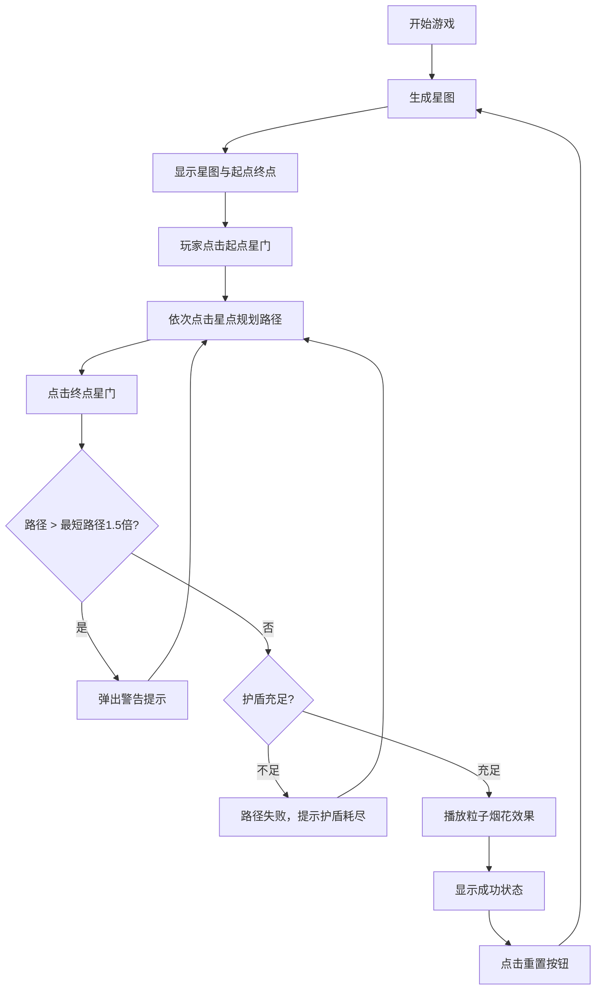

## 1. 产品概述

星际航线规划师是一款基于Canvas的太空航线规划益智游戏，玩家扮演星际领航员，在随机生成的二维星图中规划从起点星门到终点星门的最优安全航线。

- 核心玩法：通过点击星点规划路径，避开危险区域，利用引力弹弓优化航线，收集能量水晶维持护盾
- 目标用户：休闲游戏爱好者、对路径规划算法感兴趣的玩家

## 2. 核心特性

### 2.1 用户角色

| 角色 | 注册方式 | 核心权限 |
|------|----------|----------|
| 普通玩家 | 无需注册 | 进行游戏、查看统计、重置星图 |

### 2.2 功能模块

1. **游戏主界面**：星图画布、信息面板、警告提示、成功效果
2. **星图生成系统**：改进泊松盘采样、星点属性分配、可达路径计算
3. **路径规划系统**：A*最短路径算法、路径验证、护盾消耗计算
4. **视觉特效系统**：星点脉动光晕、星门旋转动画、路径绘制动画、粒子烟花、背景星空

### 2.3 页面详情

| 页面名称 | 模块名称 | 功能描述 |
|----------|----------|----------|
| 游戏主界面 | 星图画布 | 800x600 Canvas渲染星图、星点、路径、动画效果 |
| 游戏主界面 | 信息面板 | 总路径长度、预计航行时间、护盾环形进度条、重置按钮 |
| 游戏主界面 | 警告弹窗 | 路径过长时的柔和警告提示框（带抖动动画） |
| 游戏主界面 | 成功特效 | 到达终点时的粒子烟花动画 |

## 3. 核心流程

玩家打开游戏 → 系统生成随机星图（起点/终点星门 + 15-25个星点）→ 玩家点击起点星门开始规划 → 依次点击可达星点形成连续路径 → 点击终点星门完成规划 → 系统校验路径：
- 若路径长度 > 最短路径的1.5倍 → 弹出警告，玩家可重新规划
- 若路径有效且护盾充足 → 播放成功粒子烟花 → 可点击重置开始新游戏

## 4. 用户界面设计

### 4.1 设计风格
- **主色调**：深空蓝黑色 #0B0C10
- **次要色**：暗紫色 #1F2833
- **强调色**：青白色 #66FCF1（文字）、金色 #FFD700（起点）、紫色 #9C27B0（终点）
- **护盾色阶**：绿色 #4CAF50（100-70%）、橙色 #FF9800（70-40%）、红色 #F44336（40-0%）
- **字体方向**：等宽字体 + 科技感无衬线字体
- **布局方式**：居中画布 + 顶部信息面板 + 全屏星空背景
- **交互风格**：所有点击有缩放反馈（0.95→1.0，0.1s过渡），悬停有选中光环

### 4.2 页面设计总览

| 页面名称 | 模块名称 | UI元素 |
|----------|----------|--------|
| 游戏主界面 | 星图画布 | 800x600画布、16px星点带脉动光晕、星门旋转动画、虚线路径、实线路径流动光点 |
| 游戏主界面 | 信息面板 | 半透明rgba(10,10,30,0.8)背景、12px圆角、路径长度（光年）、航行时间（天）、80px环形护盾进度条、深蓝色重置按钮 |
| 游戏主界面 | 警告弹窗 | 半透明深色遮罩、300px宽淡红色#FFEBEE背景、16px圆角、抖动动画 |
| 游戏主界面 | 背景 | 80个缓慢飘移的极细白色星点（透明度0.1-0.4随机） |

### 4.3 响应式设计
- 桌面端优先：画布固定800x600，整体居中展示
- 信息面板宽度90%自适应
- 按钮和点击区域保证最小40x40px点击热区

### 4.4 动画细节
1. **星点脉动光晕**：周期1.8秒，半径呼吸式缩放
2. **起点星门**：金色光圈，2秒旋转周期
3. **终点星门**：紫色涡旋，3秒旋转周期
4. **路径绘制**：每段0.3秒依次显现动画
5. **已走路径**：实线上流动光点循环
6. **路径警告**：提示框水平抖动动画
7. **成功粒子**：60个随机颜色粒子从终点向外扩散2秒
8. **护盾环形**：颜色随百分比渐变切换
