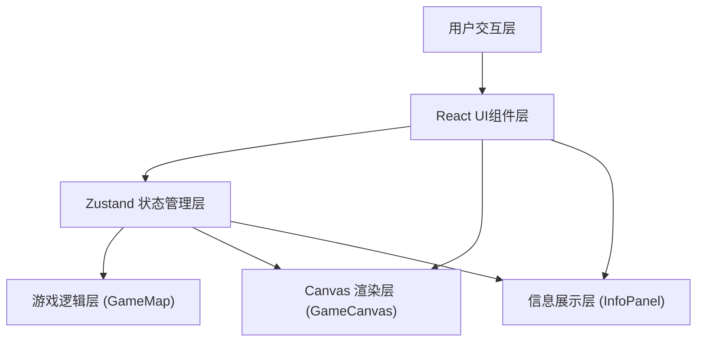

## 1. 架构设计



## 2. 技术说明

- **前端框架**：React@18 + TypeScript@5
- **构建工具**：Vite@5 + @vitejs/plugin-react@4
- **状态管理**：Zustand@4（轻量级全局状态）
- **工具库**：uuid@9（唯一ID生成）
- **渲染方案**：HTML5 Canvas 2D API（星图、动画、粒子系统）
- **无后端**：纯前端单页应用，数据全部内存存储

## 3. 模块与文件结构

```
auto367/
├── package.json              # 项目依赖配置
├── index.html                # 入口HTML
├── tsconfig.json             # TypeScript配置
├── vite.config.js            # Vite构建配置
└── src/
    ├── main.tsx              # React应用入口
    ├── App.tsx               # 根组件（布局组合）
    ├── store.ts              # Zustand全局状态管理
    ├── GameMap.ts            # 星图生成 + A*路径算法
    ├── GameCanvas.tsx        # Canvas渲染组件
    ├── InfoPanel.tsx         # 顶部信息面板组件
    └── styles.css            # 全局样式
```

## 4. 核心数据模型

### 4.1 星点数据结构

```typescript
interface StarNode {
  id: string;
  x: number;
  y: number;
  type: 'normal' | 'start' | 'end';
  radius: number;           // 固定16px
  hasCrystal: boolean;      // 是否有能量水晶
  isAsteroid: boolean;      // 是否处于小行星带
  starMass: number;         // 恒星质量(引力弹弓系数 1.0-2.0)
  pulsePhase: number;       // 脉动光晕相位
  connections: string[];    // 可达星点ID列表
}
```

### 4.2 路径数据结构

```typescript
interface PathSegment {
  fromId: string;
  toId: string;
  distance: number;
  shieldCost: number;       // 护盾消耗
  hasAsteroid: boolean;     // 是否穿越小行星带
}

interface GameState {
  nodes: StarNode[];
  startNodeId: string;
  endNodeId: string;
  adjacencyMatrix: Record<string, Record<string, number>>; // 距离矩阵
  selectedPath: string[];     // 当前选中星点ID序列
  segments: PathSegment[];    // 已规划路径段
  totalDistance: number;      // 总路径长度(像素 -> 光年换算)
  totalShieldCost: number;    // 总护盾消耗
  remainingShield: number;    // 剩余护盾百分比
  shortestPathDistance: number; // A*最短路径长度
  gameStatus: 'idle' | 'planning' | 'warned' | 'success' | 'failed';
  warningVisible: boolean;
  fireworkParticles: FireworkParticle[];
}
```

## 5. 关键算法规范

### 5.1 改进泊松盘采样算法

```
目标: 在800x600画布上生成15-25个最小间距为80px的星点
步骤:
  1. 网格划分: 栅格单元 = minDistance / √2 ≈ 57px
  2. 活动列表管理候选点
  3. 每个候选点生成k=30个随机偏移点(r ~ [minDistance, 2*minDistance])
  4. 校验新点与所有现有点距离 >= minDistance
  5. 重复直到达到目标数量或活动列表为空
  6. 后处理: 强制添加起点(左侧)和终点(右侧)并重新连接
  7. 性能约束: <=20ms完成
```

### 5.2 A*最短路径算法

```
启发函数: 欧几里得直线距离(h = sqrt((x2-x1)^2 + (y2-y1)^2))
开放列表: 优先队列(按f=g+h排序)
关闭列表: 已访问节点集合
相邻节点: connections数组中定义的可达节点
性能约束: <=50ms完成
```

### 5.3 护盾消耗计算规则

```
基础消耗 = 距离 * 0.05
小行星带惩罚 = 距离 * 0.15 (若路径经过小行星带)
引力弹弓减免 = -距离 * 0.08 * (starMass - 1.0) (若经过恒星)
能量水晶恢复 = +15% (经过含水晶星点时)
最终消耗 = max(0, 基础消耗 + 惩罚 + 减免)
```

## 6. 性能指标

| 指标 | 目标值 | 实现手段 |
|------|--------|----------|
| 星图生成 | <=20ms | 泊松采样优化、Grid空间索引 |
| 路径计算 | <=50ms | A* + 优先队列、预计算距离矩阵 |
| 动画帧率 | 60FPS | requestAnimationFrame、增量绘制、离屏缓冲 |
| 内存占用 | <50MB | 及时清理粒子对象、复用Canvas上下文 |
