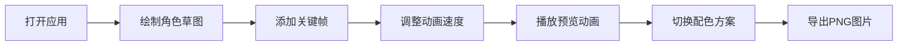

## 1. 产品概述

角色动态预览器是一款面向设计系学生的创意工具，帮助用户快速将手绘角色草图转化为可交互的数字动画，实时观察动态效果和配色方案。

- 核心价值：降低手绘角色动画化的技术门槛，提供从绘制到动画预览的一体化工作流
- 目标用户：设计系学生、动画爱好者、独立游戏开发者
- 市场定位：轻量级、快速原型验证的创意设计工具

## 2. 核心功能

### 2.1 用户角色

| 角色 | 注册方式 | 核心权限 |
|------|----------|----------|
| 普通用户 | 无需注册 | 使用全部绘制、动画、配色功能，导出PNG |

### 2.2 功能模块

1. **绘制模块**：自由绘制画布，支持画笔和橡皮擦，清空功能
2. **骨骼动画模块**：关键帧管理，贝塞尔曲线路径生成，动画播放控制，拖尾效果
3. **配色切换模块**：6种预设主题，自定义拾色器，实时预览
4. **导出模块**：PNG导出，保留动画轨迹效果

### 2.3 页面详情

| 页面名称 | 模块名称 | 功能描述 |
|----------|----------|----------|
| 主页面 | 绘制画布 | 800x600px浅灰色画布，支持鼠标自由绘制（黑色4px线条）、橡皮擦（白色20px直径）、清空按钮，20px网格背景 |
| 主页面 | 关键帧管理 | 拖拽添加红色圆点关键帧（半径8px），最多10个，自动生成贝塞尔曲线路径 |
| 主页面 | 动画控制 | 播放/暂停按钮，速度滑块（0.5x-3x），轨迹拖尾效果（半透明，40px长度） |
| 主页面 | 配色选择 | 6种预设主题色板，色环拾色器自定义主辅色，实时更新线条和背景 |
| 主页面 | 导出功能 | 底部导出按钮，将画布内容导出为PNG图片 |

## 3. 核心流程

用户打开应用 → 在左侧画布绘制角色草图 → 在右侧面板添加关键帧 → 调整动画速度并播放预览 → 切换配色方案观察效果 → 导出PNG图片

## 4. 用户界面设计

### 4.1 设计风格

- **主色调**：深色主题背景 #121212，文字 #E0E0E0
- **控制面板**：毛玻璃效果，背景 rgba(30,30,30,0.85)，边框 1px solid rgba(255,255,255,0.1)
- **按钮样式**：统一圆角 8px，高度 36px，hover 亮度提升 20%，点击反馈 scale(0.95) 100ms
- **字体**：现代无衬线字体，标题加粗，正文适中
- **布局风格**：左右两栏布局，左侧70%画布，右侧30%控制面板
- **动画过渡**：所有过渡 300ms ease-in-out

### 4.2 预设主题配色

| 主题名称 | 主色 | 辅色 |
|----------|------|------|
| 海洋蓝调 | #0077B6 | #CAF0F8 |
| 日落暖橙 | #FF6B35 | #F7D59C |
| 森林绿韵 | #2D6A4F | #D8F3DC |
| 极光紫蓝 | #7209B7 | #E0AAFF |
| 樱花粉嫩 | #FFB6C1 | #FFE4E1 |
| 赛博霓虹 | #FF006E | #8338EC |

### 4.3 页面设计概述

| 页面名称 | 模块名称 | UI 元素 |
|----------|----------|----------|
| 主页面 | 顶部工具栏 | 清空按钮、绘制/擦除模式切换、响应式菜单按钮（移动端） |
| 主页面 | 绘制画布 | 浅灰色 #F0F0F0 背景，20px 网格，800x600px 尺寸 |
| 主页面 | 关键帧管理区 | 添加关键帧提示、关键帧列表、删除按钮 |
| 主页面 | 动画控制区 | 播放/暂停按钮、速度滑块（0.5x-3x）、当前速度显示 |
| 主页面 | 配色选择区 | 6个主题色板（渐变色块）、色环拾色器、主辅色预览 |
| 主页面 | 底部导出区 | 导出PNG按钮、状态提示 |

### 4.4 响应式设计

- **桌面端**（>768px）：左右两栏布局，左侧70%画布，右侧30%控制面板
- **移动端**（≤768px）：画布占满屏幕，右侧面板折叠为底部抽屉，左上角显示切换按钮，抽屉高度自适应

### 4.5 性能约束

- 绘制延迟：低于16ms（60fps）
- 动画帧率：稳定在30fps以上
- 配色切换渲染：不超过50ms
