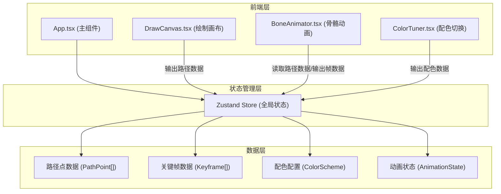

## 1. 架构设计



## 2. 技术描述

- **前端框架**：React 18 + TypeScript
- **构建工具**：Vite 5
- **状态管理**：Zustand 4
- **唯一ID生成**：uuid
- **初始化工具**：vite-init
- **后端**：无（纯前端应用）
- **数据库**：无

## 3. 路由定义

| 路由 | 用途 |
|------|------|
| / | 主页面，包含所有功能模块 |

## 4. 数据模型

### 4.1 类型定义

```typescript
// 路径点 - 用于存储绘制轨迹
interface PathPoint {
  id: string;
  x: number;
  y: number;
  timestamp: number;
  isEraser: boolean;
}

// 关键帧 - 用于骨骼动画
interface Keyframe {
  id: string;
  x: number;
  y: number;
  index: number;
}

// 配色方案
interface ColorScheme {
  id: string;
  name: string;
  primary: string;
  secondary: string;
}

// 动画状态
interface AnimationState {
  isPlaying: boolean;
  speed: number;
  currentFrame: number;
  trailPoints: PathPoint[];
}

// 绘制工具
type DrawTool = 'pen' | 'eraser';

// 全局 Store 状态
interface AppState {
  // 绘制数据
  pathPoints: PathPoint[];
  drawTool: DrawTool;
  addPathPoint: (point: Omit<PathPoint, 'id' | 'timestamp'>) => void;
  clearCanvas: () => void;
  setDrawTool: (tool: DrawTool) => void;
  
  // 关键帧数据
  keyframes: Keyframe[];
  addKeyframe: (point: Omit<Keyframe, 'id' | 'index'>) => void;
  removeKeyframe: (id: string) => void;
  clearKeyframes: () => void;
  
  // 配色数据
  colorSchemes: ColorScheme[];
  currentScheme: ColorScheme;
  setColorScheme: (scheme: ColorScheme) => void;
  setCustomColors: (primary: string, secondary: string) => void;
  
  // 动画状态
  animation: AnimationState;
  setAnimationPlaying: (isPlaying: boolean) => void;
  setAnimationSpeed: (speed: number) => void;
  setCurrentFrame: (frame: number) => void;
  setTrailPoints: (points: PathPoint[]) => void;
}
```

### 4.2 数据流

1. **DrawCanvas → Store**：用户绘制时，鼠标事件生成 PathPoint，通过 addPathPoint 更新 store
2. **BoneAnimator → Store**：读取 pathPoints 和 keyframes，插值计算动画帧，更新 currentFrame 和 trailPoints
3. **ColorTuner → Store**：用户选择配色或自定义颜色，通过 setColorScheme/setCustomColors 更新 currentScheme
4. **Store → All Components**：所有组件订阅 store 状态变化，实时渲染更新

## 5. 文件结构

```
auto368/
├── index.html                          # 入口HTML
├── package.json                        # 依赖配置
├── vite.config.js                      # Vite配置
├── tsconfig.json                       # TypeScript配置
└── src/
    ├── App.tsx                         # 主组件，布局和状态协调
    ├── main.tsx                        # 应用入口
    ├── index.css                       # 全局样式
    ├── store/
    │   └── useAppStore.ts              # Zustand全局状态管理
    ├── components/
    │   ├── DrawCanvas.tsx              # 绘制画布组件
    │   ├── BoneAnimator.tsx            # 骨骼动画组件
    │   ├── ColorTuner.tsx              # 配色切换组件
    │   ├── ControlPanel.tsx            # 控制面板容器
    │   └── ExportButton.tsx            # 导出按钮组件
    ├── utils/
    │   ├── bezier.ts                   # 贝塞尔曲线计算
    │   ├── canvas.ts                   # Canvas绘制工具
    │   └── colors.ts                   # 颜色处理工具
    └── types/
        └── index.ts                    # 类型定义
```

## 6. 文件调用关系

1. **main.tsx** → **App.tsx**：渲染根组件
2. **App.tsx** → **useAppStore.ts**：获取和分发全局状态
3. **App.tsx** → **DrawCanvas.tsx**、**ControlPanel.tsx**：布局子组件
4. **ControlPanel.tsx** → **BoneAnimator.tsx**、**ColorTuner.tsx**、**ExportButton.tsx**：控制面板子组件
5. **DrawCanvas.tsx** → **useAppStore.ts**、**canvas.ts**：绘制逻辑和状态更新
6. **BoneAnimator.tsx** → **useAppStore.ts**、**bezier.ts**：动画插值计算
7. **ColorTuner.tsx** → **useAppStore.ts**、**colors.ts**：配色处理
8. **ExportButton.tsx** → **canvas.ts**：导出PNG
