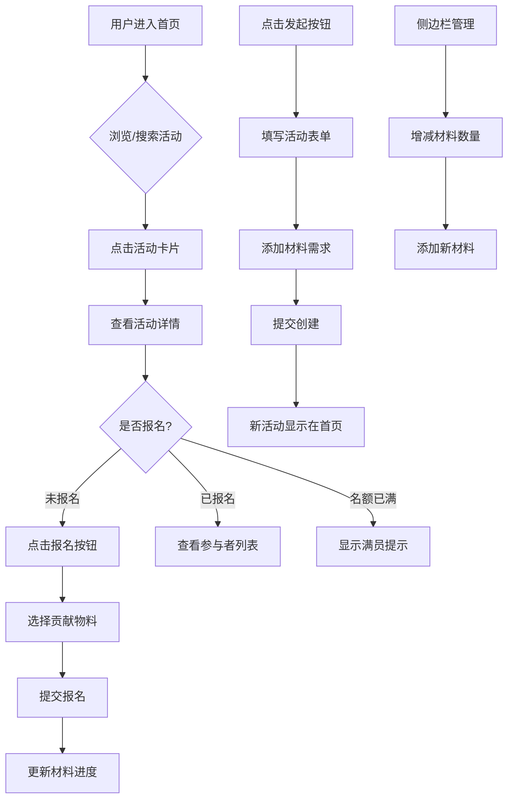

## 1. 产品概述

材料派对是一个面向手工爱好者社区的活动与物料共享应用，旨在将零散的聚会报名与手工材料分享功能整合。成员可以发起和参与各类手工活动（编织、陶艺、绘画、木工等），同时管理个人材料库并查看活动所需材料的贡献情况，实现活动组织与物料协作的无缝衔接。

- **目标用户**：手工爱好者社区成员
- **核心价值**：降低手工活动组织门槛，促进材料共享与资源优化，增强社区成员间的协作与互动

## 2. 核心功能

### 2.1 用户角色

| 角色 | 注册方式 | 核心权限 |
|------|----------|----------|
| 社区成员 | 模拟登录 | 浏览活动、发起活动、报名参与、管理个人材料库、贡献物料 |

### 2.2 功能模块

1. **首页**：活动探索与筛选、热门活动横幅、个人材料库侧边栏
2. **活动详情页**：活动信息展示、报名与物料贡献、材料进度可视化、参与者列表

### 2.3 页面详情

| 页面名称 | 模块名称 | 功能描述 |
|----------|----------|----------|
| 首页 | 热门活动横幅 | 顶部展示本月热门活动，支持点击跳转详情 |
| 首页 | 搜索与筛选栏 | 搜索框实时筛选活动名称，分类下拉筛选（全部/编织/陶艺/绘画/木工） |
| 首页 | 活动卡片网格 | 三列响应式网格展示活动卡片，含名称、日期、地点、报名人数、材料需求摘要 |
| 首页 | 发起活动按钮 | 右上角"发起"按钮，弹出模态框填写活动信息 |
| 首页 | 发起活动模态框 | 表单含活动名称、日期、地点、最大人数、材料需求列表（动态添加行） |
| 首页 | 个人材料库侧边栏 | 展示用户材料清单，支持增减数量、添加新材料，可收起/展开 |
| 首页 | 空状态 | 搜索无结果时显示空状态插图 |
| 活动详情页 | 活动信息区 | 展示活动名称、日期、地点、描述、报名按钮（含状态切换） |
| 活动详情页 | 报名与物料贡献 | 点击报名后弹窗展示用户材料清单，勾选可贡献物料及数量 |
| 活动详情页 | 材料清单Tab | 展示所需材料及已贡献数量，用进度条可视化贡献进度 |
| 活动详情页 | 参与者列表Tab | 展示已报名者及其携带物料信息 |

## 3. 核心流程

### 3.1 活动探索与报名流程
用户进入首页 → 浏览/搜索/筛选活动 → 点击活动卡片进入详情 → 查看活动信息与材料需求 → 点击报名 → 选择贡献物料 → 提交报名 → 更新活动材料进度与参与者列表

### 3.2 发起活动流程
用户点击"发起"按钮 → 填写活动信息表单 → 动态添加材料需求 → 提交表单 → 新活动出现在首页顶部 → 显示"新建成功"toast提示

### 3.3 材料库管理流程
用户在侧边栏查看材料清单 → 通过+/-按钮调整数量 → 数量为0时自动折叠 → 点击"添加新材料"按钮 → 填写名称、选择emoji、输入初始数量 → 新材料加入清单

## 4. 界面设计

### 4.1 设计风格

- **主色调**：温暖琥珀色 `#FF8C42` 与深紫色 `#2B2B44` 搭配
- **背景**：深紫色径向渐变（`#1A1A2E` → `#2B2B44`）
- **卡片**：半透明磨砂效果（`backdrop-filter: blur(8px)`），背景 `#1F1F33`，圆角 `12px`，边框 `1px #3A3A5C`
- **按钮**：琥珀色渐变（`#FF8C42` → `#E07C3A`），圆角 `8px`，悬停放大至1.03倍并加深阴影
- **字体**：标题使用圆润温暖字体，正文使用清晰易读字体
- **布局**：卡片式三列网格布局，侧边栏280px宽

### 4.2 页面设计概览

| 页面名称 | 模块名称 | UI元素 |
|----------|----------|--------|
| 首页 | 热门横幅 | 渐变背景横幅，大号标题，琥珀色强调，左右滑动切换 |
| 首页 | 搜索筛选栏 | 深色输入框带搜索图标，琥珀色下拉选择器，圆角8px |
| 首页 | 活动卡片 | 宽300px，深色磨砂背景，悬停上浮4px+外发光，进入动画（下方渐显0.4s） |
| 首页 | 发起模态框 | 宽480px，背景#2B2B44，圆角20px，表单含动态材料行 |
| 首页 | 材料库侧边栏 | 宽280px，背景#252540，可收起/展开（0.3s过渡），材料项含emoji和+/-按钮 |
| 活动详情页 | 信息区 | 大号活动名称，日期地点信息，报名按钮带弹性动画 |
| 活动详情页 | 材料进度 | 琥珀色进度条，显示已贡献/需求数量，圆角进度轨道 |
| 活动详情页 | 参与者列表 | 头像+名称+携带物料标签列表 |
| 活动详情页 | Tab切换 | 琥珀色下划线指示器，平滑切换动画 |

### 4.3 响应式设计

- **桌面端（≥768px）**：三列网格布局 + 右侧固定材料库侧边栏
- **移动端（<768px）**：单列布局，侧边栏变为顶部抽屉式菜单，卡片全宽展示
- 触摸优化：按钮最小触摸区域44px，间距适当增大

### 4.4 动画效果

- **卡片入场**：`translateY(20px) → translateY(0)`，`opacity 0 → 1`，持续0.4s
- **卡片悬停**：上浮4px + 外发光（box-shadow）
- **报名按钮**：弹性动画 `scale 0.95 → 1.05 → 1`
- **侧边栏**：宽度过渡0.3s
- **Toast提示**：从顶部滑入，2s后淡出
