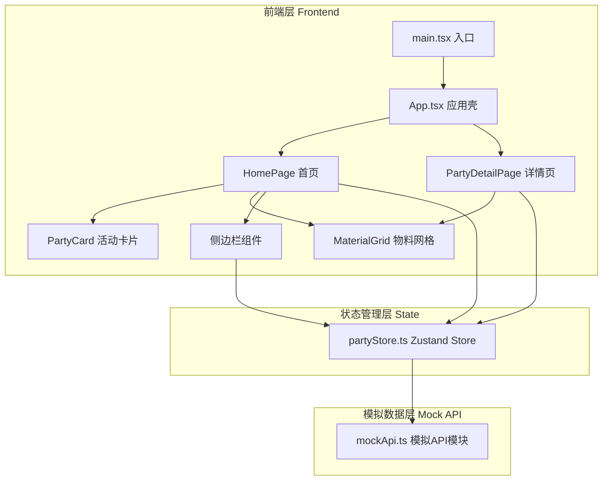
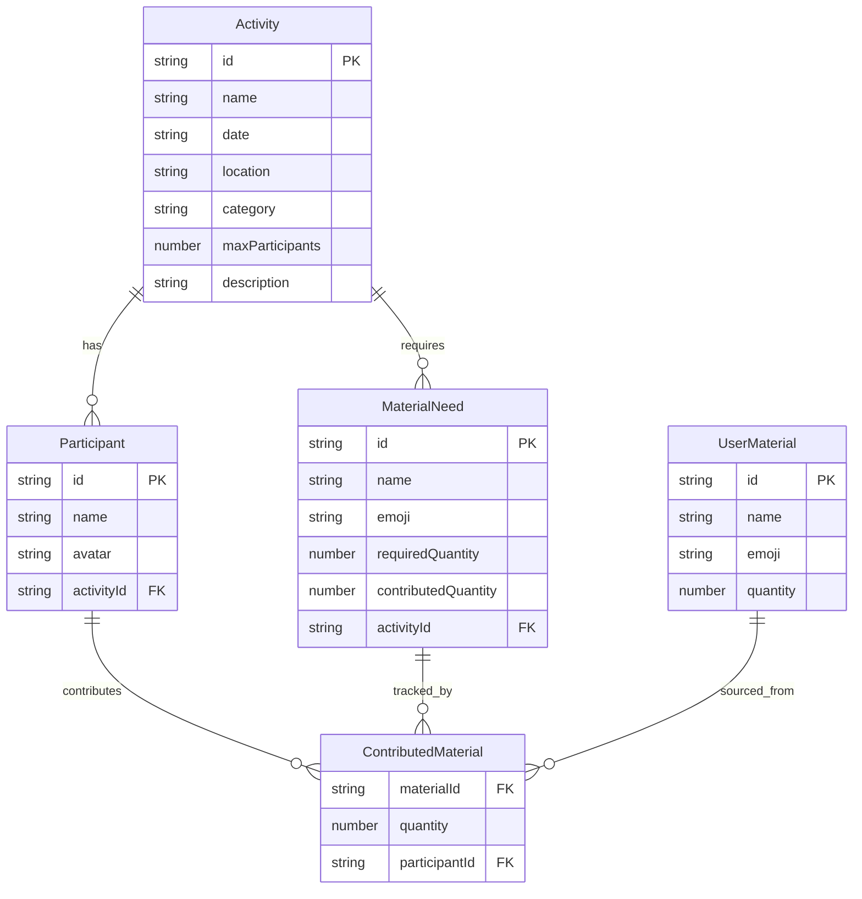

## 1. 架构设计



**数据流向**：`main.tsx → App.tsx → 各页面组件 → partyStore (Zustand) → mockApi (模拟数据)`

## 2. 技术说明

- **前端框架**：React 18 + TypeScript
- **构建工具**：Vite + @vitejs/plugin-react
- **状态管理**：Zustand
- **路由**：react-router-dom v6
- **样式方案**：Tailwind CSS + CSS Modules（动画关键帧）
- **唯一标识**：uuid
- **图标库**：lucide-react
- **后端**：无（纯前端，使用模拟API）
- **数据存储**：模拟数据，Zustand内存状态

## 3. 路由定义

| 路由 | 用途 |
|------|------|
| `/` | 首页 - 活动探索、搜索筛选、材料库侧边栏 |
| `/party/:id` | 活动详情页 - 活动信息、报名、材料进度、参与者列表 |

## 4. API定义（模拟）

### 4.1 TypeScript 类型定义

```typescript
interface Activity {
  id: string;
  name: string;
  date: string;
  location: string;
  category: '编织' | '陶艺' | '绘画' | '木工';
  maxParticipants: number;
  participants: Participant[];
  materials: MaterialNeed[];
  description: string;
}

interface Participant {
  id: string;
  name: string;
  avatar: string;
  contributedMaterials: { materialId: string; quantity: number }[];
}

interface MaterialNeed {
  id: string;
  name: string;
  emoji: string;
  requiredQuantity: number;
  contributedQuantity: number;
}

interface UserMaterial {
  id: string;
  name: string;
  emoji: string;
  quantity: number;
}
```

### 4.2 模拟API接口

| 接口 | 方法 | 说明 | 请求参数 | 返回数据 |
|------|------|------|----------|----------|
| `fetchActivities` | GET | 获取活动列表 | - | `Activity[]` |
| `createActivity` | POST | 创建新活动 | `Omit<Activity, 'id' | 'participants'>` | `Activity` |
| `joinActivity` | POST | 报名活动 | `{ activityId, userId, contributions }` | `Activity` |
| `fetchUserMaterials` | GET | 获取用户材料库 | - | `UserMaterial[]` |
| `addUserMaterial` | POST | 添加用户材料 | `Omit<UserMaterial, 'id'>` | `UserMaterial` |
| `updateUserMaterial` | PUT | 更新材料数量 | `{ id, quantity }` | `UserMaterial` |

## 5. 数据模型

### 5.1 数据模型定义



## 6. 文件结构与调用关系

```
├── package.json                    # 依赖: react, react-dom, zustand, uuid, typescript, vite
├── index.html                      # 入口页面, #root挂载点
├── vite.config.ts                  # React插件 + @→src别名
├── tsconfig.json                   # 严格模式, jsx: react-jsx, target: ES2020
├── src/
│   ├── main.tsx                    # 入口 → 渲染App, 加载全局样式
│   ├── App.tsx                     # 主壳 → RouterProvider, 初始化活动列表
│   ├── index.css                   # 全局样式, Tailwind指令, CSS变量, 动画关键帧
│   ├── api/
│   │   └── mockApi.ts              # 模拟API → 返回活动/材料数据, 模拟延迟
│   ├── stores/
│   │   └── partyStore.ts           # Zustand Store → 管理活动/材料状态, 调用mockApi
│   ├── components/
│   │   ├── PartyCard.tsx           # 活动卡片 → 接收Activity props, router跳转
│   │   ├── MaterialGrid.tsx        # 物料网格 → 接收材料列表+可编辑标志, 数量回调
│   │   ├── Sidebar.tsx             # 材料库侧边栏 → 读取partyStore, 调用store actions
│   │   ├── CreatePartyModal.tsx    # 发起活动模态框 → 表单提交调用store action
│   │   ├── JoinModal.tsx           # 报名物料贡献弹窗 → 读取store, 提交贡献
│   │   ├── Toast.tsx               # Toast提示组件 → 全局显示成功/错误消息
│   │   └── EmptyState.tsx          # 空状态组件 → 搜索无结果时展示
│   ├── pages/
│   │   ├── HomePage.tsx            # 首页 → 搜索筛选+卡片网格+侧边栏, 读取partyStore
│   │   └── PartyDetailPage.tsx     # 详情页 → 活动信息+报名+材料进度+参与者, 读取partyStore
│   └── types/
│       └── index.ts                # TypeScript类型定义 → 被所有模块引用
```

**调用关系与数据流向**：
- `main.tsx` → 渲染 `App.tsx`
- `App.tsx` → 调用 `useAppStore` 初始化数据 → 提供 `RouterProvider`
- `HomePage.tsx` → 读取 `partyStore.activities` → 渲染 `PartyCard`, `Sidebar`
- `PartyDetailPage.tsx` → 读取 `partyStore.currentActivity` → 渲染 `MaterialGrid`, 参与者列表
- `partyStore.ts` → 调用 `mockApi.ts` 获取/更新数据 → 更新自身state
- `CreatePartyModal.tsx` → 调用 `partyStore.createActivity` → 更新活动列表
- `JoinModal.tsx` → 调用 `partyStore.joinActivity` → 更新参与者与材料进度
- `Sidebar.tsx` → 调用 `partyStore.addMaterial/updateMaterial` → 更新用户材料库
