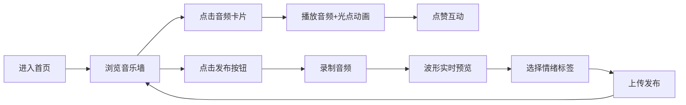

## 1. 产品概述

节奏共鸣墙是一个基于音频分享的社交互动平台，用户可以录制并发布简短音频片段（哼唱、口哨、乐器即兴等），系统将音频转化为动态视觉光点，形成沉浸式的虚拟音乐墙体验。

- 核心价值：将声音转化为可视化的动态艺术，让音乐分享变得更加生动有趣
- 目标用户：音乐爱好者、创意人士、社交互动爱好者

## 2. 核心功能

### 2.1 功能模块
1. **首页音乐墙**：瀑布流布局展示音频卡片，可视化光点动态播放
2. **发布页面**：录音功能、波形实时预览、情绪标签选择
3. **分类浏览页**：按情绪分类（欢快、忧伤、迷幻、冷峻）浏览音频

### 2.2 页面详情
| 页面名称 | 模块名称 | 功能描述 |
|-----------|-------------|---------------------|
| 首页 | 顶部导航栏 | 品牌Logo、发布入口、分类入口 |
| 首页 | 瀑布流卡片区 | 音频卡片展示、播放控制、点赞交互 |
| 发布页 | 录音区 | 圆形录音按钮、脉冲动画、录音状态指示 |
| 发布页 | 波形预览区 | Canvas实时绘制录音波形、渐变色彩 |
| 发布页 | 情绪标签选择器 | 四种情绪标签圆形按钮、图标展示 |
| 分类浏览页 | 标签导航栏 | 四个情绪胶囊标签、选中状态高亮 |
| 分类浏览页 | 瀑布流展示区 | 按分类筛选音频卡片、平滑切换动画 |

## 3. 核心流程

用户进入首页 → 浏览瀑布流音频卡片 → 点击卡片播放（光点动画+发光边框）→ 点赞互动 → 点击发布按钮进入录音页 → 录制音频 → 预览波形 → 选择情绪标签 → 上传发布 → 返回音乐墙展示

## 4. 用户界面设计

### 4.1 设计风格
- **主色调**：深色渐变背景 #0D0D1A → #1A1A2E
- **情绪色**：
  - 欢快：#FF6B6B（珊瑚红）
  - 忧伤：#6C5CE7（深紫蓝）
  - 迷幻：#A29BFE（淡紫蓝）
  - 冷峻：#00CEC9（青绿色）
- **卡片样式**：磨砂玻璃效果 backdrop-filter: blur(12px)，圆角 16px，半透明背景
- **按钮交互**：hover 放大 scale(1.05)，点击涟漪效果
- **字体**：现代无衬线字体，深色科幻美学风格
- **进度条**：渐变填充 #FF6B6B → #6C5CE7，圆角 4px

### 4.2 页面设计概览
| 页面名称 | 模块名称 | UI元素 |
|-----------|-------------|-------------|
| 首页 | 瀑布流卡片 | 240px宽、自适应高、磨砂玻璃、光点缩略动画、发光边框 |
| 发布页 | 录音按钮 | 直径80px圆形、默认红色#E74C3C、录音时脉冲动画（1.5秒周期） |
| 发布页 | 波形预览 | Canvas绘制、线宽2px、渐变#FF6B6B→#6C5CE7 |
| 发布页 | 情绪标签 | 直径48px圆形按钮、各带情绪小图标 |
| 分类浏览页 | 标签导航 | 胶囊形（高40px）、选中填充、未选中边框、均匀分布 |
| 分类浏览页 | 卡片切换 | 淡入上移动画（0.4s ease-out） |

### 4.3 响应式适配
- **桌面端**：3列瀑布流布局
- **平板端**：2列瀑布流布局
- **手机端**：1列瀑布流布局

### 4.4 性能要求
- 音频分析延迟 ≤ 100ms
- 动画帧率稳定 ≥ 30fps
