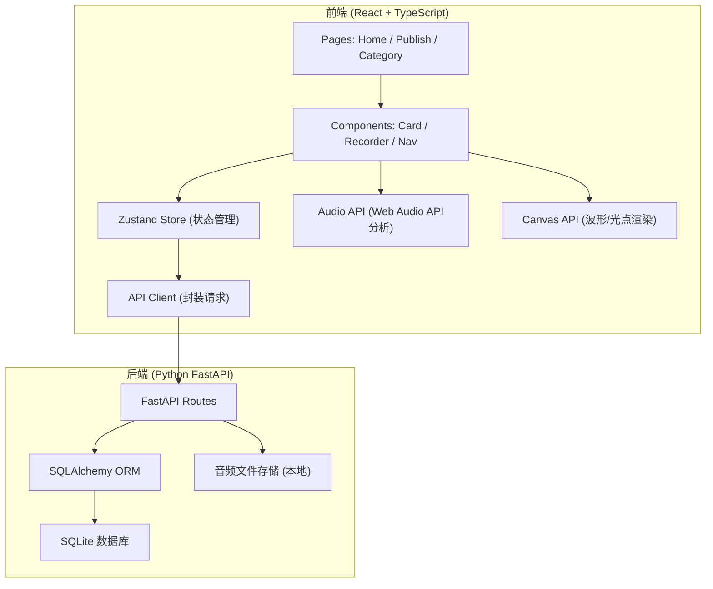
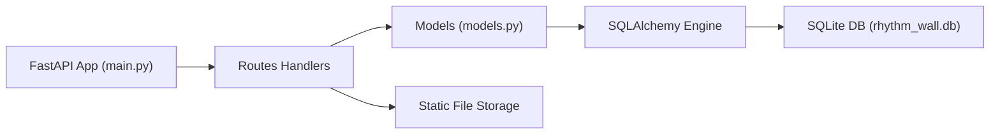
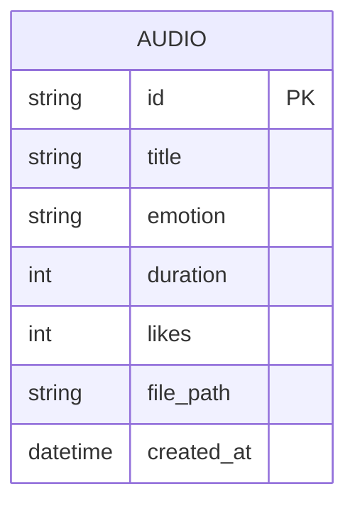

## 1. 架构设计



## 2. 技术栈说明
- **前端框架**：React 18 + TypeScript
- **构建工具**：Vite (配置代理 /api → 后端 8000 端口)
- **状态管理**：Zustand
- **路由**：React Router DOM
- **工具库**：uuid
- **后端框架**：Python FastAPI + Uvicorn
- **ORM**：SQLAlchemy
- **数据库**：SQLite

## 3. 路由定义
| 前端路由 | 页面 | 说明 |
|-----------|------|------|
| / | Home | 首页音乐墙瀑布流 |
| /publish | Publish | 发布页面（录音+上传） |
| /category | Category | 分类浏览页面 |

## 4. API 接口定义

### 类型定义
```typescript
interface AudioItem {
  id: string;
  title: string;
  emotion: 'happy' | 'sad' | 'psychedelic' | 'cool';
  duration: number;
  likes: number;
  filePath: string;
  createdAt: string;
  audioData?: number[]; // 音频分析数据用于光点动画
}
```

### REST API
| Method | Endpoint | 说明 |
|--------|----------|------|
| POST | /api/upload | 上传音频文件及元数据 |
| GET | /api/audios | 获取音频列表（支持emotion筛选） |
| POST | /api/audios/:id/like | 对音频点赞 |

## 5. 后端服务架构



## 6. 数据模型

### 6.1 ER 图


### 6.2 数据模型定义
```python
# SQLAlchemy Model
class Audio(Base):
    __tablename__ = "audios"
    id = Column(String, primary_key=True)
    title = Column(String, nullable=False)
    emotion = Column(String, nullable=False)  # happy/sad/psychedelic/cool
    duration = Column(Integer, nullable=False)
    likes = Column(Integer, default=0)
    file_path = Column(String, nullable=False)
    created_at = Column(DateTime, default=datetime.utcnow)
```

## 7. 项目文件结构
```
auto370/
├── package.json
├── index.html
├── tsconfig.json
├── vite.config.js
├── src/
│   ├── App.tsx
│   ├── store.ts
│   ├── api.ts
│   └── components/
│       ├── Card.tsx
│       └── Recorder.tsx
└── backend/
    ├── main.py
    ├── models.py
    └── requirements.txt
```
