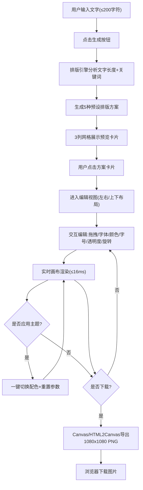

## 1. 产品概述
文字可视化排版应用，解决手动设计文字海报耗时且缺乏创意灵感的问题。用户输入任意文字（诗句、名言、歌词等），系统自动生成多种创意排版方案，支持实时编辑并一键导出社交媒体分享图。
- 目标用户：社交媒体创作者、内容运营、个人用户
- 产品价值：降低设计门槛，秒级生成专业级文字海报

## 2. 核心功能

### 2.1 功能模块
1. **文字输入区**：大尺寸文本域，支持最多200字符输入，一键生成排版方案
2. **排版方案预览**：5种自动生成方案缩略图，3列网格布局展示
3. **编辑画布**：1080x1080px实时画布，支持拖拽移动文字、字体选择
4. **参数调节区**：背景色、文字色、字号、透明度、旋转角度5个参数实时调节
5. **配色主题**：3种预设主题一键应用，重置参数
6. **图片导出**：PNG格式1080x1080px高清下载

### 2.3 功能详情
| 功能模块 | 子功能 | 功能描述 |
|-----------|-------------|---------------------|
| 文字输入 | 文本域 | 圆角12px，背景#F9F9F9，500x200px，200字符限制 |
| 文字输入 | 生成按钮 | 点击后基于文字长度+关键词匹配排版方案，生成5种预览 |
| 方案预览 | 卡片展示 | 180x180px卡片，圆角8px，2px边框#E0E0E0，3列网格间距16px |
| 方案预览 | 方案名称 | 卡片左下角显示（诗意留白、几何冲击、渐变聚焦等） |
| 编辑画布 | 画布渲染 | 1080x1080px，#FFFFFF背景，1px边框#EAEAEA，左栏70%宽度 |
| 编辑画布 | 拖拽移动 | 鼠标拖拽文字块自由移动，文字为不可分割整体 |
| 编辑画布 | 字体选择 | 点击文字弹出面板，4种Google Fonts：Noto Serif SC、ZCOOL QingKe HuangYou、Ma Shan Zheng、SiKuai |
| 参数调节 | 右栏布局 | 30%宽度，背景#F5F5F5，圆角12px |
| 参数调节 | 背景色 | 色环拾色器(HSV)，默认#FFFFFF |
| 参数调节 | 文字色 | 色环拾色器(HSV) |
| 参数调节 | 字号 | 滑块32-96px，步长4px |
| 参数调节 | 透明度 | 滑块0.1-1，步长0.05 |
| 参数调节 | 旋转 | 滑块-30°到30°，步长1° |
| 参数调节 | 实时渲染 | 帧间隔≤16ms（60fps） |
| 配色主题 | 晨曦暖阳 | 主色#FF8C42、辅色#F4D03F、强调#E67E22 |
| 配色主题 | 深海幽蓝 | 主色#1A5276、辅色#2E86C1、强调#AED6F1 |
| 配色主题 | 暗夜极光 | 主色#4A235A、辅色#8E44AD、强调#D2B4DE |
| 配色主题 | 主题卡片 | 60x60px，圆角8px，显示名称和三个色块 |
| 图片导出 | 下载按钮 | 圆角8px，背景#333，文字#FFF，悬停变#555 |
| 图片导出 | PNG生成 | 1080x1080px，纯色背景不透明，高清无锯齿，≤2秒生成 |

## 3. 核心流程
用户输入文字 → 点击生成按钮 → 排版引擎生成5种方案 → 预览网格展示缩略图 → 用户选择方案进入编辑 → 拖拽/调节参数/换字体/换主题 → 实时预览效果 → 点击下载 → 生成PNG并下载

## 4. 用户界面设计

### 4.1 设计风格
- 主色调：米白背景#F0ECE3，顶部渐变装饰条（#FF8C42→#E67E22→#AED6F1→#1A5276）
- 按钮风格：圆角8px-12px，深色按钮#333→悬停#555，过渡动画0.2s ease-in-out
- 字体：UI默认系统无衬线 + 4种创意Google Fonts
- 布局：纵向单列居中，最大宽度1000px，卡片式设计

### 4.2 页面模块
| 模块 | UI元素 | 细节说明 |
|-----------|-------------|-------------|
| 顶部装饰 | 渐变条 | height:4px，linear-gradient 90deg四色过渡 |
| 输入区 | 文本域+按钮 | 居中布局，500x200px文本域，下方生成按钮 |
| 预览网格 | 卡片 | 3列间距16px，180x180px缩略图+方案名称标签 |
| 编辑视图 | 左右分栏 | 桌面：左70%画布+右30%参数；<800px上下布局；<500px画布100%宽 |
| 参数面板 | 主题区+控件 | 顶部3个主题卡片(60x60)+色环拾色器x2+滑块x3 |
| 下载区 | 按钮 | 参数面板底部固定，深色大按钮 |

### 4.3 响应式
- 桌面端(≥800px)：编辑视图左右分栏，画布70% / 参数30%
- 平板端(<800px)：编辑视图上下布局，画布在上，参数在下
- 移动端(<500px)：画布缩放至宽度100%，保持1:1比例
- 所有交互元素0.2s ease-in-out过渡动画

## 5. 性能约束
- 参数调节渲染延迟：≤16ms（60fps）
- 图片下载生成：≤2秒
- 字体加载：Web Font Loader预加载
