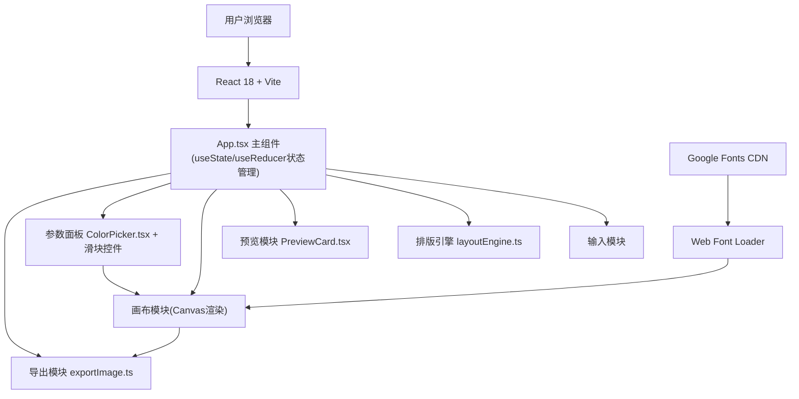

## 1. 架构设计


## 2. 技术选型
- 前端框架：React 18 + TypeScript 5.x (严格模式)
- 构建工具：Vite 5.x + @vitejs/plugin-react
- 字体加载：webfontloader
- 图片导出：html2canvas + 原生Canvas API（双保险）
- 状态管理：React useState + useReducer（轻量场景，无需zustand）
- 样式方案：原生CSS（style对象 + CSS类混合，避免额外依赖）

## 3. 项目结构
```
auto372/
├── package.json              # 依赖管理：react, react-dom, vite, typescript, html2canvas, webfontloader
├── vite.config.ts            # Vite配置 + React插件
├── tsconfig.json             # TS严格模式，ESNext模块
├── index.html                # 入口HTML，引入Google Fonts链接
└── src/
    ├── main.tsx              # 入口文件
    ├── App.tsx               # 主组件：输入区/预览/编辑/下载 状态协调
    ├── types.ts              # 类型定义：LayoutScheme / ColorTheme / TextStyle
    ├── layoutEngine.ts       # 排版引擎：文字→5种方案坐标/字体/颜色
    ├── exportImage.ts        # 导出模块：DOM→Canvas→PNG下载
    ├── components/
    │   ├── ColorPicker.tsx   # 自定义色环拾色器(HSV→HEX)
    │   └── PreviewCard.tsx   # 预览卡片组件
    └── index.css             # 全局样式
```

## 4. 类型定义（types.ts）
```typescript
export interface LayoutScheme {
  id: string;
  name: string;          // 方案名称：诗意留白/几何冲击/渐变聚焦等
  layoutType: 'center' | 'left' | 'diagonal' | 'split' | 'minimal';
  textPosition: { x: number; y: number };  // 画布坐标(0-1080)
  textAlign: 'left' | 'center' | 'right';
  fontFamily: string;    // Noto Serif SC / ZCOOL QingKe HuangYou / Ma Shan Zheng / SiKuai
  fontSize: number;      // 32-96px
  textColor: string;     // HEX
  backgroundColor: string; // HEX
  rotation: number;      // -30 ~ 30度
  opacity: number;       // 0.1 - 1
  accentColor?: string;  // 装饰元素颜色
  decorElements?: DecorElement[];
}

export interface ColorTheme {
  id: string;
  name: string;          // 晨曦暖阳/深海幽蓝/暗夜极光
  primary: string;
  secondary: string;
  accent: string;
  suggestedBg: string;
  suggestedText: string;
}

export interface TextStyle {
  content: string;
  fontFamily: string;
  fontSize: number;
  color: string;
  position: { x: number; y: number };
  rotation: number;
  opacity: number;
  backgroundColor: string;
}

export interface DecorElement {
  type: 'line' | 'circle' | 'rect' | 'gradient';
  position: { x: number; y: number };
  size: { width: number; height: number };
  color: string;
  rotation?: number;
}
```

## 5. 核心算法

### 5.1 排版引擎（layoutEngine.ts）
- 输入：文字内容(string) + 随机种子(可选)
- 流程：
  1. 文字长度分析（短<30 / 中30-100 / 长>100字符）
  2. 关键词情感粗分（检查"爱/梦/风/月/心/诗"等触发诗意方案）
  3. 5种预设模板池（居中大字/左对齐留白/斜向分割/几何冲击/渐变聚焦）
  4. 坐标随机化（模板基础上±20px微调，保证5种差异化）
  5. 输出：LayoutScheme[5]

### 5.2 导出模块（exportImage.ts）
- 方案A（首选）：html2canvas捕获画布DOM → scale:2高清 → toBlob → 触发a标签下载
- 方案B（兜底）：原生Canvas API绘制（背景+文字+装饰）→ toDataURL下载
- 参数：backgroundColor强制覆盖不透明，DPR=2保证清晰度

### 5.3 色环拾色器（ColorPicker.tsx）
- HSV模型渲染：canvas绘制色环（Hue）+ 中心方块（Saturation+Value）
- 交互：拖动色环选H，拖动方块选S/V
- 输出：HEX字符串

## 6. 性能优化
- 画布渲染：使用transform代替top/left定位（GPU加速）
- 滑块防抖：requestAnimationFrame节流而非setTimeout
- 字体：Web Font Loader预加载4种字体，active事件后渲染
- 导出：离屏Canvas + 直接写入像素，避免DOM序列化开销
