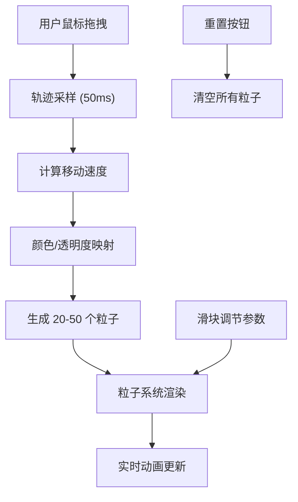

## 1. 产品概述

星云调色盘是一款沉浸式三维交互可视化数字绘画应用，用户通过鼠标在画布上拖拽即可实时生成和调节动态粒子星云，创造独一无二的数字艺术作品。

- 主要用途：创意数字绘画、艺术表达、放松冥想
- 目标用户：数字艺术爱好者、设计师、普通用户
- 产品价值：将鼠标轨迹转化为绚丽的粒子星云，提供即时反馈的创作体验

## 2. 核心功能

### 2.1 功能模块

1. **主画布**：全屏 Three.js 3D 粒子星云场景
2. **控制面板**：密度、颜色偏移、旋转速度调节及重置功能
3. **粒子系统**：动态粒子生成、轨迹追踪、颜色映射、动画效果

### 2.2 功能详情

| 功能模块 | 子功能 | 功能描述 |
|---------|--------|---------|
| 主画布 | 鼠标拖拽交互 | 记录鼠标轨迹，采样间隔 50ms |
| 主画布 | 粒子生成 | 在轨迹点周围半径 15px 球体内随机生成 20-50 个粒子 |
| 粒子系统 | 大小随机 | 粒子大小 1-4px 随机分布 |
| 粒子系统 | 速度颜色映射 | 速度<50px/s：冷色系(180-240°)；50-150px/s：中色系(30-120°)；>150px/s：暖色系(0-30°) |
| 粒子系统 | 透明度映射 | 透明度随速度从 0.3 线性增加到 0.8 |
| 粒子系统 | 整体旋转 | 绕 Y 轴缓慢旋转，速度 0-0.5 弧度/秒可调 |
| 粒子系统 | 个体波动 | 垂直方向正弦波动，振幅 2px，频率 1.5Hz |
| 粒子系统 | 性能优化 | 粒子总数上限 5000，超出自动淘汰最早粒子，保持 FPS≥45 |
| 控制面板 | 密度滑块 | 范围 1000-5000，控制粒子总数 |
| 控制面板 | 颜色偏移滑块 | 色相偏移 -180° 到 +180° |
| 控制面板 | 旋转速度滑块 | 范围 0-0.5，步长 0.01 |
| 控制面板 | 重置按钮 | 清除所有粒子，恢复初始状态 |

## 3. 核心流程

用户在画布上点击并拖拽鼠标 → 系统记录轨迹点（每 50ms 采样一次）→ 根据轨迹点生成新粒子（位置、大小、颜色、透明度）→ 粒子在 3D 空间中持续动画（旋转、波动）→ 用户通过滑块调节参数 → 实时反馈到粒子系统

## 4. 用户界面设计

### 4.1 设计风格

- **主色调**：深空渐变背景 #0B0B1A → #1A1A3E
- **强调色**：粒子滑块 #FF6B6B，重置按钮 #E53935
- **文字颜色**：浅灰 #E0E0E0
- **字体**：'Inter', sans-serif
- **按钮风格**：圆角 8px，重置按钮点击时 scale(0.95) 缩放动画
- **布局风格**：左侧悬浮半透明控制面板，全屏画布
- **粒子视觉**：圆形渐变纹理，中心亮边缘半透明的径向渐变，粒子间不互相遮挡

### 4.2 页面设计

| 区域 | 模块 | UI 元素 |
|-----|------|---------|
| 全屏 | 3D 画布 | Three.js Canvas，深空渐变背景，动态粒子星云 |
| 左侧悬浮 | 控制面板 | 背景 rgba(20,20,30,0.7)，圆角 12px，宽 220px，内边距 16px |
| 控制面板 | 密度滑块 | 轨道高 4px，圆角 2px，背景 #444，滑块圆形直径 16px，颜色 #FF6B6B |
| 控制面板 | 颜色偏移滑块 | 同上样式 |
| 控制面板 | 旋转速度滑块 | 同上样式 |
| 控制面板 | 重置按钮 | 红色 #E53935，圆角 8px，hover 变暗，active 缩放 |

### 4.3 响应式

- 桌面端优先，全屏画布自适应视口大小
- 控制面板固定左上角，不随窗口大小变化

### 4.4 3D 场景

- **环境**：深空渐变背景，无外部光照（粒子自发光）
- **相机**：PerspectiveCamera，固定视角
- **粒子渲染**：Points + ShaderMaterial，使用圆形渐变纹理，启用 AdditiveBlending，禁用深度写入
- **动画**：requestAnimationFrame 驱动，每帧更新一次
