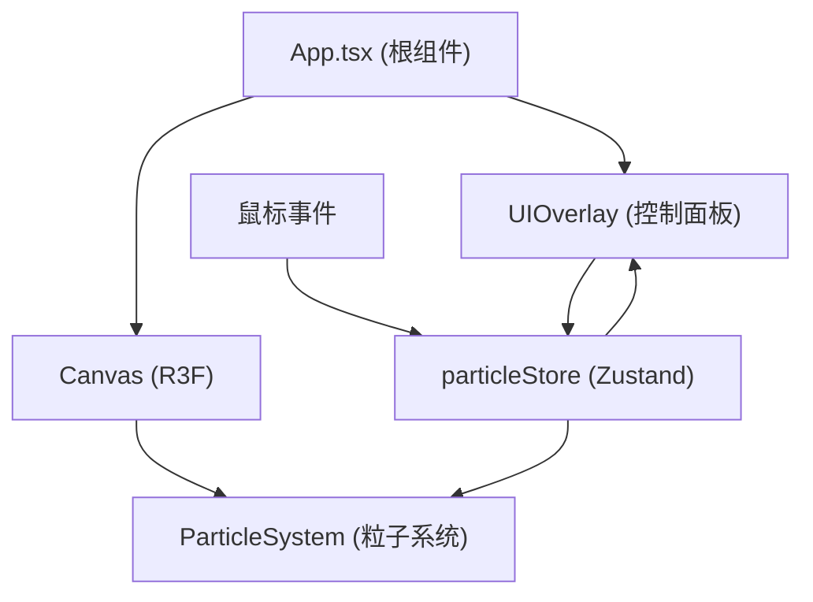

## 1. 架构设计



## 2. 技术栈说明

- **前端框架**：React 18 + TypeScript
- **构建工具**：Vite
- **3D 渲染**：Three.js + @react-three/fiber + @react-three/drei
- **状态管理**：Zustand
- **工具库**：uuid

## 3. 项目文件结构

```
.
├── package.json
├── vite.config.js
├── tsconfig.json
├── index.html
└── src/
    ├── App.tsx              # 根组件：Canvas + UI 面板
    ├── particleStore.ts     # Zustand Store：粒子状态管理
    ├── ParticleSystem.tsx   # Three.js 粒子系统组件
    └── UIOverlay.tsx        # 用户界面控制面板
```

## 4. 数据模型

### 4.1 粒子数据结构

```typescript
interface Particle {
  id: string;
  position: { x: number; y: number; z: number };
  basePosition: { x: number; y: number; z: number };
  color: { h: number; s: number; l: number };
  size: number;
  opacity: number;
  createdAt: number;
}
```

### 4.2 Zustand Store

```typescript
interface ParticleStore {
  particles: Particle[];
  maxParticles: number;        // 1000-5000
  colorOffset: number;         // -180 ~ +180
  rotationSpeed: number;       // 0 ~ 0.5
  addParticles: (particles: Particle[]) => void;
  setMaxParticles: (n: number) => void;
  setColorOffset: (n: number) => void;
  setRotationSpeed: (n: number) => void;
  reset: () => void;
}
```

## 5. 性能优化策略

1. **粒子数量上限**：5000 个，超出时淘汰最早创建的粒子
2. **渲染优化**：使用 BufferGeometry + Points，单个 draw call
3. **更新频率**：每帧更新一次，使用 requestAnimationFrame
4. **深度测试**：禁用 depthWrite，启用 AdditiveBlending，避免粒子遮挡
5. **鼠标采样**：50ms 采样间隔，避免高频生成粒子
6. **计算耗时**：单次粒子更新控制在 2ms 以内

## 6. 核心算法

### 6.1 速度计算

```
speed = distance(currentPos, lastPos) / deltaTime
```

### 6.2 颜色映射

```
speed < 50    → hue ∈ [180, 240] 冷色系
50 ≤ speed ≤ 150 → hue ∈ [30, 120]  中色系
speed > 150   → hue ∈ [0, 30]    暖色系
finalHue = (hue + colorOffset + 360) % 360
```

### 6.3 透明度映射

```
opacity = 0.3 + clamp(speed / 200, 0, 1) * 0.5
```

### 6.4 粒子波动

```
y(t) = baseY + 2 * sin(2π * 1.5 * t + phaseOffset)
```
