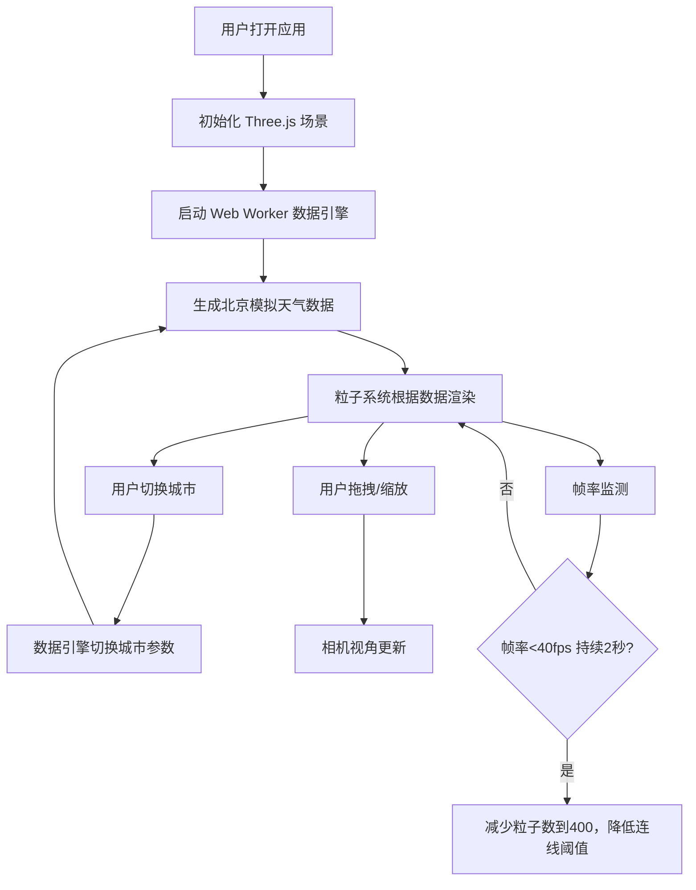

## 1. 产品概述

气象粒子泳池是一款将抽象气象数据（温度、湿度、风速、风向、气压）通过三维粒子系统进行可视化的应用。通过将实时天气参数映射为粒子的颜色、大小、运动轨迹和旋转速度，让用户能够直观地感知和理解气候变化趋势。

- **目标用户**：气象爱好者、数据可视化从业者、教育领域用户
- **核心价值**：将抽象数值转化为沉浸式的三维视觉体验，使气象数据变得可感知、可交互

## 2. 核心功能

### 2.1 功能模块

1. **三维粒子系统**：800+ 粒子构成的动态粒子群，颜色、大小、运动、旋转均受天气数据驱动
2. **天气数据引擎**：模拟生成四个城市（北京、上海、东京、纽约）的实时天气数据，每2秒随机波动
3. **城市选择器**：下拉切换城市，实时更新粒子系统状态
4. **控制面板**：显示实时天气参数数值，提供粒子响应开关
5. **性能自适应**：动态调节粒子数量和连线阈值，保持流畅帧率

### 2.3 页面详情

| 页面名称 | 模块名称 | 功能描述 |
|---------|---------|---------|
| 主页面 | 三维粒子场景 | 全屏 Three.js 粒子系统，支持鼠标拖拽旋转、滚轮缩放 |
| 主页面 | 城市选择下拉框 | 左上角城市切换，四个预设城市 |
| 主页面 | 右侧控制面板 | 显示温度/湿度/风速/风向/气压数值，粒子响应开关 |
| 主页面 | 粒子连线效果 | 粒子间距小于阈值时绘制半透明白色连线，形成蛛网效果 |
| 主页面 | 参考网格 | 场景底部极细半透明灰色网格，辅助空间感知 |
| 主页面 | 移动端适配 | 宽度小于1024px时控制面板折叠为悬浮按钮 |

## 3. 核心流程

用户打开应用 → 默认显示北京天气数据 → 粒子系统根据数据实时渲染 → 用户切换城市 → 数据引擎切换为对应城市的模拟数据 → 粒子系统平滑过渡到新状态 → 用户可通过鼠标交互浏览三维空间 → 用户可通过开关暂停/恢复数据响应

## 4. 用户界面设计

### 4.1 设计风格

- **主色调**：深色渐变背景（#0B0F19 → #1A1F2E），营造沉浸感
- **强调色**：蓝色 #3B82F6（交互高亮）、绿色 #22C55E（开启状态）、灰色 #6B7280（关闭状态）
- **粒子色带**：-10°C 蓝色 #0044FF → 0°C 青色 #00FFCC → 20°C 绿色 #00FF44 → 40°C 红色 #FF4400
- **字体**：Inter，白色无衬线字体
- **整体风格**：科技感、沉浸式、数据艺术化

### 4.2 页面设计概览

| 页面 | 模块 | UI 元素 |
|-----|-----|---------|
| 主页面 | 应用标题 | 左上角白色粗体24px，应用名称"气象粒子泳池" |
| 主页面 | 城市下拉框 | 圆角8px，半透明背景 rgba(255,255,255,0.1)，选中高亮 #3B82F6 |
| 主页面 | 控制面板 | 右侧宽200px，半透明 rgba(0,0,0,0.6)，顶部圆角12px，距右边界20px |
| 主页面 | 开关按钮 | 宽40px高24px，绿色/灰色背景切换 |
| 主页面 | 粒子效果 | 半透明发光材质，动态蛛网连线 |
| 主页面 | 参考网格 | 底部半透明灰色网格，线宽0.5px |
| 主页面 | 悬浮按钮（移动端） | 直径48px圆形，#3B82F6 背景，点击展开面板 |

### 4.3 交互动效

- **悬停效果**：所有控件鼠标悬停时亮度提升10%
- **点击动效**：点击时缩放到0.95再恢复，持续0.15秒
- **数据过渡**：天气参数变化时粒子属性平滑过渡
- **面板展开/折叠**：移动端控制面板展开/折叠动画

### 4.4 响应式设计

- **桌面优先**：以1024px+宽度为主要设计目标
- **断点**：1024px 为控制面板折叠/展开的临界点
- **触控优化**：移动端支持触摸旋转和缩放

### 4.5 三维场景指南

- **环境**：深色渐变背景，无外部 HDRI，自发光粒子为主视觉
- **光照**：粒子使用自发光材质，不依赖场景光照
- **相机**：PerspectiveCamera，初始距离适中，可 OrbitControls 交互
- **构图**：粒子群居中，底部参考网格提供空间锚点
- **动画**：粒子持续运动，系统整体缓慢自转
- **性能**：目标 45fps+，动态降级到 400 粒子
