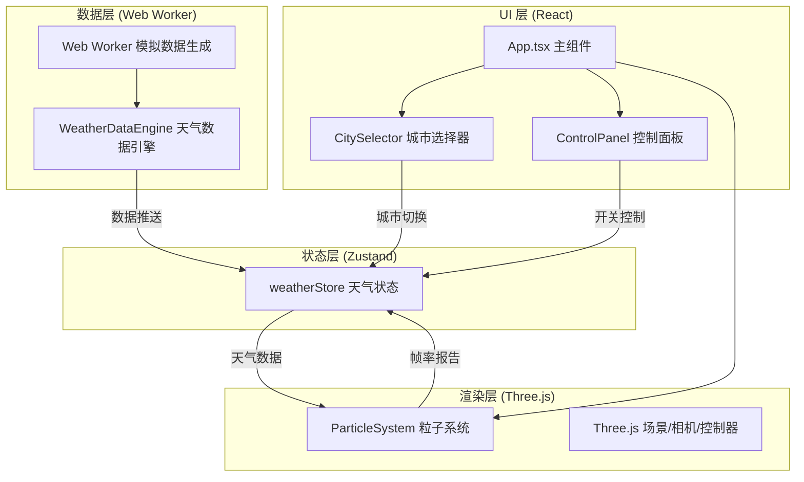

## 1. 架构设计



## 2. 技术选型说明

| 类别 | 技术 | 版本 | 说明 |
|-----|------|------|------|
| 前端框架 | React | ^18 | 组件化 UI 构建 |
| 构建工具 | Vite | ^5 | 快速开发构建 |
| 语言 | TypeScript | ^5 | 类型安全 |
| 3D 引擎 | Three.js | ^0.160 | WebGL 三维渲染 |
| React 绑定 | @react-three/fiber | ^8 | React 声明式 Three.js |
| 辅助库 | @react-three/drei | ^9 | 常用 Three.js 组件封装 |
| 状态管理 | Zustand | ^4 | 轻量级状态管理 |
| 工具库 | uuid | ^9 | 生成唯一标识 |

## 3. 项目文件结构

```
auto375/
├── package.json
├── vite.config.ts
├── tsconfig.json
├── index.html
├── .trae/
│   └── documents/
└── src/
    ├── main.tsx              # React 入口
    ├── App.tsx               # 主应用组件
    ├── store/
    │   └── weatherStore.ts   # Zustand 状态管理
    ├── components/
    │   ├── CitySelector.tsx  # 城市选择器
    │   └── ControlPanel.tsx  # 控制面板
    ├── engine/
    │   ├── WeatherDataEngine.ts  # 天气数据引擎
    │   └── weatherWorker.worker.ts  # Web Worker
    ├── particles/
    │   └── ParticleSystem.tsx    # 粒子系统组件
    └── utils/
        └── colorMapping.ts   # 颜色映射工具
```

## 4. 数据模型

### 4.1 天气数据类型

```typescript
interface WeatherData {
  temperature: number;  // 温度 -10 ~ 40 °C
  humidity: number;     // 湿度 20 ~ 90 %
  windSpeed: number;    // 风速 0 ~ 20 m/s
  windDirection: number;// 风向 0 ~ 360 度
  pressure: number;     // 气压 980 ~ 1040 hPa
  city: string;         // 城市名称
  timestamp: number;    // 时间戳
}
```

### 4.2 粒子系统状态

```typescript
interface ParticleState {
  particleCount: number;      // 当前粒子数量
  connectionThreshold: number;// 连线距离阈值
  fps: number;                // 当前帧率
  isResponsive: boolean;      // 是否响应数据变化
}
```

### 4.3 Zustand Store 结构

```typescript
interface WeatherStore {
  weather: WeatherData;
  particleState: ParticleState;
  cities: string[];
  currentCity: string;
  
  setCity: (city: string) => void;
  updateWeather: (data: WeatherData) => void;
  toggleResponsive: () => void;
  setFps: (fps: number) => void;
  adjustPerformance: () => void;
}
```

## 5. 核心算法

### 5.1 温度-颜色映射

使用 HSL 线性插值，在四个关键色之间分段插值：
- -10°C: #0044FF (HSL: 225, 100%, 50%)
- 0°C: #00FFCC (HSL: 168, 100%, 50%)
- 20°C: #00FF44 (HSL: 136, 100%, 50%)
- 40°C: #FF4400 (HSL: 16, 100%, 50%)

### 5.2 湿度-粒子大小映射

线性映射：20% → 0.3 单位，90% → 1.0 单位

### 5.3 风-粒子运动映射

- 风向：0° 向右（+X），90° 向上（+Y），映射为水平方向向量
- 风速：0 m/s → 0 单位/秒，20 m/s → 3 单位/秒，线性映射

### 5.4 气压-系统自转映射

- 980 hPa → 0.05 rad/s
- 1040 hPa → 0.01 rad/s
- 线性反比映射

### 5.5 性能自适应

- 监测帧率，若连续 2 秒 < 40fps
- 粒子数从 800 → 400
- 连线阈值从 0.8 → 0.5

## 6. Web Worker 通信协议

### 6.1 主线程 → Worker

```typescript
// 启动/切换城市
{ type: 'START', city: string }

// 停止
{ type: 'STOP' }
```

### 6.2 Worker → 主线程

```typescript
// 天气数据更新
{ type: 'WEATHER_UPDATE', data: WeatherData }
```

## 7. 性能优化策略

1. **粒子几何体复用**：使用 BufferGeometry 统一管理所有粒子
2. **Web Worker 数据生成**：避免阻塞主线程
3. **帧率动态降级**：粒子数和连线阈值自适应调整
4. **材质共享**：所有粒子使用同一份 ShaderMaterial
5. **连线优化**：空间分区或只计算近邻粒子连线
6. **requestAnimationFrame**：使用原生 RAF 循环
