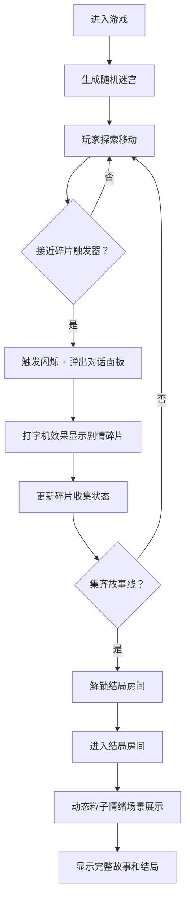

## 1. 产品概述
记忆迷宫是一款赛博朋克风格的 3D 交互叙事情境游戏，玩家在随机生成的迷宫中探索收集碎片化剧情，通过非线性叙事组合揭示完整故事，最终解锁不同结局。
- 目标用户：喜欢叙事探索、解谜类游戏的玩家
- 产品价值：将迷宫探索与碎片化叙事结合，提供沉浸式的赛博朋克风格剧情体验

## 2. 核心特性

### 2.1 功能模块
1. **迷宫场景**：递归分割算法生成唯一解迷宫，3D 渲染带距离渐变效果
2. **玩家控制系统**：第一人称视角，键盘移动，摄像机平滑跟随
3. **碎片收集系统**：全息球体触发器，接近触发剧情碎片展示
4. **叙事组合系统**：按收集顺序组合碎片，形成非线性叙事图
5. **结局房间**：集齐故事线后解锁，动态粒子情绪场景
6. **对话 UI**：磨砂玻璃面板，打字机效果逐字显示

### 2.2 页面详情
| 页面名称 | 模块名称 | 功能描述 |
|-----------|-------------|---------------------|
| 游戏主界面 | 3D 迷宫场景 | 渲染迷宫墙壁、玩家视角、碎片触发器 |
| 游戏主界面 | 对话面板 | 显示剧情碎片，打字机效果，磨砂玻璃样式 |
| 游戏主界面 | 状态 HUD | 显示碎片收集进度、当前位置 |
| 结局房间 | 粒子场景 | 动态粒子展示结局情绪（金色胜利/蓝色悲伤） |
| 结局房间 | 结局展示 | 显示完整叙事和结局文本 |

## 3. 核心流程
玩家进入游戏 → 在迷宫中探索移动 → 接近全息球体触发剧情碎片 → 碎片以打字机效果显示 → 继续探索收集更多碎片 → 集齐某故事线所有碎片 → 解锁结局房间 → 进入结局房间观看动态粒子场景和完整故事

## 4. 用户界面设计

### 4.1 设计风格
- **主色调**：深蓝 #0A1128，荧光绿 #00FFAA，金黄 #FFD700
- **墙壁渐变**：近处 #00FFAA → 远处 #0A2A48
- **字体**：等宽字体 Courier New, monospace
- **视觉风格**：赛博朋克迷幻风，深色背景配霓虹色高亮
- **特效**：box-shadow 脉冲发光、磨砂玻璃 backdrop-filter:blur(8px)

### 4.2 页面设计概览
| 页面名称 | 模块名称 | UI 元素 |
|-----------|-------------|-------------|
| 游戏主界面 | 3D 迷宫场景 | 深蓝墙壁带荧光绿网格线，距离渐变，第一人称视角 |
| 游戏主界面 | 碎片触发器 | 半径 6px 金黄全息球体，1.2s 脉动光晕，接近闪烁 |
| 游戏主界面 | 对话面板 | 320px 宽自适应高，圆角 16px，磨砂玻璃，打字机 40ms/字 |
| 结局房间 | 粒子场景 | 悲伤：蓝色粒子缓慢下落；胜利：金色粒子向上飘散 |
| 全局 | 交互元素 | 所有按钮带微光边缘脉冲动画 |

### 4.3 响应式
桌面端优先，适配主流分辨率（1920×1080 及以上），全屏 3D 渲染场景。

### 4.4 3D 场景指引
- **环境**：深蓝 #0A1128 背景，霓虹色网格墙壁
- **光照**：环境光 + 方向光模拟赛博朋克氛围
- **摄像机**：第一人称背后跟随，阻尼系数 0.08 平滑过渡
- **交互**：WASD 移动，鼠标控制视角方向
- **后处理**：墙壁颜色随距离动态渐变，碎片发光效果
- **性能**：迷宫生成 ≤50ms，帧率 ≥50fps，UI 响应延迟 ≤16ms
