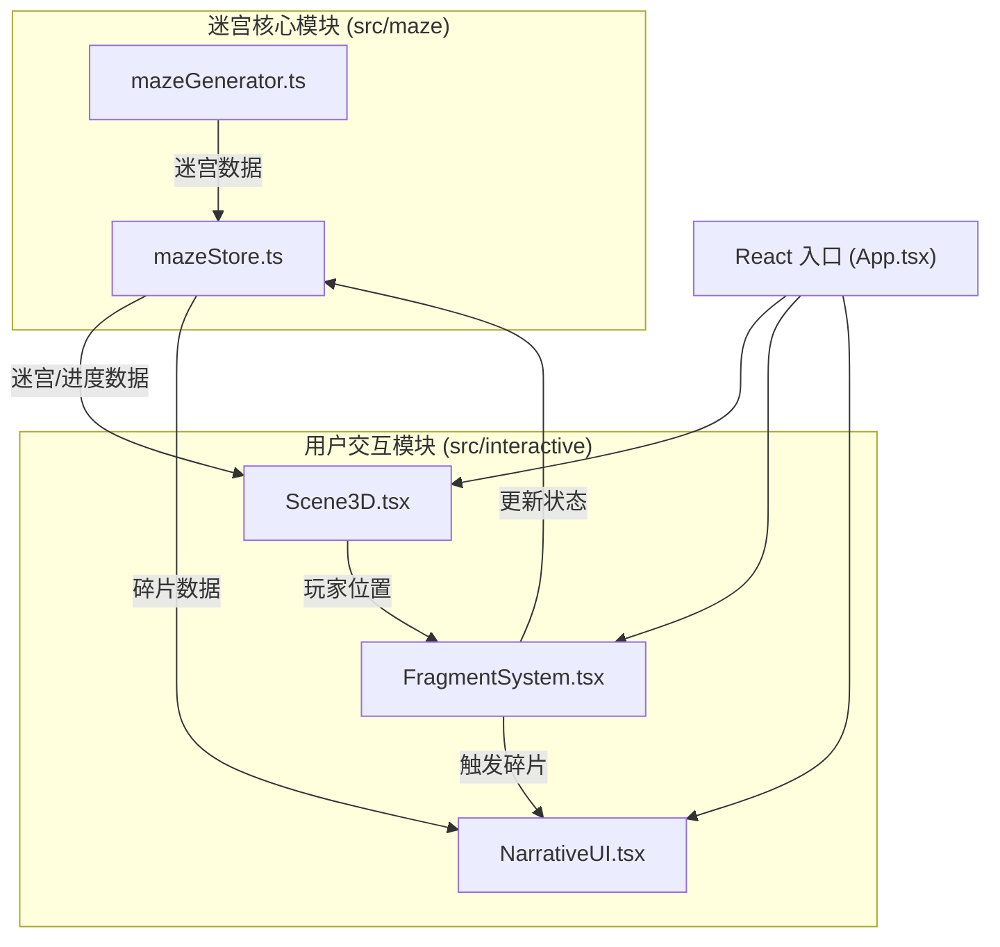

## 1. 架构设计



## 2. 技术说明
- **前端框架**：React 18 + TypeScript + Vite
- **3D 渲染**：Three.js + @react-three/fiber + @react-three/drei
- **状态管理**：Zustand
- **构建工具**：Vite
- **唯一 ID**：uuid

## 3. 目录结构

```
src/
├── maze/                    # 迷宫核心模块
│   ├── mazeGenerator.ts     # 递归分割迷宫生成算法
│   └── mazeStore.ts         # Zustand 状态管理
├── interactive/             # 用户交互模块
│   ├── Scene3D.tsx          # Three.js 3D 场景渲染
│   ├── FragmentSystem.tsx   # 碎片触发器与剧情逻辑
│   └── NarrativeUI.tsx      # 对话面板与结局 UI
├── App.tsx                  # 主应用入口
└── main.tsx                 # React 挂载入口
```

## 4. 数据模型

### 4.1 迷宫数据结构
```typescript
// 迷宫单元格类型
interface Cell {
  x: number;
  y: number;
  walls: { top: boolean; right: boolean; bottom: boolean; left: boolean };
  isPath: boolean;
  isSolution: boolean;
}

// 迷宫数据
interface MazeData {
  width: number;
  height: number;
  grid: Cell[][];
  solutionPath: Array<{ x: number; y: number }>;
  seed: number;
}
```

### 4.2 碎片数据结构
```typescript
// 剧情碎片
interface Fragment {
  id: string;
  position: { x: number; y: number };
  text: string;
  storyLine: string;
  order: number;
  prerequisites: string[];
  nextFragments: string[];
  collected: boolean;
}

// 故事线
interface StoryLine {
  id: string;
  name: string;
  fragments: string[];
  ending: {
    type: 'victory' | 'sorrow' | 'neutral';
    text: string;
  };
  unlocked: boolean;
}
```

### 4.3 玩家状态
```typescript
interface PlayerState {
  position: { x: number; y: number; z: number };
  rotation: { yaw: number; pitch: number };
  collectedFragments: string[];
}
```

## 5. 模块接口定义

### 5.1 迷宫核心模块接口
```typescript
// mazeGenerator.ts
export function generateMaze(
  width: number,
  height: number,
  seed?: number
): MazeData;

// mazeStore.ts
interface MazeStore {
  maze: MazeData | null;
  fragments: Fragment[];
  storyLines: StoryLine[];
  playerState: PlayerState;
  activeFragment: Fragment | null;
  activeEnding: StoryLine | null;
  generateNewMaze: (seed?: number) => void;
  collectFragment: (id: string) => void;
  setPlayerPosition: (pos: PlayerState['position']) => void;
  setPlayerRotation: (rot: PlayerState['rotation']) => void;
  setActiveFragment: (f: Fragment | null) => void;
  checkStoryLineCompletion: () => void;
  triggerEnding: (storyLineId: string) => void;
}
```

### 5.2 用户交互模块接口
- `Scene3D.tsx`：渲染迷宫墙壁、玩家控制、距离渐变效果
- `FragmentSystem.tsx`：全息球体渲染、碰撞检测、触发剧情碎片
- `NarrativeUI.tsx`：对话面板组件（磨砂玻璃、打字机效果）、结局粒子场景
