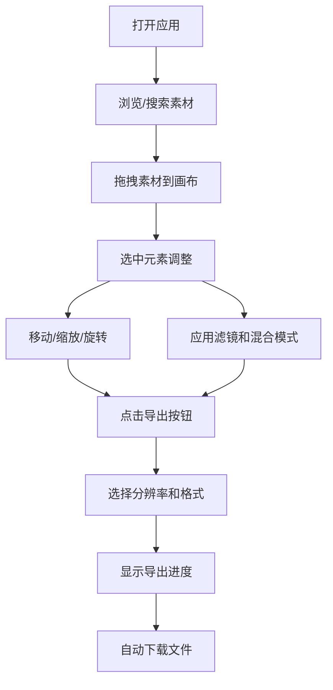

## 1. 产品概述
像素拼贴工坊是一款面向创意用户的在线拼贴画创作应用，用户可从丰富的素材库中拖拽贴纸、图片和几何形状到画布上自由组合创作，并应用多种滤镜效果与混合模式，最终导出为高清PNG或PDF图片文件。

- 目标用户：设计师、社交媒体创作者、学生及普通创意爱好者
- 核心价值：零门槛、轻量级的在线拼贴创作体验，无需安装专业设计软件

## 2. 核心功能

### 2.1 功能模块
1. **素材库面板**：贴纸分类、几何形状、纯色填充块、搜索筛选、最近使用
2. **画布编辑器**：元素拖拽、多选、缩放、旋转、层级管理、网格背景
3. **滤镜引擎**：CSS滤镜（模糊、亮度、对比度、饱和度、色相旋转）、不透明度、混合模式
4. **导出模块**：PNG/PDF导出、多分辨率选择、进度反馈、自动下载

### 2.2 页面详情
| 页面名称 | 模块名称 | 功能描述 |
|----------|----------|----------|
| 主编辑页 | 顶部标题栏 | 展示应用名称、品牌标识 |
| 主编辑页 | 左侧素材面板 | 搜索框、分类标签、素材网格展示、拖拽添加 |
| 主编辑页 | 中央画布区域 | 800x600像素画布、浅灰网格背景、元素渲染、选框、控制点 |
| 主编辑页 | 右侧滤镜面板 | 折叠展开、六个滤镜滑块、混合模式下拉框 |
| 主编辑页 | 导出对话框 | 分辨率选择、格式选择、进度条、导出按钮 |

## 3. 核心流程
用户打开应用后，从左侧素材面板浏览或搜索素材，通过拖拽将素材添加到画布中央。在画布上可选中元素进行位置移动、缩放（8个控制点等比缩放）、旋转（右上角旋转手柄，15度吸附）操作。按住Shift可多选多个元素。点击画布右上角导出按钮，在弹出对话框中选择分辨率（普通1080x1080/高清2160x2160）和格式（PNG透明/PNG白底/PDF A4），点击导出后显示进度条，完成后自动下载文件。

## 4. 用户界面设计

### 4.1 设计风格
- **主色调**：暖色调设计，主背景 #F8F5F0，面板背景 #F5F3EF，标题栏 #3D3A35
- **强调色**：#D4A373（暖棕色，用于选中状态、按钮、滑块）
- **按钮样式**：圆角8px，平滑过渡动画0.2s ease
- **字体**：使用优雅的衬线/无衬线字体搭配，标题加粗
- **布局风格**：三栏式布局（左侧素材面板、中央画布、右侧折叠滤镜面板）
- **交互细节**：素材卡片悬停上浮3px+阴影、元素拖拽时不透明度变化、磨砂玻璃效果滤镜面板

### 4.2 页面设计概览
| 页面名称 | 模块名称 | UI元素 |
|----------|----------|--------|
| 主编辑页 | 标题栏 | 60px高，深棕背景#3D3A35，白色文字带0.5px阴影 |
| 主编辑页 | 素材面板 | 280px宽，#F5F3EF背景，圆角8px搜索框，36px高分类按钮，2px彩色下划线，120x120px圆角12px素材卡片 |
| 主编辑页 | 画布区域 | 70%宽度，800x600px画布，#E8E8E8背景+10px间距网格线，6x6px白色控制点带#333边框，12px直径旋转手柄 |
| 主编辑页 | 滤镜面板 | 240px宽，#2D2D2D背景+圆角12px+磨砂效果，4px高圆角滑块轨道，16px直径#D4A373滑块手柄 |
| 主编辑页 | 导出按钮 | 画布右上角，圆角8px，#D4A373背景白色文字，悬停#BC8F5A |
| 主编辑页 | 导出对话框 | 360px宽居中，白色背景圆角16px，8px阴影，#4A90D9蓝色圆角4px进度条 |

### 4.3 响应式设计
- 桌面端（≥1024px）：标准三栏布局
- 移动端/平板（<1024px）：素材面板折叠为底部80px高横向滚动工具栏，画布自适应可用宽度

### 4.4 性能要求
- 拖拽和缩放帧率 ≥ 50fps
- 画布同时容纳30个元素时流畅无卡顿
- 导出生成时间 ≤ 3秒
