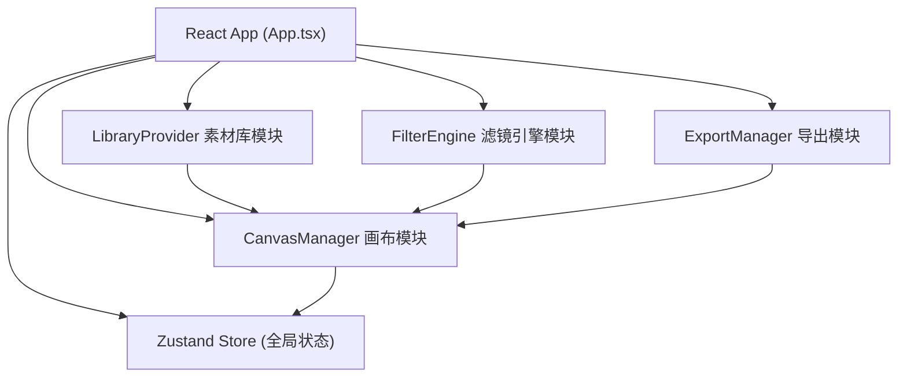

## 1. 架构设计



## 2. 技术选型说明
- **前端框架**：React 18 + TypeScript
- **构建工具**：Vite + @vitejs/plugin-react
- **状态管理**：Zustand
- **拖拽库**：react-beautiful-dnd
- **导出工具**：html2canvas + jspdf
- **唯一ID**：uuid
- **样式方案**：原生CSS（配合CSS变量实现主题一致性）

## 3. 模块职责定义

### 3.1 CanvasManager (src/modules/canvas/CanvasManager.ts)
画布核心模块，职责：
- 管理所有画布元素的位置、尺寸、旋转角度、层级
- 提供元素操作方法：addElement、removeElement、moveElement、scaleElement、rotateElement
- 支持多选操作（Shift点击）和框选
- 输出画布状态快照供导出模块使用
- 处理拖拽、缩放、旋转等交互的底层逻辑

### 3.2 LibraryProvider (src/modules/library/LibraryProvider.ts)
素材库模块，职责：
- 管理预置素材数据：贴纸（多分类）、几何形状（圆/矩/三角/星）、纯色填充块
- 提供素材筛选功能：按类型分类、关键词搜索
- 管理最近使用素材列表
- 通过CanvasManager命令向画布添加素材元素

### 3.3 FilterEngine (src/modules/filter/FilterEngine.ts)
滤镜引擎模块，职责：
- 实现CSS滤镜效果：blur、brightness、contrast、saturate、hue-rotate、opacity
- 实现CSS混合模式：normal、multiply、screen、overlay、soft-light、hard-light
- 将滤镜参数转换为React内联样式对象
- 提供实时更新画布渲染的接口

### 3.4 ExportManager (src/modules/export/ExportManager.ts)
导出模块，职责：
- 接收CanvasManager输出的画布快照
- 使用html2canvas将DOM画布渲染为Canvas元素
- 支持多种分辨率：1080x1080、2160x2160
- 支持多种格式：PNG（透明背景）、PNG（白色背景）、PDF（A4比例）
- 提供导出进度反馈和文件下载功能
- 通过jsPDF处理PDF格式导出

## 4. 状态管理（Zustand Store）

```typescript
interface CanvasElement {
  id: string;
  type: 'sticker' | 'shape' | 'fill';
  src?: string;
  shape?: 'circle' | 'rectangle' | 'triangle' | 'star';
  fillColor?: string;
  x: number;
  y: number;
  width: number;
  height: number;
  rotation: number;
  zIndex: number;
  filters: {
    blur: number;
    brightness: number;
    contrast: number;
    saturate: number;
    hueRotate: number;
    opacity: number;
  };
  blendMode: BlendMode;
}

interface AppState {
  elements: CanvasElement[];
  selectedIds: string[];
  activeCategory: string;
  searchQuery: string;
  filterPanelOpen: boolean;
  exportDialogOpen: boolean;
  // actions...
}
```

## 5. 文件结构

```
src/
├── main.tsx                    # React入口
├── App.tsx                     # 主应用组件
├── store/
│   └── useCanvasStore.ts       # Zustand状态管理
├── modules/
│   ├── canvas/
│   │   └── CanvasManager.ts    # 画布核心逻辑
│   ├── library/
│   │   └── LibraryProvider.ts  # 素材库管理
│   ├── filter/
│   │   └── FilterEngine.ts     # 滤镜引擎
│   └── export/
│       └── ExportManager.ts    # 导出模块
├── components/
│   ├── Header.tsx              # 顶部标题栏
│   ├── LibraryPanel.tsx        # 左侧素材面板
│   ├── Canvas.tsx              # 画布渲染组件
│   ├── CanvasElement.tsx       # 单个画布元素组件
│   ├── FilterPanel.tsx         # 右侧滤镜面板
│   └── ExportDialog.tsx        # 导出对话框
├── types/
│   └── index.ts                # 类型定义
└── assets/
    └── stickers/               # 贴纸素材（SVG占位）
```

## 6. 性能优化策略
- 使用React.memo优化CanvasElement重渲染
- 拖拽操作使用requestAnimationFrame节流
- 元素transform使用GPU加速（translate3d）
- 导出操作使用Web Worker（如需要）避免阻塞主线程
- 素材图片懒加载
