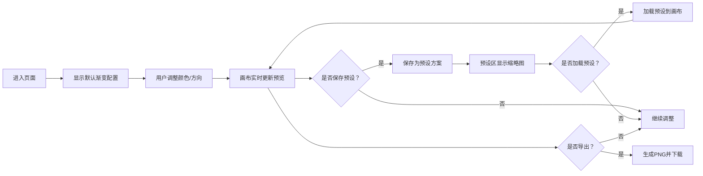

## 1. 产品概述

渐变工坊是一款面向创意团队平面设计师的在线渐变海报设计工具，帮助用户快速生成不同风格的渐变背景海报，解决手动调整颜色和渐变方向耗时、难以保存和复用设计灵感的问题。

- 核心用户：平面设计师、社交媒体运营人员、创意工作者
- 产品价值：提升渐变设计效率，保存设计灵感，一键导出高质量海报

## 2. 核心功能

### 2.1 功能模块

1. **颜色管理模块**：预设基础色选择、多色阶管理、位置与透明度调整
2. **渐变方向控制**：8种可视化方向选择，实时预览
3. **画布渲染模块**：实时渐变预览，动态边框效果
4. **预设方案管理**：保存/加载渐变配置，缩略图展示
5. **导出功能**：PNG图片导出，高清尺寸

### 2.2 页面详情

| 页面名称 | 模块名称 | 功能描述 |
|---------|---------|---------|
| 主页面 | 颜色控制面板 | 8个预设基础色块选择，最多5个色阶管理，位置滑块，透明度输入 |
| 主页面 | 方向控制栏 | 8个可视化方向按钮，实时更新渐变方向 |
| 主页面 | 画布预览区 | 600x600px渐变预览，动态渐变边框动画 |
| 主页面 | 预设管理区 | 横向滚动缩略图列表，保存/加载预设方案 |
| 主页面 | 导出按钮 | 1080x1080px PNG导出，带加载动画 |

## 3. 核心流程

### 3.1 主要用户流程

1. 用户进入页面，看到默认渐变配置的画布预览
2. 用户通过颜色面板选择基础色、调整色阶位置和透明度
3. 用户点击方向按钮改变渐变方向，画布实时更新
4. 用户点击保存按钮，将当前配置保存为预设方案
5. 用户点击预设缩略图，快速加载已保存的渐变方案
6. 用户点击导出按钮，生成并下载1080x1080px的PNG海报

### 3.2 流程图

## 4. 用户界面设计

### 4.1 设计风格

- **主题**：深色主题，背景色 #1E1E2E
- **主色调**：绿色导出按钮 #4CAF50，灰色预设背景 #E0E0E0
- **预设基础色**：#FF6B6B、#4ECDC4、#45B7D1、#96CEB4、#FFEAA7、#DDA0DD、#98D8C8、#2C3E50
- **按钮风格**：圆角8-16px，悬停上浮效果（translateY(-2px)），选中脉冲光晕
- **字体**：系统无衬线字体，字重400-600
- **布局风格**：居中布局，左侧颜色面板（280px），主体画布（600x600px），底部预设区
- **动效**：所有交互元素0.2s过渡动画，预设加载0.3s淡入，导出加载旋转圆环

### 4.2 页面设计概览

| 页面名称 | 模块名称 | UI元素 |
|---------|---------|-------|
| 主页面 | 颜色面板 | 圆形色块（32px）、选中白边阴影、位置滑块、透明度数字输入、添加/删除色阶按钮 |
| 主页面 | 方向按钮行 | 8个方向按钮、45x45px方块、白色箭头线段、浅色渐变背景 |
| 主页面 | 画布区域 | 600x600px画布、圆角16px、渐变边框动画、实时渐变渲染 |
| 主页面 | 预设管理区 | 横向滚动容器、100x100px缩略图、圆角12px、灰色背景、淡入动画 |
| 主页面 | 导出按钮 | 绿色按钮 #4CAF50、圆角8px、加载旋转动画 |

### 4.3 响应式

- 桌面端优先，居中布局
- 最小支持宽度：1200px
- 画布区域固定尺寸，确保预览准确性

### 4.4 性能约束

- 颜色/方向调整后画布更新 < 100ms
- 导出操作总耗时 < 2秒
- 页面首屏加载 < 1.5秒
- 每帧重绘 < 16ms
