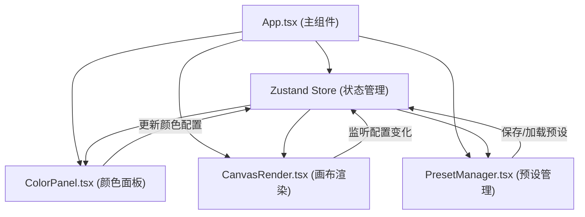

## 1. 架构设计



## 2. 技术描述

- **前端框架**：React 18 + TypeScript
- **构建工具**：Vite
- **状态管理**：Zustand
- **唯一ID生成**：uuid
- **开发语言**：TypeScript（严格模式，target: ESNext）
- **样式方案**：CSS Modules / 内联样式（按项目需求）

### 2.1 依赖清单

| 依赖包 | 版本说明 | 用途 |
|-------|---------|------|
| react | ^18.0.0 | UI框架 |
| react-dom | ^18.0.0 | DOM渲染 |
| zustand | ^4.0.0 | 状态管理 |
| uuid | ^9.0.0 | 生成唯一ID |
| vite | ^5.0.0 | 构建工具 |
| @vitejs/plugin-react | ^4.0.0 | React插件 |
| typescript | ^5.0.0 | TypeScript语言 |
| @types/react | ^18.0.0 | React类型定义 |
| @types/react-dom | ^18.0.0 | React DOM类型定义 |

## 3. 模块划分与数据流向

### 3.1 文件结构

```
src/
├── types/
│   └── gradient.ts          # 渐变配置类型定义
├── store/
│   └── useGradientStore.ts  # Zustand状态管理
├── utils/
│   └── gradientUtils.ts     # 渐变计算工具函数
├── components/
│   ├── ColorPanel.tsx       # 颜色控制面板
│   ├── CanvasRender.tsx     # 画布渲染组件
│   └── PresetManager.tsx    # 预设方案管理
├── App.tsx                  # 主应用组件
├── main.tsx                 # 入口文件
└── index.css                # 全局样式
```

### 3.2 数据流向

1. **ColorPanel → Store**：用户选择颜色、调整位置/透明度 → 更新store中的gradientConfig
2. **Store → CanvasRender**：store变化触发CanvasRender重新计算渐变CSS → 重新渲染画布
3. **PresetManager → Store**：用户保存预设 → store添加preset；用户加载预设 → store更新gradientConfig
4. **Store → PresetManager**：preset列表变化 → PresetManager重新渲染缩略图

## 4. 数据模型

### 4.1 类型定义

```typescript
// 渐变颜色色阶
interface ColorStop {
  id: string;
  color: string;      // hex颜色值
  position: number;   // 位置 0-100
  opacity: number;    // 透明度 0-1
}

// 渐变方向
type GradientDirection = 
  | 'to right'
  | 'to left'
  | 'to bottom'
  | 'to top'
  | 'to bottom right'
  | 'to bottom left'
  | 'to top right'
  | 'to top left';

// 渐变配置
interface GradientConfig {
  colorStops: ColorStop[];
  direction: GradientDirection;
}

// 预设方案
interface Preset {
  id: string;
  name: string;
  config: GradientConfig;
  createdAt: number;
}

// Store状态
interface GradientState {
  config: GradientConfig;
  presets: Preset[];
  selectedColorStopId: string | null;
  setDirection: (direction: GradientDirection) => void;
  addColorStop: () => void;
  removeColorStop: (id: string) => void;
  updateColorStop: (id: string, updates: Partial<ColorStop>) => void;
  selectColorStop: (id: string | null) => void;
  savePreset: (name: string) => void;
  loadPreset: (id: string) => void;
  deletePreset: (id: string) => void;
}
```

## 5. 核心功能实现思路

### 5.1 颜色管理

- 8个预设基础色以圆形色块展示
- 最多支持5个色阶，可添加/删除
- 每个色阶独立的位置滑块（0-100%）和透明度输入（0.0-1.0）
- 选中色阶时高亮显示（2px白色边框+阴影）

### 5.2 渐变方向

- 8个方向按钮，内嵌45x45px方块示意
- 使用CSS linear-gradient实现箭头效果
- 点击立即更新，响应时间<100ms

### 5.3 画布渲染

- 使用CSS background: linear-gradient 实时渲染
- 通过Zustand订阅优化渲染性能
- 渐变边框动画：border-image或伪元素实现

### 5.4 预设管理

- 使用Canvas API生成100x100px缩略图
- 横向滚动容器展示预设列表
- localStorage持久化存储预设
- 加载时0.3s淡入动画

### 5.5 导出功能

- 使用Canvas API绘制1080x1080px渐变
- canvas.toBlob()生成PNG
- 创建a标签触发下载
- 加载动画：CSS旋转圆环，1秒超时保护

## 6. 性能优化策略

1. **状态细粒度订阅**：CanvasRender只订阅必要的状态字段，避免不必要重渲染
2. **useMemo优化**：渐变CSS字符串计算使用useMemo缓存
3. **Canvas离屏渲染**：缩略图生成使用离屏Canvas
4. **防抖处理**：导出操作防抖，避免重复触发
5. **虚拟列表**：预设数量多时考虑虚拟滚动（当前阶段可省略）
