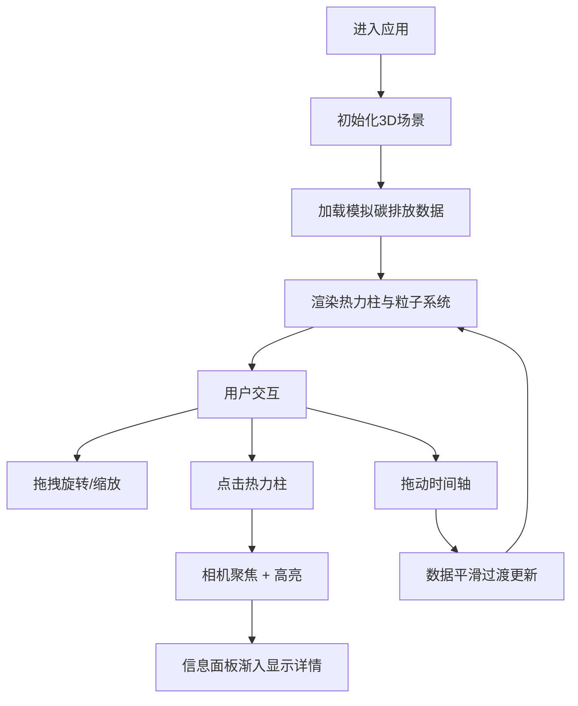

## 1. 产品概述
城市热力呼吸是一个3D交互可视化应用，通过热力柱、流动粒子和动态连线直观展示城市各区域实时模拟的碳排放数据，帮助用户理解城市碳排放的空间分布和时间变化规律。
- 面向城市规划者、环保研究者和公众，提供沉浸式的碳排放数据可视化体验
- 利用3D可视化技术将抽象的环境数据转化为直观可交互的视觉呈现

## 2. 核心功能

### 2.1 用户角色
| 角色 | 注册方式 | 核心权限 |
|------|----------|----------|
| 普通用户 | 无需注册 | 浏览3D场景、查看数据详情、调整时间轴 |

### 2.2 功能模块
1. **3D场景主视图**: 城市热力柱渲染、粒子系统、地面网格、环境光照
2. **热力柱交互**: 点击查看详情、高亮选中、相机聚焦
3. **时间轴控制器**: 24小时数据切换、平滑过渡动画、数据同步
4. **信息面板**: 区域详情展示、数据指标展示、渐入动画
5. **视角控制**: 场景旋转、滚轮缩放、平滑过渡

### 2.3 页面详情
| 页面名称 | 模块名称 | 功能描述 |
|----------|----------|----------|
| 主页面 | 3D场景 | 全屏Three.js场景，渲染城市热力柱和流动粒子 |
| 主页面 | 应用标题 | 左上角显示应用名称，带发光效果 |
| 主页面 | 信息面板 | 右上角/底部展示选中区域的详细碳排放数据 |
| 主页面 | 时间轴 | 底部时间轴滑块，控制24小时数据切换 |

## 3. 核心流程
用户进入应用后，首先看到3D城市热力图，热力柱根据当前时间的碳排放数据动态渲染，粒子系统围绕热力柱流动。用户可以通过鼠标拖拽旋转场景、滚轮缩放视角，点击任意热力柱查看该区域的详细碳排放数据，此时相机自动聚焦到选中柱体，信息面板渐入展示详情。拖动底部时间轴可切换不同小时的数据，热力柱高度和粒子运动会同步平滑过渡。

## 4. 用户界面设计

### 4.1 设计风格
- 主色调: #00D4FF（科技蓝），辅助色: #0A192F（深蓝），文字色: #E0F2FE（浅蓝白）
- 字体: JetBrains Mono，科技感等宽字体
- 风格: 深色科技风，磨砂玻璃面板，发光效果，渐变背景
- 面板样式: 背景rgba(10,25,47,0.85)，backdrop-filter: blur(10px)，圆角16px，边框1px solid rgba(255,255,255,0.1)

### 4.2 页面设计概述
| 页面名称 | 模块名称 | UI元素 |
|----------|----------|--------|
| 主页面 | 3D场景 | 深蓝渐变背景#0B1A30到#1C3B60，半透明网格地面，发光热力柱，彩色流动粒子 |
| 主页面 | 应用标题 | 左上角，JetBrains Mono 20px，#E0F2FE，text-shadow发光 |
| 主页面 | 信息面板 | 320px宽，两列网格布局，渐入动画opacity 0→1（0.3s） |
| 主页面 | 时间轴 | 高60px，磨砂玻璃背景，自定义滑块thumb圆形12px #00D4FF，填充渐变#1C3B60到#00D4FF |

### 4.3 响应式
- 桌面端（>768px）: 信息面板位于右上角，时间轴位于底部
- 移动端（≤768px）: 信息面板折叠为底部浮层（高200px），时间轴移至浮层上方
- 触摸优化: 支持双指缩放、触摸拖拽旋转

### 4.4 3D场景设计
- 相机: 初始位置(20,15,20)看向原点，OrbitControls控制，缩放范围5-40
- 光照: 环境光强度0.4，方向光强度0.8并开启阴影
- 背景: 深蓝渐变#0B1A30到#1C3B60
- 地面: 半透明GridHelper网格平面
- 热力柱: 圆柱几何体，半径0.5，高度映射碳排放（1-8），颜色渐变#2ECC71→#F1C40F→#E74C3C，柱顶sprite发光光晕，柱底圆形投影
- 粒子系统: 300个粒子，螺旋上升运动，颜色与热力柱一致，大小随高度衰减0.3→0.1，受风向因子偏移
- 动画: 时间轴切换duration 0.5s平滑过渡，点击聚焦transition 0.8s ease-out，选中高亮emissive #FFF强度0.5，非选中透明度0.3
