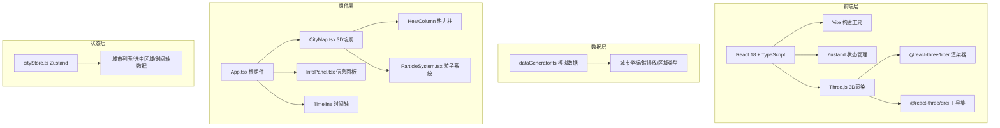
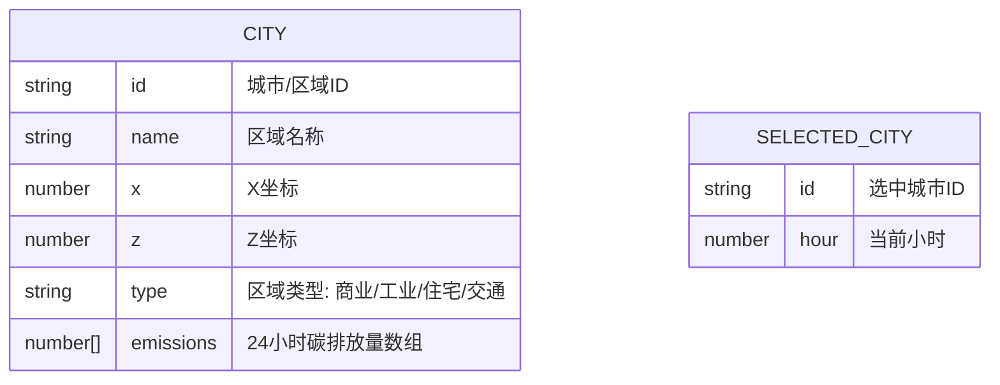

## 1. 架构设计



## 2. 技术描述
- 前端: React@18 + TypeScript@5 + Vite@5
- 3D引擎: three@0.160 + @react-three/fiber@8 + @react-three/drei@9
- 状态管理: zustand@4
- 工具库: uuid@9
- 数据: 纯前端模拟数据，无需后端服务

## 3. 目录结构
```
d:\Pro\tasks\auto380
├── package.json
├── index.html
├── tsconfig.json
├── vite.config.js
└── src
    ├── main.tsx
    ├── App.tsx
    ├── store
    │   └── cityStore.ts
    ├── components
    │   ├── CityMap.tsx
    │   ├── ParticleSystem.tsx
    │   └── InfoPanel.tsx
    └── utils
        └── dataGenerator.ts
```

## 4. 核心数据模型

### 4.1 数据模型定义


### 4.2 TypeScript类型定义
```typescript
interface City {
  id: string;
  name: string;
  x: number;
  z: number;
  type: 'commercial' | 'industrial' | 'residential' | 'transport';
  emissions: number[]; // 24小时数据
}

interface CityStore {
  cities: City[];
  selectedCityId: string | null;
  currentHour: number;
  setSelectedCity: (id: string | null) => void;
  setCurrentHour: (hour: number) => void;
  getCityEmission: (cityId: string) => number;
}

interface ParticleData {
  id: string;
  cityId: string;
  angle: number;
  radius: number;
  height: number;
  speed: number;
}
```

## 5. 性能优化策略
| 优化点 | 策略 | 目标 |
|--------|------|------|
| 粒子数量 | 限制最大300个，使用BufferGeometry | 帧率≥40FPS |
| 热力柱数量 | 限制最大30个，复用几何体 | 交互延迟<50ms |
| 渲染优化 | 使用InstancedMesh批量渲染热力柱 | 降低Draw Call |
| 动画优化 | 使用useFrame节流，requestAnimationFrame | 平滑60fps动画 |
| 材质复用 | 共享材质实例，避免重复创建 | 减少内存占用 |
