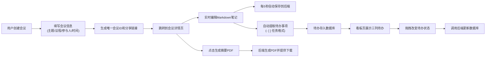

## 1. 产品概述
会议脉冲是一款面向小型创业团队的轻量级一站式会议管理工具，帮助团队高效创建、分享和记录会议，并自动追踪待办事项。
- 解决会议效率低下、笔记散乱、待办事项追踪困难等痛点
- 目标用户为5-20人的小型团队，核心价值在于"极简操作 + 智能提取 + 可视化追踪"

## 2. 核心 Features

### 2.1 用户角色
| Role | Registration Method | Core Permissions |
|------|---------------------|------------------|
| 普通用户 | 无需注册，通过分享链接访问 | 创建会议、编辑笔记、查看和管理待办事项 |

### 2.2 Feature Module
1. **主页**：会议创建表单、会议列表展示
2. **会议详情页**：议程展示、实时笔记编辑（Markdown）、参会人列表、待办提取、PDF生成
3. **看板页**：待办事项三列看板、拖拽管理、关联会议信息

### 2.3 Page Details
| Page Name | Module Name | Feature description |
|-----------|-------------|---------------------|
| 主页 | 会议创建表单 | 填写主题、议程、参与人邮箱、日期时间，生成唯一会议ID和分享链接 |
| 主页 | 会议列表 | 展示所有会议卡片，点击进入详情页 |
| 会议详情页 | 笔记编辑器 | Markdown实时渲染，5秒自动保存，支持@提及转待办 |
| 会议详情页 | 待办列表 | 自动从笔记中提取"- [ ] 任务"格式的待办项 |
| 会议详情页 | PDF生成 | 一键生成包含会议信息、笔记摘要、待办清单的PDF |
| 看板页 | 三列看板 | 待办/进行中/已完成三列，支持拖拽改变状态和排序 |
| 看板页 | 待办卡片 | 显示任务描述、状态、关联会议链接 |

## 3. 核心流程

## 4. 用户界面设计

### 4.1 Design Style
- **主色调**：#7A8B8E（灰绿），辅助色：#C4A77D（米驼），背景：#F5F2EE（米白），字体：#3A3D40（深灰）
- **按钮风格**：圆角8px，主色背景，悬停时有轻微阴影和透明度变化
- **字体**：使用现代无衬线字体，标题18-24px，正文14px，辅助文字12px
- **布局风格**：卡片式设计，充足留白，双栏/三列布局，顶部固定导航栏
- **图标风格**：使用lucide-react线性图标，简洁统一

### 4.2 Page Design Overview
| Page Name | Module Name | UI Elements |
|-----------|-------------|-------------|
| 主页 | Hero区域 | 应用Logo、标题、简短描述、创建会议按钮 |
| 主页 | 会议创建表单 | 四个输入字段（主题、议程、参与人、时间）、提交按钮 |
| 主页 | 会议列表 | 网格布局卡片，展示会议主题、日期、参与人数 |
| 会议详情页 | 双栏布局 | 左栏60%笔记编辑区，右栏40%预览和参与人 |
| 会议详情页 | 笔记编辑区 | textarea圆角8px，背景#FFFFFF，内阴影 |
| 会议详情页 | 预览区 | 背景#FAF8F5，圆角8px，最小高度300px |
| 会议详情页 | 待办列表 | 勾选框、任务描述、状态标签 |
| 看板页 | 三列瀑布流 | 每列宽300px，间距24px，卡片背景#FFFFFF，圆角12px |
| 看板页 | 拖拽效果 | 0.2秒缩放动画scale 1.05，半透明阴影 |

### 4.3 响应式设计
- **桌面端（>768px）**：双栏布局、三列看板
- **移动端（<768px）**：单栏堆叠，看板改为横向滑动，触摸优化
- 导航栏在移动端折叠为汉堡菜单

### 4.4 交互与动画
- 页面加载时元素渐入动画，延迟0.1s递增
- 卡片悬停时轻微上浮（transform: translateY(-2px)）
- 拖拽时卡片缩放和阴影变化
- 保存状态指示器（保存中/已保存）
- 待办状态切换时的平滑过渡
