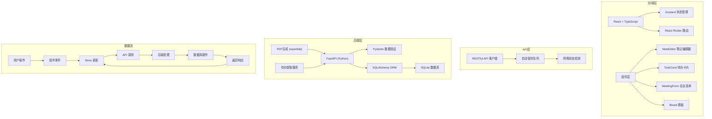
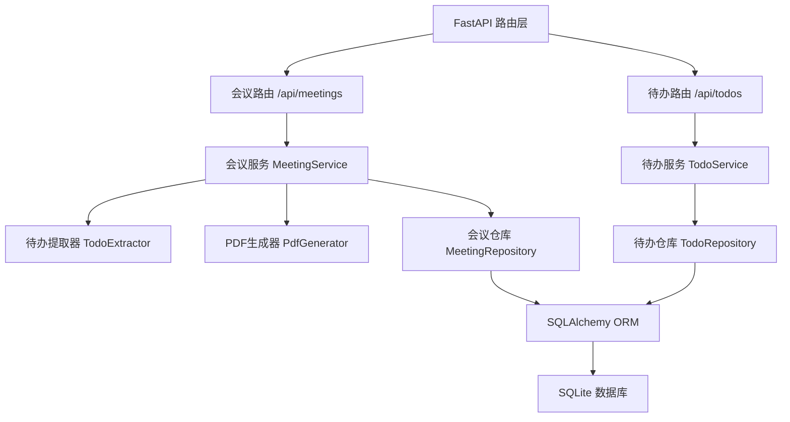
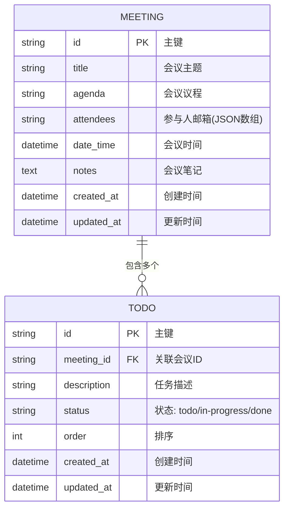

## 1. 架构设计



## 2. 技术栈描述

### 前端技术栈
- **框架**：React 18 + TypeScript
- **构建工具**：Vite 5
- **状态管理**：Zustand 4
- **路由**：React Router DOM 6
- **Markdown渲染**：react-markdown 9
- **拖拽库**：@hello-pangea/dnd 16
- **图表**：recharts 2
- **工具库**：uuid 9
- **类型定义**：@types/react, @types/react-dom

### 后端技术栈
- **Web框架**：FastAPI 0.109
- **ORM**：SQLAlchemy 2.0
- **数据库**：SQLite 3
- **数据验证**：Pydantic 2
- **PDF生成**：reportlab 4
- **CORS**：fastapi.middleware.cors

### 核心依赖版本
```json
{
  "react": "^18.2.0",
  "react-dom": "^18.2.0",
  "react-router-dom": "^6.22.0",
  "zustand": "^4.5.0",
  "uuid": "^9.0.1",
  "recharts": "^2.12.0",
  "@hello-pangea/dnd": "^16.6.0",
  "react-markdown": "^9.0.1",
  "vite": "^5.1.0",
  "@vitejs/plugin-react": "^4.2.1",
  "typescript": "^5.3.3",
  "@types/react": "^18.2.55",
  "@types/react-dom": "^18.2.19"
}
```

## 3. 路由定义

| Route | Purpose |
|-------|---------|
| `/` | 主页 - 会议创建表单和会议列表 |
| `/meeting/:id` | 会议详情页 - 笔记编辑、待办列表、PDF生成 |
| `/board` | 看板页 - 三列待办拖拽管理 |

## 4. API 定义

### TypeScript 类型定义
```typescript
// 会议类型
interface Meeting {
  id: string;
  title: string;
  agenda: string;
  attendees: string[];
  dateTime: string;
  notes: string;
  createdAt: string;
  updatedAt: string;
}

// 待办事项类型
interface Todo {
  id: string;
  meetingId: string;
  description: string;
  status: 'todo' | 'in-progress' | 'done';
  order: number;
  createdAt: string;
  updatedAt: string;
}

// 创建会议请求
interface CreateMeetingRequest {
  title: string;
  agenda: string;
  attendees: string[];
  dateTime: string;
}

// 更新笔记请求
interface UpdateNotesRequest {
  notes: string;
}

// 更新待办状态请求
interface UpdateTodoRequest {
  status: 'todo' | 'in-progress' | 'done';
  order: number;
}
```

### API 端点
| Method | Endpoint | Description |
|--------|----------|-------------|
| POST | `/api/meetings` | 创建新会议 |
| GET | `/api/meetings` | 获取所有会议列表 |
| GET | `/api/meetings/:id` | 获取单个会议详情 |
| PUT | `/api/meetings/:id/notes` | 更新会议笔记 |
| GET | `/api/meetings/:id/pdf` | 生成并下载会议PDF |
| GET | `/api/todos` | 获取所有待办事项 |
| GET | `/api/meetings/:id/todos` | 获取会议的待办事项 |
| PUT | `/api/todos/:id` | 更新待办事项状态和顺序 |

## 5. 后端架构图



## 6. 数据模型

### 6.1 ER 图



### 6.2 DDL 语句 (SQLite)
```sql
-- 会议表
CREATE TABLE IF NOT EXISTS meetings (
    id VARCHAR(36) PRIMARY KEY,
    title VARCHAR(255) NOT NULL,
    agenda TEXT,
    attendees TEXT,
    date_time DATETIME NOT NULL,
    notes TEXT DEFAULT '',
    created_at DATETIME DEFAULT CURRENT_TIMESTAMP,
    updated_at DATETIME DEFAULT CURRENT_TIMESTAMP
);

-- 待办表
CREATE TABLE IF NOT EXISTS todos (
    id VARCHAR(36) PRIMARY KEY,
    meeting_id VARCHAR(36) NOT NULL,
    description TEXT NOT NULL,
    status VARCHAR(20) DEFAULT 'todo',
    "order" INTEGER DEFAULT 0,
    created_at DATETIME DEFAULT CURRENT_TIMESTAMP,
    updated_at DATETIME DEFAULT CURRENT_TIMESTAMP,
    FOREIGN KEY (meeting_id) REFERENCES meetings(id) ON DELETE CASCADE
);

-- 索引
CREATE INDEX IF NOT EXISTS idx_todos_meeting_id ON todos(meeting_id);
CREATE INDEX IF NOT EXISTS idx_todos_status ON todos(status);
CREATE INDEX IF NOT EXISTS idx_meetings_date_time ON meetings(date_time);
```

## 7. 性能优化策略

### 前端优化
1. **自动保存队列**：笔记更新每5秒批量保存，网络异常时放入队列，恢复后重试
2. **乐观更新**：看板拖拽时本地立即更新，后端异步同步
3. **代码分割**：按路由分割代码，首屏加载 < 2秒
4. **防抖处理**：笔记输入防抖，避免频繁触发待办提取

### 后端优化
1. **SQLAlchemy 连接池**：复用数据库连接
2. **待办增量提取**：仅提取新增的待办项，避免全量解析
3. **PDF流式生成**：边生成边写入响应，减少内存占用

### 数据流向说明
1. **会议创建**：MeetingForm → useMeetingStore.createMeeting → API POST → 后端创建 → Store更新 → 路由跳转
2. **笔记编辑**：NoteEditor onChange → 本地状态更新 → 5秒定时器 → API PUT → 后端更新 → TodoExtractor提取待办 → 前端Store同步
3. **看板拖拽**：Board onDragEnd → 本地Store立即更新 → API PUT → 后端异步更新 → 确认响应
4. **PDF生成**：MeetingDetail 点击按钮 → API GET /pdf → 后端生成PDF → 浏览器下载
